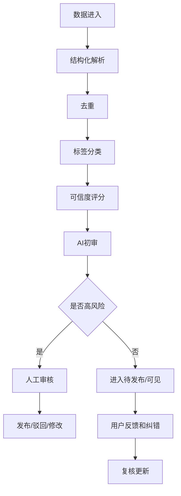

# 游艺圈数据采集与治理方案

版本：V0.1  
日期：2026-07-02

---

## 1. 数据目标

平台数据要满足四个目标：

1. 查得到：厂家、产品、文审、配件、政策、商机、资料。
2. 用得上：可搜索、可筛选、可推荐、可询价。
3. 信得过：来源、更新时间、可信度、认证状态清楚。
4. 可治理：可去重、纠错、下架、屏蔽、审核。

---

## 2. 数据来源

| 来源 | 内容 |
|---|---|
| 厂家主动上传 | PDF、Word、图片、视频、产品表、营业执照 |
| 平台人工录入 | 厂家、产品、文审、政策、商机 |
| 用户发布 | 求购、出售、二手、转让、合作开店 |
| 公开网络 | 政府网站、行业网站、B2B、展会资料 |
| 短视频平台 | 视频号、抖音号、直播间、达人主页 |
| 行业纸媒 | 杂志、画册、展会图册 |
| 圈子社区 | 热点话题、行业观点、经验内容 |
| 潜在会员库 | 手机号、微信号、微信群、视频号、抖音号 |
| AI 客服 | 用户找不到的信息和真实需求 |

## 3. 数据治理流程

---

## 4. 关键数据模型

### 厂家

- 厂家名称
- 地址
- 服务类型标签
- 主营品类
- 营业执照
- 联系方式
- 认证状态
- 信用评分
- 数据来源
- 是否屏蔽

### 产品

- 产品名称
- 产品分类
- 外观图
- 游戏画面图
- 视频
- 产品语言
- 年龄段
- 人群标签
- 是否退彩票
- 是否退礼品
- 文审状态
- 厂家关联

### 商机

- 类型
- 地区
- 品类
- 数量
- 预算
- 联系方式状态
- 有效期
- 来源
- 可信度
- 失效状态

### 潜在会员

- 手机号
- 微信号
- 视频号/抖音号
- 来源渠道
- 身份标签
- 地区
- 触达次数
- 转化状态
- 是否无效

---

## 5. 潜在会员库治理

必须与正式会员库分开。

状态：

- 未触达
- 已触达
- 已注册
- 已认证
- 已付费
- 无效

去重依据：

- 手机号
- 微信号
- 抖音号
- 视频号
- 企业名称
- 联系人姓名
- 地址

无效池进入条件：

- 手机号错误
- 明确拒绝
- 多轮无响应
- 行业无关
- 投诉骚扰
- 重复低质

---

## 6. 合规要求

重点风险：

- 微信群和私域聊天内容采集。
- 手机号、微信号等个人信息。
- 电商和短视频平台规则。
- 文审和政策信息误读。
- 图片、视频、资料版权。

建议：

- 优先使用授权、公开、用户主动提交的数据。
- 对个人信息进行权限控制和脱敏。
- 营销触达提供拒收和投诉机制。
- 数据来源要保留。
- 厂家可申请认领、纠错、下架、屏蔽。

---

## 7. 数据质量指标

- 厂家重复率
- 产品重复率
- 商机有效率
- 文审核验准确率
- 图片识别匹配率
- 潜客重复率
- 潜客转化率
- 用户纠错率
- 投诉率
