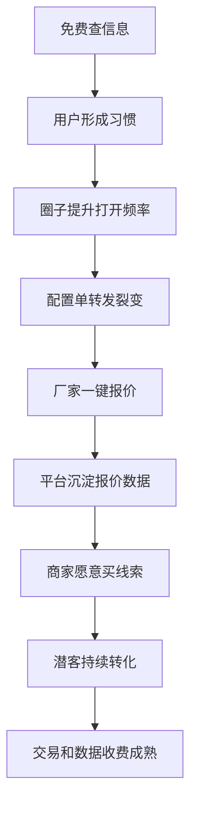

# 游艺圈交易收费与增长路线

版本：V0.1  
日期：2026-07-02

---

## 1. 收费原则

平台早期要简单、低价、好理解，不能让用户一上来觉得规则复杂或费用高。

原则：

1. 基础查询免费。
2. 联系方式低价。
3. 商家可以买单。
4. 深度工具收费。
5. 成交服务收费。
6. 所有收费功能后台可配置为 0，实现限时免费。

---

## 2. 定价开关

所有未来收费模块先按收费流程开发，但上线初期可设置价格为 0。

后台能力：

- 功能价格配置
- 限时免费
- 价格为 0
- 区域定价
- 身份定价
- 活动价
- 灰度收费
- 会员价

意义：

- 技术流程一次到位。
- 早期可免费推广。
- 后期可平滑收费。
- 便于不同城市和用户群测试价格。

---

## 3. 冷启动期

免费：

- 基础搜索
- 厂家展示
- 产品展示
- 文审基础查询
- 圈子社区
- 基础商机浏览
- 厂家微官网基础版
- 配置单基础生成
- 潜在会员导入和转化基础功能

低价：

- 查看联系方式限时 1 元/次。
- 高价值商机可后续分级收费。

商家侧：

- 免费入驻。
- 免费上传产品。
- 免费生成微官网。
- 开通主动询价服务的商家可优先展示。

---

## 4. 验证付费期

收费：

- 联系方式查看。
- 高价值商机查看。
- 高级配置单导出。
- AI 代询价。
- 厂家推广位。
- 商家主动询价服务。

继续免费：

- 基础查询。
- 基础商家展示。
- 基础圈子。
- 基础热搜。

---

## 5. 规模化期

新增收入：

- 厂家会员。
- 数据专业版。
- 配件商城抽佣。
- 担保交易服务费。
- 达人推广分佣。
- 高级行业指数。
- 区域报告。

---

## 6. 成熟期

成熟收入：

- 成交佣金。
- 官方配件商城服务费或差价。
- 厂家广告和品牌专题。
- 数据订阅。
- 5G 电玩导流分佣。
- 展会、探厂、招商活动服务费。
- 高级圈子服务和话题推广。

---

## 7. 用户视角规则

前端表达要简单：

| 用户看到的规则 | 说明 |
|---|---|
| 查信息免费 | 基础厂家、产品、文审、榜单免费 |
| 看联系方式低价 | 限时 1 元查看联系方式 |
| 商家买单可免费联系 | 商家开通主动询价，买家免费询价 |
| 深度工具再收费 | 高级导出、AI 代询价、数据报告 |
| 成交服务平台保障 | 平台收款、协议、担保收取服务费 |

---

## 8. 增长路径

