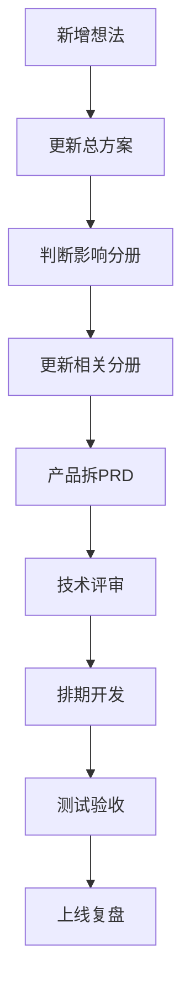

# 游艺圈岗位分工与协作机制

版本：V0.1  
日期：2026-07-02

---

## 1. 建议岗位

| 岗位 | 主要职责 |
|---|---|
| 项目负责人 | 控制目标、优先级、资源、跨组协调 |
| 产品负责人 | PRD、流程、原型、需求验收 |
| 技术负责人 | 技术架构、开发规范、系统稳定性 |
| 前端负责人 | 小程序、APP、Web 管理后台 |
| 后端负责人 | 数据库、接口、权限、订单、支付、后台服务 |
| AI 负责人 | AI 识图、客服、选品、内容审核、推荐 |
| 数据负责人 | 数据采集、清洗、去重、标签、文审和政策库 |
| 运营负责人 | 厂家入驻、商机审核、圈子运营、日报 |
| 商务负责人 | 厂家合作、达人合作、配件供应商、广告 |
| 客服审核 | 投诉、下架、纠错、内容审核、用户反馈 |
| 测试负责人 | 功能测试、流程测试、数据测试、风控测试 |

---

## 2. 分组建议

### 产品组

负责：

- 总流程设计
- 页面原型
- 功能优先级
- 业务规则
- 验收标准

### 技术组

负责：

- 架构设计
- 数据库
- API
- 前端实现
- 后台系统
- 性能和安全

### 数据组

负责：

- 厂家库
- 产品库
- 文审库
- 政策库
- 潜在会员库
- 数据质量

### 运营组

负责：

- 厂家入驻
- 商机审核
- 圈子运营
- 内容日报
- 用户调研
- 客服反馈

### 商务组

负责：

- 厂家合作
- 达人合作
- 配件供应商
- 5G 电玩运营商
- 广告和推广

---

## 3. 需求流转

---

## 4. 每周会议建议

| 会议 | 参与人 | 目的 |
|---|---|---|
| 项目总会 | 各负责人 | 确认优先级和风险 |
| 产品评审 | 产品、技术、运营 | 确认需求和原型 |
| 技术评审 | 技术、AI、数据 | 确认方案和排期 |
| 数据运营会 | 数据、运营、客服 | 数据质量、审核、投诉 |
| 商务增长会 | 商务、运营、产品 | 厂家、达人、潜客转化 |

---

## 5. 交付物

| 岗位 | 交付物 |
|---|---|
| 产品 | PRD、原型、流程图、验收清单 |
| 技术 | 技术方案、接口文档、数据库设计 |
| AI | 模型方案、提示词、评估指标、审核规则 |
| 数据 | 数据模板、采集规则、清洗规则、质量报告 |
| 运营 | 审核规则、日报模板、圈子运营方案 |
| 商务 | 合作方案、报价表、客户名单、转化记录 |
| 测试 | 测试用例、缺陷记录、验收报告 |

---

## 6. 风险机制

高风险事项必须单独评审：

- 微信和私域数据采集
- 手机号和潜在会员库
- 支付和担保交易
- 文审合规表达
- 圈子内容审核
- 图片联系方式识别
- 自动化营销触达
- 大规模资料下载

