# 游艺圈 AI 游戏游艺行业平台需求框架

版本：V0.1  
日期：2026-06-30  
用途：正式开发前的产品、技术、运营需求框架讨论

---

## 1. 项目定位

游艺圈是面向游戏游艺、电玩设备、电玩城经营、厂家供应链、周边服务人员和行业从业者的 AI 数据引擎平台。

平台不是单纯的信息发布平台，而是要把行业中分散、混乱、真假难辨、时效性差的信息，整理成可搜索、可验证、可推荐、可询价、可交易、可决策的数据资产。

核心定位：

> 游艺圈，游戏游艺行业的 AI 数据引擎。

核心价值：

1. 看得见，查得到：厂家、产品、文审、政策、商机、资料、供应链信息集中查询。
2. 拍得准，找得到：通过 AI 识图识别设备、游戏画面、铭牌、二维码，快速找到供应商。
3. 配得准，买得省：AI 场地选品、报价清单、自动询价、采购方案生成。
4. 卖得快，撮合准：商机采集、AI 代卖、AI 代询价、买卖双方撮合。
5. 数据真，更新快：每日简报、政策预警、文审动态、区域排行、行业大数据。
6. 信用强，可成交：厂家信用、平台收款、成交记录、实地认证、区域厂家和周边服务保障。
7. 配件全，发货快：整合全国通用零配件供应，逐步形成行业配件仓库。
8. 达人强，流量活：联合行业视频达人和业务精英，形成内容、信任和交易闭环。
9. 趋势清，推荐准：热搜、指数、榜单、个性化关注和关联推荐帮助用户更快发现机会。
10. 5G 电玩新入口：收录线上线下互联的远程可玩游戏机运营商，展示行业新业态。
11. 圈子强，关系活：建立行业社交圈，让达人、厂家、业务员、场地老板形成内容和关系网络。
12. 拉新准，转化高：建立潜在会员库，持续挖掘、去重、转化和清理行业客户资源。

---

## 2. 产品终端

### 2.1 微信小程序端

适合高频轻量使用，重点服务买家的直观采购、快速查询、行业数据浏览和微信裂变转发。

主要功能：

- 查厂家
- 查产品
- 拍照识别设备
- 查文审
- 看商机
- 看每日简报
- AI 客服
- 发布求购/出售
- 商机付费查看
- 选品清单快速生成
- 厂家微官网浏览
- 区域厂家和周边服务查询
- 配件搜索与下单
- 达人/业务精英主页浏览
- 热搜词和趋势榜
- 5G 电玩专区体验入口
- 圈子浏览、发帖、话题互动

小程序定位：

- 买家第一入口，打开快、分享快、转发配置单方便。
- 展示较为直观的采购信息和行业基础数据。
- 支持配置单、报价页、厂家微官网、商机详情在微信内快速传播。
- 深度数据、卖家经营、复杂后台能力引导到 APP。
- 厂家和服务商可在小程序收到新咨询提醒、报价提醒、订单提醒，但不承载完整工作台。

### 2.2 独立 APP

适合深度用户、厂家、业务员、服务商和高频经营者。APP 的最大优势是快捷直观打开、功能完整、数据沉淀强、适合日常经营。

主要功能：

- AI 选品工具
- 商机订阅
- 区域行情看板
- 厂家工作台
- 业务员工作台
- AI 代询价
- AI 代卖
- 资料下载
- 政策预警
- 线上探店
- 钱包与收款
- 广告与推广管理
- 配件商城
- 达人合作中心
- 5G 电玩专区
- 个人关注和搜索偏好
- 圈子社区
- 私聊与好友
- 潜在会员转化工具

APP 定位：

- 买家可查看更深度的行业运营数据、趋势指数、区域报表、政策预警。
- 厂家主要工作台放在 APP，包括产品管理、报价、询盘、订单、收款、推广。
- 厂家业务员可在 APP 处理客服、报价、客户跟进和配置单。
- 服务商可在 APP 接单、报价、管理服务记录和评价。
- 小程序和 APP 核心功能保持一致，但复杂编辑、深度数据、卖家经营工具优先放在 APP。

端侧分工原则：

| 场景 | 小程序 | APP |
|---|---|---|
| 买家快速查询 | 强 | 强 |
| 微信转发配置单 | 强 | 中 |
| 商机浏览 | 强 | 强 |
| 深度行业数据 | 基础展示，引导 APP | 强 |
| 厂家产品管理 | 提醒和轻编辑 | 强 |
| 多厂家报价管理 | 基础查看 | 强 |
| 订单、收款、提现 | 基础提醒 | 强 |
| 广告和推广 | 基础查看 | 强 |
| 服务商接单 | 提醒和简易确认 | 强 |

### 2.3 Web 管理后台

面向平台运营、审核、客服、销售和技术管理。

主要功能：

- 厂家审核
- 产品审核
- 文审资料审核
- 商机审核
- 资料下载审核
- 杀毒与安全标记
- 投诉与下架处理
- 数据采集任务管理
- AI 识别结果复核
- 平台广告位管理
- 消息群发管理
- 充值与订单管理
- 数据看板
- 配件供应链后台
- 达人合作管理
- 热搜指数管理
- 5G 电玩运营商管理
- 圈子内容审核
- 潜在会员库管理
- 定价开关管理

---

## 3. 总体产品架构

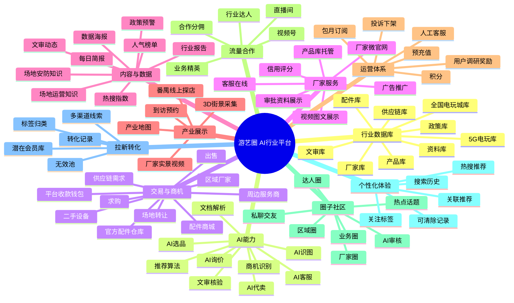

---

## 4. 核心用户角色

平台主身份不要过度拆分，否则权限和产品体验会变复杂。建议主身份固定为四类，其他用服务标签、经营标签、会员等级和功能权限表达。

| 主身份 | 包含对象 | 核心需求 | 平台价值 |
|---|---|---|---|
| 个人用户 | 新开店老板、老场地老板、采购人、二手设备出售方、行业从业者 | 查资料、买设备、卖二手、找服务、看行情 | AI 选品、商机、二手发布、政策与数据查询 |
| 厂家 | 整机厂家、配件供应商、贸易型公司、5G 电玩运营商 | 展示产品、销售、收款、获客、建立信用 | 厂家微官网、产品库、配件商城、询盘和推广 |
| 厂家业务员 | 厂家员工、销售代表、客服人员 | 给客户配单、跟进询盘、维护客户 | 厂家可绑定权限，业务员可担当客服、报价和商机跟进 |
| 服务商 | 装机技工、送货师傅、维修师傅、其他周边服务人员或团队 | 接单、展示服务能力、获取本地客户 | 服务商主页、服务地图、服务标签、订单和评价 |

补充说明：

- 个人用户允许发布二手设备、场地转让、合作开店等信息，逻辑类似闲鱼或淘宝个人卖家，不需要单独定义成“卖家”主身份。
- 投资级别报表不单独设置“投资人”身份，任何用户开通高级数据服务后，都可以查看对应数据报告。
- 行业达人、业务精英可以作为个人用户或厂家业务员的扩展认证标签，不一定单独作为主身份。
- 厂家业务员的权限由所属厂家配置，可设置是否允许管理产品、接待客服、查看询盘、报价、导出清单、发布商机。
- 广州厂家、外地厂家、区域经销商、区域代理、本地机台销售方都属于“厂家”身份，差异通过地址、服务范围和服务标签展示，不再设置“区域服务商”身份。
- 服务商特指周边服务人员或团队，可以是个人，也可以是企业，但不承担厂家店铺和产品库身份。

---

## 5. 核心功能模块

## 5.1 行业数据库

行业数据库是平台底座，所有 AI 推荐、商机撮合、选品工具、信用评分都依赖它。

### 5.1.1 厂家库

字段建议：

| 字段 | 说明 |
|---|---|
| 厂家名称 | 标准名称、简称、历史名称 |
| 所在地区 | 省、市、区、产业带 |
| 主营品类 | 礼品机、文审机、赛车机、娃娃机、配件等 |
| 服务类型标签 | 机台销售、产品研发、维修服务、场地规划、合作开店、二手买卖、安装调试、装修设计、其他服务 |
| 联系方式 | 电话、微信、客服、平台在线咨询 |
| 营业执照 | 营业执照图片、统一社会信用代码、认证状态 |
| 认证状态 | 未认证、已认领、平台实地认证 |
| 产品数量 | 已收录产品数 |
| 文审产品数 | 关联文审设备数量 |
| 成交信息 | 平台成交、询价、服务记录 |
| 信用评分 | 综合评分 |
| 实地资料 | 门头、展厅、视频、3D 探店 |
| 数据来源 | 厂家提交、公开网络、平台采集、人工录入 |
| 下架状态 | 正常、部分屏蔽、永久屏蔽 |

### 5.1.2 产品库

字段建议：

| 字段 | 说明 |
|---|---|
| 产品名称 | 标准名称和别名 |
| 产品大类 | 游戏设备、管理系统、周边配件 |
| 运营场景 | 户外游乐设备、室内电玩设备、儿童游艺设备、共享自助设备、5G 电玩设备等 |
| 玩法/功能分类 | 娃娃机、扭蛋机、赛车竞速、射击、推币、支付盒子、币器、主板等 |
| 厂家/供应商 | 可多个关联 |
| 图片/视频 | 机器外观图、游戏画面图、场地实拍、视频 |
| 规格参数 | 尺寸、功率、玩家数、屏幕、配置 |
| 产品语言 | 中文、英文、日文、韩文、泰文、越南文、印尼文、阿拉伯文、西班牙文等，可多选 |
| 适应年龄段 | 全年龄、儿童 2-8 岁、青少年、成人 18 岁以上等 |
| 特定人群 | 儿童、亲子、成人、情侣、家庭、竞技玩家、礼品玩家等 |
| 是否退彩票 | 是/否/未知 |
| 是否退礼品 | 是/否/未知 |
| 文审状态 | 有文审、无文审、待核验、疑似下架 |
| 文审编号 | 关联文审库 |
| 价格区间 | 高、中、低、二手价、历史价 |
| 适用场地 | 商场店、街边店、儿童乐园、大型综合店 |
| 热度指数 | 区域热度、搜索热度、询价热度 |
| 可信度 | 厂家确认、平台整理、网络线索、待核验 |

后台规则：

- 产品语言支持多选，方便外贸商按语言筛选产品。
- 适应年龄段和特定人群要作为选品推荐条件。
- 是否退彩票、是否退礼品是重要合规和经营属性，应进入搜索筛选、选品问答、政策风险判断和推荐算法。
- 外观图、游戏画面图、视频不强制上传，但资料完整度影响排序。
- 默认上传的产品图片应加游艺圈水印，后台可配置水印位置、透明度、文字、Logo、打码样式。
- 后台可配置分类、标签、字段是否必填、排序权重和展示规则。

### 5.1.3 产品分类体系

产品分类建议坚持“最多两级”，不要做太深。第一层解决“这是什么业务对象”，第二层解决“它适合什么场景或属于什么玩法/功能”。用户看得懂，后台也方便维护。

总产品分为三大类：

1. 游戏设备
2. 管理系统
3. 周边配件

#### 游戏设备分类

游戏设备建议用“大分类定位运营场景，小分类定位玩法”的方式。

| 一级分类 | 二级分类建议 |
|---|---|
| 室内电玩设备 | 娃娃机、礼品机、彩票机、扭蛋机、摇球机、推币机、赛车竞速、射击、音乐舞蹈、格斗竞技、模拟运动、VR/沉浸式、亲子互动、综合游艺 |
| 儿童游艺设备 | 儿童摇摆机、儿童赛车、儿童射击、儿童互动屏、儿童淘气堡配套、亲子礼品机、儿童币控设备 |
| 户外游乐设备 | 小火车、碰碰车、轨道车、旋转类、无动力游乐、充气游乐、水上游乐、户外亲子设备 |
| 共享自助设备 | 共享唱歌机、共享按摩椅、共享照相/拍贴、共享售卖机、共享充电/寄存、无人值守娱乐设备 |
| 5G 电玩设备 | 远程娃娃机、远程礼品机、远程推币/互动设备、远程竞技设备、5G 电玩运营方案 |
| 二手/整场设备 | 二手机台、整场打包、场地转让设备、库存尾货、展会样机 |

#### 管理系统分类

| 一级分类 | 二级分类建议 |
|---|---|
| 管理系统 | 场地管理系统、会员系统、收银系统、支付系统、刷卡系统、电子币系统、二维码彩票器、投币器系统、售币机、票务/出票系统、数据看板、远程运维系统 |

#### 周边配件分类

| 一级分类 | 二级分类建议 |
|---|---|
| 周边配件 | 主板/程序板、币器/投币器、支付模块、读卡器、摇杆按钮、屏幕显示、电源线材、灯光音响、彩票纸/耗材、礼品机配件、锁具五金、传感器、电机马达、外壳机柜、维修工具 |

礼品是周边配件中的高频热门类目，应单独作为二级分类展示，例如娃娃、扭蛋、小玩偶、盲盒、兑换礼品、礼品包装、礼品机耗材等。

补充规则：

- 同一产品可挂多个标签，但主分类只能有一个，避免搜索和统计混乱。
- 产品录入时机器外观图、游戏画面图、视频分开上传，不强制全部上传。
- 在搜索匹配权重相同的情况下，资料越完整、图片越规范、视频和文审资料越齐全，排名越靠前。
- AI 识图时，机器外观图用于找同款设备，游戏画面图用于识别玩法和游戏内容，两类图应分开训练和匹配。
- 总后台可对所有产品分类进行新增、删除、修改、排序、合并和停用。
- 总后台可配置水印和打码格式，避免商家在图片中留下绕过平台的联系方式。

### 5.1.4 文审与政策库

功能：

- 全国文审设备收录
- 各省文审动态统计
- 新增文审设备记录
- 下架/暂停设备记录
- 政策原文链接
- AI 政策摘要
- 风险等级提示
- 产品库自动关联文审信息

政策数据必须保留官方来源、发布日期、适用地区和原文链接。

---

## 5.2 AI 识图找供应商

用户上传一张照片、截图、铭牌、二维码或游戏画面，系统自动识别对应设备和供应商。

### 输入类型

| 输入 | 识别目标 |
|---|---|
| 设备外观照片 | 产品品类、相似设备、可能厂家 |
| 游戏画面截图 | 游戏名称、玩法类型、对应设备 |
| 铭牌照片 | 厂家、型号、编号 |
| 海报/朋友圈图 | 产品名、联系人、厂家 |
| 文审二维码 | 文审链接、审批信息、真实性判断 |

### 输出结果

- 最可能匹配的产品
- 相似产品列表
- 可能厂家列表
- 可联系供应商
- 是否有文审
- 价格区间
- 数据来源
- 匹配可信度
- 一键询价

匹配机制要允许“不确定”，不能强行唯一判断。

---

## 5.3 AI 一站式选品工具

帮助用户从开店目标直接生成采购方案。

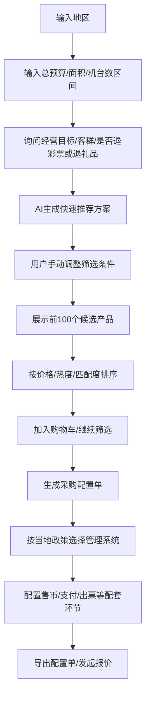

输出内容：

- 场地配置方案
- 设备采购清单
- 文审合规状态
- 预算区间
- 厂家推荐
- 区域厂家和周边服务推荐
- 管理系统推荐
- 报价单导出
- AI 代询价

推荐流程补充：

- 首先询问总预算，例如 30 万、100 万。
- 询问场地规模、机台数区间、城市地区、目标客群。
- 询问是否接受退彩票设备、是否接受退礼品设备、是否只看文审设备。
- 默认给出智能推荐，但不局限于高中低档。
- 快速推荐之外，用户可以像阿里巴巴搜索产品一样手动筛选。
- 每次根据条件自动展示前 100 个候选产品。
- 支持按价格区间、热门程度、匹配度、文审状态、厂家信用、资料完整度排序。
- 用户感兴趣的产品加入购物车，继续下一个条件筛选。
- 最终根据购物车生成采购配置单、预算表、询价表和管理系统配套方案。

### 配置单与厂家报价

一站式选品生成的配置单不仅要能导出，还要能成为询价工具。

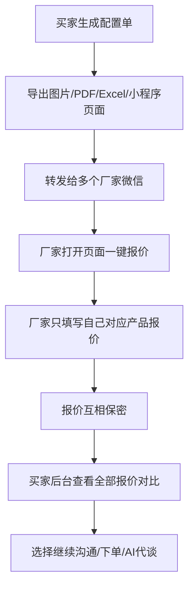

关键规则：

- 配置单支持买家转发到微信。
- 厂家打开后可一键报价。
- 每个厂家只看到自己需要填写的产品和报价入口。
- 厂家之间报价相互保密。
- 只有买家后台能看到完整报价对比。
- 平台给厂家接单希望，也给买家更强的比价和决策数据。
- 报价单可记录报价有效期、是否含运费、是否含税、发货周期、售后条件。

### 选品流程后台配置

总后台应支持配置一站式选品流程，不应把流程写死。

可配置能力：

| 能力 | 说明 |
|---|---|
| 新增流程 | 增加一个询问步骤或判断节点 |
| 删除流程 | 删除不再需要的问题或条件 |
| 调整顺序 | 拖拽调整问答顺序 |
| 条件判断 | 根据地区、预算、场地类型、退彩票、退礼品等进入不同分支 |
| 推荐权重 | 调整价格、热度、匹配度、信用、资料完整度权重 |
| 政策规则 | 按地区配置允许/不建议/禁用项 |
| 输出模板 | 配置导出表单、报价单、图片和 PDF 样式 |

### 管理系统与当地政策配置

一站式选品在选择管理系统时，不能只推荐品牌，还要结合当地政策允许范围和设备配套方式。后台应支持按地区配置可选项、禁用项和流程。

可配置内容：

| 配置项 | 示例 |
|---|---|
| 支付方式 | 刷卡、支付盒子、电子币、投币器 |
| 出票方式 | 二维码彩票器、纸质彩票、无出票 |
| 售币环节 | 是否需要售币机、游戏币、代币、会员充值 |
| 设备接入 | 单机、联网、管理系统统一接入 |
| 政策限制 | 某地区允许/不建议/禁止某类支付或出票方式 |
| 场地类型 | 商场店、街边店、儿童乐园、综合游乐场 |
| 文审要求 | 有文审设备比例、无文审设备风险提醒 |

前端体验：

1. 用户选择地区后，系统自动读取当地政策配置。
2. 选择管理系统时展示“推荐/可选/不建议/禁用”状态。
3. 用户选择刷卡、支付盒子、电子币、投币器、二维码彩票器等方式时，系统提示对应风险和配套设备。
4. 最终方案中生成符合当地政策和设备配套逻辑的管理系统清单。
5. 后台可随政策变化调整配置，不需要每次改代码。

---

## 5.4 AI 代询价与 AI 代卖

### AI 代询价

适合买家不想被频繁骚扰，或者想比较多家报价。

流程：

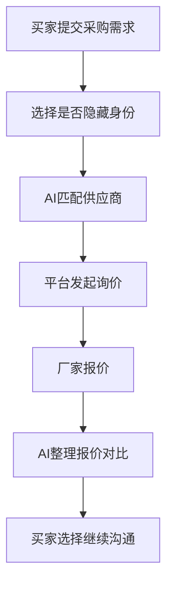

收费方式：

- 单次咨询费
- 询价服务费
- 成交后向厂家收佣
- 高价值采购单可定制服务

### AI 代卖

适合场地老板、二手设备卖家、转让方不想公开身份。

使用场景：

- 电玩城整体转让
- 在营业场地低调出售
- 批量二手机台处理
- 厂家清库存
- 代理商转让货源

流程：

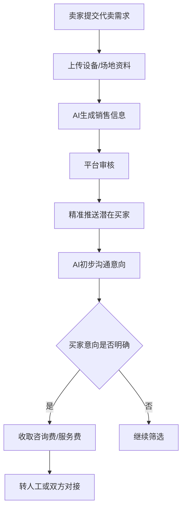

---

## 5.5 商机平台

商机来源：

1. 平台采集的公开信息。
2. 用户主动发布。
3. 厂家提交。
4. 厂家和周边服务商提交。
5. AI 客服收集。
6. 用户调研反馈。

商机类型：

- 求购设备
- 出售设备
- 二手机台
- 场地转让
- 厂家促销
- 代理招商
- 维修服务
- 配件需求
- 安装调试
- 合作开店
- 管理系统需求

合作开店适合全国大量想入行但资源不完整的人群：

- 有资金但没有行业经验。
- 有场地但缺少资金。
- 有经验但缺少资金或场地。
- 广州或外地业内专家寻找合作项目。
- 厂家、服务商、场地老板共同投入、共同运营、共同分润。

有效性机制：

- 默认有效期
- AI 自动提醒确认
- 人工回访确认
- 用户反馈失效
- 成交后关闭
- 虚假信息扣分
- 发布者信用记录

### 联系方式与付费查看

平台应让用户先看到足够完整的信息，再决定是否付费查看联系方式，避免用户觉得被强行收费。

展示规则：

- 商家名、产品信息、地区、服务标签、图片、文审状态、价格区间、信用度等完整展示。
- 手机、微信、详细联系方式默认隐藏。
- 买家需要查看联系方式时付费。
- 上线初期可设置限时优惠，例如每次查看 1 元。
- 已失效、虚假或投诉成立的信息应支持退款或补偿券。

商家可开通“主动询价服务”：

- 买家查看商家信息时，由商家承担查看/询价服务费。
- 对买家显示“商家已开通免费询价”或“商家买单”。
- 开通主动询价服务的商家可获得优先展示排名。
- 排名仍要结合信用、匹配度、资料完整度，不能只按付费排序。

图片与联系方式风控：

- AI 自动检测图片中是否带电话、微信、二维码、水印联系方式。
- 默认上传图片加游艺圈水印。
- 商家图片中出现绕过平台的联系水印，首次可提醒整改，严重或重复作弊可封禁店铺。
- 后台可配置水印格式、打码规则和违规处罚等级。

### AI 助理跟进范围

AI 代询价、AI 代卖、合作开店撮合等功能，应在启用时设置默认工作范围，避免一次触达过多人造成骚扰，也避免发布人失控。

可选限制：

| 限制方式 | 可选值 |
|---|---|
| 按交流人数 | 最多沟通 10 人、30 人、50 人、100 人 |
| 按时间 | 最多执行 1 天、3 天、7 天 |
| 按阶段 | 初筛、报价、意向确认、转人工 |

工作机制：

- 默认采用较保守范围，例如 10 人或 1 天。
- AI 阶段性同步结果给发布人。
- 发布人可随时暂停、继续或终止。
- 达到人数或时间上限后自动停止。
- 对外沟通应有频率控制，避免打扰供应商和买家。
- 重要意向进入人工确认或双方授权对接。

---

## 5.6 厂家微官网

平台为厂家自动生成标准化微官网，解决厂家资料不规范、没有官网、不会整理产品的问题。

### 厂家微官网内容

| 模块 | 内容 |
|---|---|
| 厂家首页 | 厂家简介、主营品类、认证状态、信用评分 |
| 产品库 | 标准化产品列表、分类、筛选、详情页 |
| 在线销售 | 产品下单、询价、货到付款、平台担保、发货跟进 |
| 视频中心 | 产品视频、展厅视频、实地视频、案例视频 |
| 图文资料 | 产品介绍、参数、场景图、宣传图 |
| 审批资料 | 文审二维码、文审编号、审批截图、合规说明 |
| 成交信息 | 平台成交记录、询价记录、服务记录 |
| 信用度 | 认证、投诉、成交、响应速度、资料完整度 |
| 在线客服 | 平台客服、厂家客服、AI 客服 |
| 实地实景 | 厂房、展厅、门头、3D 探店、实拍视频 |
| 询价入口 | 一键询价、批量询价、隐藏身份询价 |

厂家微官网不仅是展示页，也可以直接销售产品。通过平台销售的产品，可享受平台免费跟进发货和基础交易状态提醒。商家可设置退货条件、发货周期、质保规则、是否支持货到付款等服务条件。

平台可以提供有限中介担保：

- 买家通过平台支付。
- 商家按订单发货。
- 平台跟进物流和交付状态。
- 达到约定条件后商家可提现。
- 出现争议时平台按规则介入协调。

平台需要明确责任边界：平台提供交易撮合、收款通道、发货跟进和争议协调，不对产品质量、厂家承诺和线下安装结果承担无限责任，除非平台在具体订单中作出明确担保。

### 自动生成流程

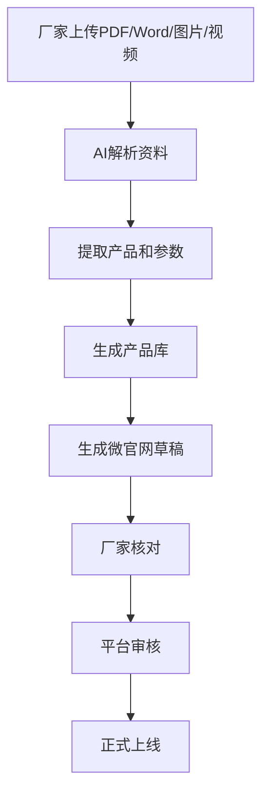

---

## 5.7 平台收款钱包

平台提供线上收款通道，帮助商家降低个人收款码异地远程收款带来的风控、诈骗提示和信用不足问题。

### 核心价值

- 帮助商家安全收款
- 提升买家支付信任
- 沉淀平台成交数据
- 形成供应商信用评分
- 为平台佣金和服务费结算提供基础

### 功能设计

| 功能 | 说明 |
|---|---|
| 平台钱包 | 用户余额、充值、消费、提现 |
| 订单收款 | 买家通过平台订单支付 |
| 供应商收款 | 平台结算给厂家或服务商 |
| 担保交易 | 可选平台担保，确认后放款 |
| 发票/收据 | 后续可扩展 |
| 风控审核 | 异常交易、投诉、退款、冻结 |
| 信用加分 | 通过平台收款越多，信用记录越完整 |

注意：支付通道必须接入合规第三方支付机构，涉及支付牌照、二清风险、资金监管和实名验证，不能自行违规沉淀资金。

---

## 5.8 区域厂家与周边服务地图

全国各省都有本地电玩代理、经销、维修、合作开店资源。平台不再把“区域服务商”作为独立身份，而是拆成两类展示：

1. 区域厂家：本质仍是厂家身份，只是地址在外省市，或具备某些区域服务能力。
2. 周边服务商：专指提供装机、送货、维修等周边服务的个人或企业。

### 区域厂家

广州厂家、外地厂家、区域代理、本地经销商、配件供应商、管理系统服务方，都统一归入“厂家”身份。平台根据地址、服务范围和服务标签，展示其是否具备区域服务能力。

区域厂家可选择的服务范围标签：

| 服务标签 | 说明 |
|---|---|
| 机台销售 | 整机销售、本地代理、经销、现货供应 |
| 产品研发 | 产品设计、程序、美术、结构、电控、样机开发 |
| 维修服务 | 厂家或团队提供维修、配件更换、售后 |
| 场地规划 | 设备配置、动线规划、经营建议 |
| 合作开店 | 有经验找资金、有资金找经验、有场地找合作方 |
| 二手买卖 | 二手机台回收、销售、整场打包 |
| 安装调试 | 新机安装、系统调试、设备联调 |
| 装修设计 | 场地装修、门头、灯光、氛围设计 |
| 其他服务 | 其他可补充服务 |

展示逻辑：

- 用户按地区找本地厂家时，优先展示该地区或服务范围覆盖该地区的厂家。
- 外地厂家可在厂家微官网中展示“服务地区”和“服务标签”。
- 广州厂家也可以选择覆盖全国或部分省市。
- 平台不再单独统计“区域服务商”，而统计“具备区域服务能力的厂家”。

### 周边服务商

服务商特指提供周边服务的群体，可以是个人，也可以是企业，不一定拥有产品库或厂家店铺。

周边服务商可选择的服务标签：

| 服务标签 | 说明 |
|---|---|
| 装机技工 | 代客装机、计件装配、外包生产 |
| 送货师傅 | 三轮车、小车、货车送货和短途搬运 |
| 维修师傅 | 设备维修、主板更换、现场排障 |
| 其他服务 | 其他临时、周边、辅助服务 |

周边服务商可展示：

- 服务地区
- 服务类型
- 可接单时间
- 计费方式
- 车辆类型
- 案例图片
- 评价记录
- 是否平台认证
- 是否支持平台担保

### 平台价值

对当地场地老板：

- 优先找到本地可服务的厂家。
- 找到附近装机、送货、维修人员。
- 售后更方便，沟通成本更低。

对广州厂家：

- 招募区域厂家、代理、经销合作方。
- 找到外地周边服务人员配合交付。
- 降低售后和安装成本。

对周边服务商：

- 获得本地订单和短期服务机会。
- 通过评价、认证和履约记录积累信用。

---

## 5.9 推送与推荐算法机制

平台推荐不能只基于用户主动搜索，还要基于身份、关注、竞品、地域、品类和行为做关联推荐。

### 用户身份

- 个人用户
- 厂家
- 厂家业务员
- 服务商
- 行业达人/业务精英标签用户

### 关注对象

- 厂家
- 产品
- 品类
- 地区
- 竞品
- 商机关键词
- 政策地区
- 文审动态

### 推荐内容

| 推荐类型 | 示例 |
|---|---|
| 同类产品推荐 | 用户看赛车机，推荐其他赛车机厂家 |
| 竞品动态推荐 | 厂家关注同行新品、价格、热度 |
| 客户线索推荐 | 厂家收到相关求购信息 |
| 区域商机推荐 | 区域厂家收到本省销售/合作需求，周边服务商收到本地装机/送货/维修需求 |
| 政策预警推荐 | 某地设备下架或检查风险 |
| 文审动态推荐 | 关注品类新增文审或下架 |
| 热门榜单推荐 | 同地区热门机台、热门厂家 |

推荐算法排序因子：

| 因子 | 说明 |
|---|---|
| 信息关联度 | 品类、地区、价格、数量、意图匹配 |
| 用户身份 | 个人用户、厂家、厂家业务员、服务商看到不同内容 |
| 用户行为 | 浏览、收藏、询价、付费、反馈 |
| 商机时效 | 越新的商机权重越高 |
| 信用评分 | 高信用来源优先 |
| 成交概率 | 历史行为和匹配程度 |
| 付费推广 | 广告内容需要明确标识 |
| 竞品关注 | 同类厂家、同类产品、同区域动态 |

平台要允许“竞品推荐”，这是提升买家体验和平台真实性的重要机制。但对厂家侧展示时要注意广告标识和公平排序规则。

---

## 5.10 平台营销服务

平台为厂家、活动方、展会、代理招商、产品发布提供营销服务。

### 服务内容

- 产品推广
- 新品发布
- 厂家品牌专题
- 大事件传播
- 展会报名
- 活动报名
- 代理招商
- 区域广告
- 商机置顶
- 消息群发
- AI 交互广告

### 后台需要预留

| 后台能力 | 说明 |
|---|---|
| 广告位管理 | 首页、搜索页、商机页、产品详情页 |
| 消息群发 | 按地区、品类、身份、关注标签群发 |
| 活动报名 | 展会、沙龙、探厂、招商会 |
| 推广数据 | 曝光、点击、询价、成交线索 |
| AI 广告配置 | 用户咨询时推荐相关厂家或产品 |
| 审核机制 | 广告内容人工审核 |

AI 交互广告必须控制体验，不能让用户觉得客服回答被广告污染。建议标记“推广”或“推荐服务商”。

---

## 5.11 番禺线上探店与产业地图

番禺游戏机产业集中，是平台展示真实性、吸引外地客户到访广州的重要内容。

### 功能

- 主干道路 3D 采集
- 道路两侧厂家展示
- 厂家门头实拍
- 展厅视频
- 产品视频
- 地图筛选
- 预约到访
- 产业路线推荐
- 平台探厂直播

### 价值

- 让外地客户快速理解产业集中度
- 提升平台数据真实性
- 帮助厂家获得到访客户
- 帮助平台形成广州产业链入口地位

---

## 5.12 场地运营知识与场地安防

### 场地运营知识

- 开店筹备
- 设备配比
- 投资预算
- 活动运营
- 会员充值
- 礼品采购
- 淡旺季运营
- 商场谈判
- 员工管理
- 回本测算

### 场地安防

- 防盗币
- 防刷分
- 防拆机
- 防员工舞弊
- 礼品机作弊
- 收银异常
- 摄像头布局
- 管理系统风控
- 常见作弊案例库

---

## 5.13 资料下载中心

资料下载中心是行业高粘性功能，但必须重视安全。

### 资料类型

- 程序包
- 驱动
- 说明书
- 维修资料
- 故障代码
- 线路图
- 运营资料
- 活动模板
- 政策文件
- 报价模板
- 游戏机销售协议模板
- 文审游戏机销售免责协议
- 二手设备转让协议
- 场地合作开店协议
- 安装调试服务协议

### 安全机制

- 人工审核
- 杀毒检测
- 文件来源标注
- 版本管理
- 下载权限
- 用户举报
- 风险提示

### 行业协议与在线签约

平台资料库应提供行业规范协议模板，方便行业人士下载、转载和使用。

重点协议：

| 协议 | 使用场景 |
|---|---|
| 游戏机销售协议 | 整机、新机、常规设备交易 |
| 文审游戏机销售免责协议 | 涉及文审游戏机整机销售时 |
| 二手设备转让协议 | 个人用户卖二手设备或整场设备 |
| 安装调试服务协议 | 装机、调试、售后服务 |
| 合作开店协议 | 有资金、有场地、有经验的多方合作 |

当平台卖家店铺销售涉及文审游戏机整机时，应提供在线协议签订服务：

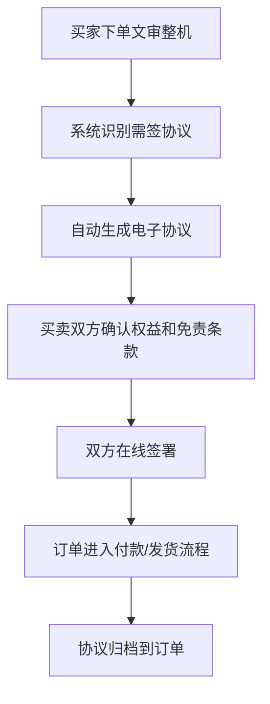

协议中应写明：

- 卖家信息
- 买家信息
- 产品名称和文审资料
- 设备用途和交付范围
- 安装、运输、售后责任
- 文审资料展示和核验方式
- 买卖双方权益
- 平台服务边界
- 争议处理方式

协议服务费可由平台从佣金中收取，或作为高级交易服务包含在订单服务费内。

---

## 5.14 AI 客服与反馈中心

AI 客服应放在全平台最显眼的位置。

支持输入：

- 文字
- 语音
- 图片
- 视频截图
- PDF
- Word
- Excel

支持任务：

- 找设备
- 找厂家
- 查文审
- 查政策
- 发商机
- 代询价
- 代卖
- 投诉下架
- 建议反馈
- 转人工客服

AI 客服不仅是客服，也是需求收集入口。所有高频问题都要进入产品需求池。

---

## 5.15 行业配件仓库与商城模式

电玩行业存在大量通用零配件需求，例如币器、主板、电源、屏幕、摇杆、按钮、线材、彩票纸、礼品机耗材、传感器、锁具、灯条、读卡器、支付模块等。全国散客采购频次高，但如果平台逐个对接配件店，效率低、体验不稳定。

平台可以借鉴美团模式，阶段性建设两种形态：

1. 商家自营店铺：合作配件供应商入驻平台，自行维护店铺、商品、库存、价格和发货。
2. 官方配件商城：前端以“游艺圈官方配件仓库”统一呈现，背后接入多家线下实体配件店供货。

### 5.15.1 两种模式对比

| 模式 | 前端体验 | 后端履约 | 优点 | 风险 |
|---|---|---|---|---|
| 商家自营 | 用户进入不同供应商店铺选品 | 供应商自行发货 | 启动快、责任清晰、平台轻 | 商品标准不一、体验不统一 |
| 官方配件商城 | 用户像逛官方仓库一样下单 | 多家配件店接单供货 | 体验统一、效率高、平台信任强 | 库存、售后、价格、履约要求高 |

建议先做商家自营，再逐步做官方配件商城。美团早期以商家自营为主，后续平台直营能力成熟后体验更高效，游艺圈也可以采用相同节奏。

### 5.15.2 阶段化路径

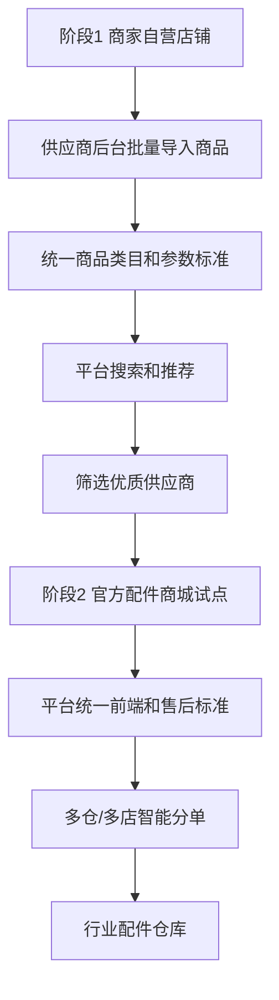

### 5.15.3 商家自营店铺

功能：

- 配件供应商入驻
- 店铺主页
- 商品分类
- 商品批量导入
- 库存与价格维护
- 订单管理
- 发货管理
- 售后处理
- 店铺信用评分
- 客服在线

适合第一阶段验证：

- 哪些配件高频
- 哪些供应商履约稳定
- 哪些地区需求集中
- 哪些商品需要平台统一标准

### 5.15.4 官方配件商城

前端统一展示为“游艺圈官方配件仓库”或“游艺圈配件商城”，用户不需要逐个对比配件店，直接搜索和下单。

背后供货逻辑：

- 多家线下实体配件店接入系统
- 平台统一商品标准
- 平台统一前端展示
- 平台按库存、价格、地区、发货速度、信用评分智能分单
- 供应商只负责接单、打包、发货和售后配合

适合品类：

- 标准化程度高的通用件
- 消耗频率高的耗材
- 用户急需的维修件
- 售后争议较低的配件

不适合早期官方化的品类：

- 需要强适配判断的主板和程序
- 侵权或来源不清晰的程序包
- 容易产生售后争议的二手配件
- 需要专业安装调试的大件

### 5.15.5 供应链后台

配件供应商需要一个专门的供应链后台。

核心功能：

| 功能 | 说明 |
|---|---|
| 商品批量导入 | Excel、图片包、PDF、已有商品表导入 |
| AI 商品整理 | 自动识别名称、规格、型号、适配机型 |
| 库存管理 | 现货、预售、缺货、到货时间 |
| 价格管理 | 零售价、批发价、会员价、阶梯价 |
| 订单处理 | 接单、发货、物流、售后 |
| 适配关系 | 某配件适配哪些机台和品牌 |
| 质保规则 | 质保期、退换条件、风险提示 |
| 信用评分 | 发货速度、售后率、投诉率、成交额 |

### 5.15.6 用户体验设计

用户搜索配件时，应优先让他快速买对，而不是只看到很多商品。

建议搜索路径：

- 按配件名称搜索
- 按设备型号搜索
- 拍照识别配件
- 上传故障图片找配件
- 从设备详情页进入适配配件
- 找不到时 AI 客服辅助匹配

配件详情页要突出：

- 是否现货
- 发货地
- 预计到货时间
- 适配机型
- 是否原厂/通用/替代
- 售后规则
- 供应商信用
- 平台是否参与保障

### 5.15.7 风险与关键控制

配件商城最怕“买错、发慢、售后差”。如果早期供应链协同做不好，会直接影响用户对平台的信任。

必须控制：

- 商品标准化
- 图片和型号准确
- 库存真实
- 发货时效
- 售后责任
- 供应商准入
- 平台客服介入
- 低质供应商淘汰

官方配件商城上线前，建议先用商家自营跑出一批高信用供应商，再把高频标准品纳入官方仓库。

---

## 5.16 行业达人与业务精英合作生态

行业里有一批视频号、直播间做得好的达人，也有很多非常有名气、有客户资源、有个人魅力的业务精英。他们本身就是流量入口、信任入口和交易入口。

平台应邀请他们入驻，形成“内容展示 + 个人主页 + 店铺/产品橱窗 + 商机合作 + 分佣结算”的合作体系。

### 5.16.1 合作对象

| 类型 | 特点 | 合作价值 |
|---|---|---|
| 视频达人 | 擅长拍摄、测评、直播、探店 | 带来内容流量和用户信任 |
| 直播主播 | 有固定直播间和粉丝互动 | 适合产品推广、活动报名、带货 |
| 业务精英 | 手上有大量客户和行业人脉 | 适合撮合成交、销售设备和服务 |
| 探厂达人 | 擅长拍厂家、拍展厅、拍产业带 | 提升平台内容真实感 |
| 维修达人 | 懂技术、懂故障、懂配件 | 带动资料、配件、维修服务 |
| 场地运营达人 | 懂门店经营和活动运营 | 带动知识付费和咨询服务 |

### 5.16.2 展现形态

达人和业务精英不应只是一个广告位，而应有标准化主页。

主页内容：

- 个人头像和简介
- 所在地区
- 擅长领域
- 视频号/抖音/直播间入口
- 代表视频
- 合作厂家
- 推荐产品
- 个人店铺或橱窗
- 成交案例
- 粉丝数/影响力标签
- 平台认证状态
- 在线咨询
- 预约直播/探店/带看

内容展示位置：

- 首页达人推荐
- 产品详情页关联达人视频
- 厂家微官网关联探厂视频
- 配件详情页关联维修达人
- 运营知识页关联运营达人
- 商机页关联业务精英
- 直播活动专区

### 5.16.3 合作模式

| 合作模式 | 说明 |
|---|---|
| 内容入驻 | 达人同步展示视频号、直播间和精选内容 |
| 推广分佣 | 达人推广产品、厂家、服务，按线索或成交分佣 |
| 店铺橱窗 | 达人精选设备、配件、资料、服务形成个人橱窗 |
| 联合直播 | 平台组织厂家、达人、业务精英做直播活动 |
| 探厂探店 | 达人拍摄厂家、展厅、区域产业带，平台支付或分佣 |
| 商机合作 | 业务精英获得匹配线索，成交后参与分佣 |
| 知识服务 | 运营达人、维修达人提供付费咨询或课程 |

### 5.16.4 用户体验原则

达人合作要“丝滑”，不能让用户觉得被硬广打断。

设计原则：

- 内容要跟当前页面强相关
- 推广内容必须标识清楚
- 达人视频应帮助用户理解产品，而不是单纯引流
- 可直接从视频进入产品、厂家、配件或询价
- 用户可以关注达人，也可以屏蔽不感兴趣内容
- 达人推荐的产品要有平台数据和信用体系兜底

典型体验：

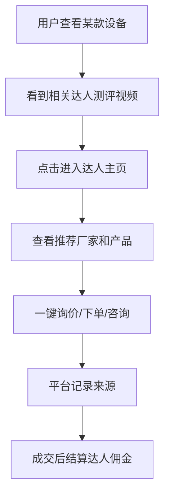

### 5.16.5 平台后台能力

| 后台能力 | 说明 |
|---|---|
| 达人入驻审核 | 身份、账号、影响力、内容质量 |
| 内容管理 | 视频、直播、图文、主页资料 |
| 绑定推广对象 | 产品、厂家、配件、活动、商机 |
| 分佣规则 | 按点击、线索、订单、成交分佣 |
| 数据看板 | 曝光、点击、咨询、成交、佣金 |
| 风险控制 | 虚假宣传、私下交易、投诉处理 |
| 结算管理 | 佣金确认、提现、对账 |

### 5.16.6 与平台生态的关系

达人和业务精英不是单独模块，而是能嵌入全平台：

- 为厂家微官网补充真实视频内容
- 为配件商城提供维修教学和适配讲解
- 为选品工具提供“专家推荐方案”
- 为商机平台提供信任背书
- 为番禺线上探店补充内容生产能力
- 为平台营销服务提供活动传播能力

---

## 5.17 圈子社区

游戏机运营是一个专业、小众、强经验、强关系的行业。外行业的人即使有资金和资源，也未必能运营好场地。因此行业从业者非常重视圈子、人脉、信息差、区域朋友和共同兴趣。平台应建设“圈子”功能，把游艺圈从工具平台升级为行业社交入口。

### 5.17.1 圈子定位

圈子是面向游戏游艺行业的内容和关系网络，形态可以参考贴吧、微博、行业论坛和朋友圈信息流。

核心价值：

- 让用户找到当地同行、厂家、业务员、达人、服务人员。
- 让行业经验、观点、热点、爆料、运营心得自然流动。
- 给达人和业务精英持续曝光场景。
- 给平台日报、热搜、商机、趋势指数提供内容来源。
- 提高用户留存和打开频率。

### 5.17.2 圈子板块

| 板块 | 内容 |
|---|---|
| 区域圈 | 广东圈、番禺圈、成都圈、郑州圈、东北圈等 |
| 达人圈 | 达人主页、视频内容、观点、直播预告 |
| 厂家圈 | 新品、促销、展会、探厂、招聘、合作 |
| 业务圈 | 业务员交流、客户需求、销售心得、合作机会 |
| 场地运营圈 | 开店经验、活动玩法、会员运营、回本讨论 |
| 维修技术圈 | 故障案例、配件经验、维修资料交流 |
| 合作开店圈 | 有资金找经验、有场地找资金、有团队找项目 |
| 二手设备圈 | 二手机台、整场转让、库存处理 |
| 政策合规圈 | 文审、政策、风险提醒、地方动态 |

### 5.17.3 内容能力

任何账号都可以在圈子中发表内容，但权限和展示权重应根据身份、信用和历史表现动态调整。

支持内容：

- 发文
- 图片
- 视频
- 话题标签
- 评论
- 点赞
- 收藏
- 转发
- 私聊
- 关注用户
- 关注圈子
- 举报

内容可关联：

- 厂家
- 产品
- 配件
- 商机
- 资料
- 政策
- 达人
- 区域

### 5.17.4 热点话题与日报联动

圈子内容应与平台日报、热搜、推荐系统联动。

机制：

- 热门话题进入首页热榜。
- 高质量帖子可进入每日简报。
- 区域热点推送给当地用户。
- 政策和风险类话题进入政策预警池。
- 设备和配件讨论反向影响产品热度指数。
- 达人内容可进入达人推荐和直播活动页。

### 5.17.5 社交与私聊

私聊功能应帮助用户建立行业关系，但要控制骚扰。

建议规则：

- 用户可关注、私聊、交换名片。
- 新用户私聊频率受限。
- 被多人投诉的账号限制私聊。
- 平台可提供“交换联系方式”按钮，避免用户在公开内容里留微信和电话。
- 商业沟通可引导进入询价、商机或订单流程。

### 5.17.6 内容审核机制

圈子必须建立内容审核机制，防止垃圾、广告、违规、侵权和恶意攻击。

审核流程：

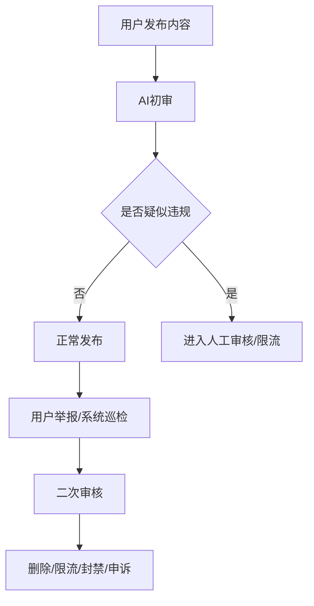

AI 初审重点：

- 垃圾广告
- 违规联系方式
- 色情低俗
- 赌博诈骗
- 政策敏感
- 人身攻击
- 虚假宣传
- 侵权图片和视频
- 恶意刷屏

### 5.17.7 圈子增长价值

圈子是长期流量池，不应一开始就收费。前期重点是鼓励发帖、关注、互动、转发和交友，后续可在成熟后探索：

- 达人话题推广
- 厂家新品话题
- 圈子置顶
- 活动报名
- 直播导流
- 高级社群服务

---

## 5.18 热搜推荐、趋势指数与个性化体验

平台要让用户不仅能“查到”，还要能“被提醒”。用户打开游艺圈时，应自然看到行业正在热什么、大家在搜什么、哪些厂家和配件人气上升、哪些地区和品类正在变化。

### 5.18.1 热搜推荐

热搜体系可以覆盖：

| 热搜类型 | 示例 |
|---|---|
| 热搜词 | 娃娃机、文审机、礼品机、二手赛车机、番禺厂家 |
| 热门点击 | 今日点击最多的产品、厂家、商机、资料 |
| 人气厂家 | 搜索高、询价多、收藏多、成交多的厂家 |
| 人气配件 | 高频搜索和高频下单配件 |
| 热门商机 | 浏览多、付费查看多、匹配度高的求购/出售 |
| 热门地区 | 广州、番禺、成都、郑州、沈阳等区域热度 |
| 政策热词 | 某省文审、某地检查、设备下架、消防合规 |

搜索框体验：

- 输入前展示热搜词。
- 输入时自动补全关键词。
- 支持拼音、错别字、别名和行业俗称。
- 支持“搜产品、厂家、配件、文审、商机、资料”多类型联想。
- 支持拍照搜索和文字搜索并列。

### 5.18.2 趋势指数

可以做成“游艺圈行业指数”，类似百度指数，但聚焦游戏游艺行业。

数据维度：

| 指数 | 说明 |
|---|---|
| 搜索指数 | 某关键词被搜索的次数趋势 |
| 点击指数 | 产品、厂家、商机被点击的趋势 |
| 询价指数 | 某类设备、厂家、配件被询价的趋势 |
| 成交指数 | 平台内有成交记录的趋势 |
| 配件需求指数 | 高频维修和耗材需求变化 |
| 区域热度指数 | 某地区设备、商机、政策热度 |
| 政策风险指数 | 某地区政策和执法动态活跃程度 |

展示形式：

- 7 天、30 天、90 天趋势图。
- 同比、环比变化。
- 上升最快榜。
- 地区分布图。
- 相关词推荐。
- 相关厂家、产品、配件、商机推荐。

### 5.18.3 关联推荐

用户看一个内容时，平台应自动推荐强相关内容。

| 当前行为 | 推荐内容 |
|---|---|
| 看某款设备 | 同类设备、相似厂家、适配配件、达人测评 |
| 看某厂家 | 同类厂家、该厂家热销产品、竞品动态 |
| 看某配件 | 适配机型、维修资料、相关供应商 |
| 看某商机 | 相似商机、同地区区域厂家、周边服务商、相关厂家 |
| 查某政策 | 相关设备、风险地区、文审动态 |
| 看某达人 | 相关产品、直播活动、推荐厂家 |

### 5.18.4 个人习惯与关注

平台应记忆用户习惯，但要给用户清晰控制权。

个人化内容：

- 搜索历史
- 浏览历史
- 关注厂家
- 关注产品
- 关注配件
- 关注地区
- 关注品类
- 关注政策
- 关注达人
- 常用标签

用户控制：

- 可清除搜索历史。
- 可清除浏览历史。
- 可关闭个性化推荐。
- 可取消关注标签。
- 可屏蔽不感兴趣内容。
- 敏感行为和联系方式应遵守隐私规则。

推荐排序原则：

1. 用户关注内容优先。
2. 用户常搜品类优先。
3. 所在地区相关内容优先。
4. 高时效商机优先。
5. 高信用厂家和供应商优先。
6. 广告推广必须清楚标识。

---

## 5.19 5G 电玩专区

5G 电玩是线上线下互联的新型游戏游艺形态。用户通过互联网和物联网技术远程操作线下真实游戏机，本质仍是线下游戏机的延伸，不是传统手游。该方向有政策鼓励空间，也有助于行业探索新的消费场景。

### 5.19.1 定位

5G 电玩专区用于收录和展示远程可玩的线下游戏机运营商、设备方案、体验入口和合作案例。

平台价值：

- 帮助用户理解 5G 电玩不是手游，而是线下设备远程化。
- 帮助运营商展示真实设备、机房、玩法和体验区。
- 帮助厂家了解哪些设备适合远程化。
- 帮助场地老板判断是否能增加线上收入。
- 为平台带来导流分佣和商家入驻收入。

### 5.19.2 专区内容

| 模块 | 内容 |
|---|---|
| 运营商主页 | 公司介绍、设备规模、机房实景、运营地区 |
| 设备展示 | 可远程玩的设备、玩法、画面、文审状态 |
| 体验区跳转 | 一键跳转到运营商小程序、APP 或 H5 体验区 |
| 技术方案 | 摄像头、网络、物联网控制、延迟优化 |
| 合规资料 | 文审信息、线下设备属性、平台说明 |
| 合作案例 | 场地接入案例、收益模型、运营数据 |
| 商务合作 | 厂家合作、场地合作、代理合作 |

### 5.19.3 体验流程

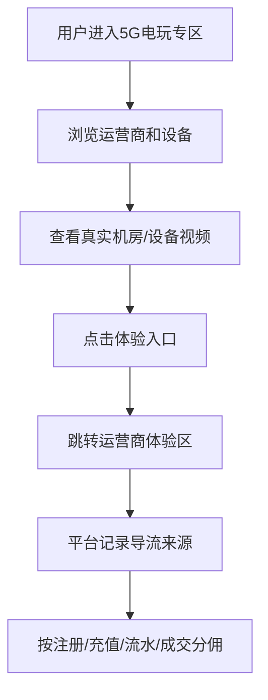

### 5.19.4 商业模式

- 运营商入驻费。
- 运营商会员费。
- 首页和专区推广费。
- 一键跳转导流分佣。
- 按注册、充值、有效用户或流水分佣。
- 厂家远程化设备推广服务。
- 场地接入咨询服务。

### 5.19.5 风险控制

5G 电玩专区需要特别注意合规表达：

- 明确展示其线下实体设备属性。
- 标注文审和设备合规信息。
- 避免与网络游戏、博彩、非法抽奖混淆。
- 对外部跳转平台进行资质审核。
- 平台不为外部运营商的充值和运营承诺背书，除非签署明确合作协议。

---

## 5.20 UI 风格规划

游艺圈的 UI 风格建议定位为：

> 科技感、简洁、高可信、带轻度游戏电子风。

不要做成过重的游戏娱乐网站，也不要做成传统 B2B 黄页。它应该像一个专业数据工具，但有行业温度和电子娱乐识别度。

### 5.20.1 设计关键词

- 专业
- 高效
- 数据感
- 科技感
- 电子感
- 清晰
- 可信
- 轻量游戏氛围

### 5.20.2 视觉方向

| 设计项 | 建议 |
|---|---|
| 主色 | 深蓝黑、科技蓝、青色、少量电光绿或紫色点缀 |
| 背景 | 大面积干净浅色或深色数据面板，两端可分主题 |
| 卡片 | 简洁、信息密度高、圆角控制在 8px 内 |
| 图标 | 线性科技图标，配合少量游戏设备图标 |
| 字体 | 清晰易读，避免过度装饰 |
| 数据图表 | 趋势线、热力图、榜单、指数卡片 |
| 游戏感 | 用在按钮高亮、标签、动效和专区，不要全站过度霓虹 |
| 信任感 | 认证、来源、更新时间、信用评分要突出 |

### 5.20.3 首页信息层级

首页第一屏建议不是营销大图，而是“AI 搜索 + 数据规模 + 高频入口”。

结构：

1. 顶部品牌和导航。
2. 大号 AI 搜索框，支持文字、语音、图片。
3. 搜索框下方展示热搜词。
4. 数据规模：厂家数、产品数、配件数、文审数、今日商机。
5. 高频入口：查厂家、拍照找设备、查文审、AI 选品、配件商城、5G 电玩。
6. 今日热榜：热搜、热门厂家、人气配件、热门商机。
7. 个性化关注：我的地区、我的品类、关注厂家更新。

### 5.20.4 页面风格分区

| 页面 | 风格 |
|---|---|
| 首页 | 数据门户感，像行业搜索引擎 |
| 搜索页 | 类似专业搜索工具，结果清晰、筛选强 |
| 厂家页 | 企业信用主页，突出产品、视频、认证、客服 |
| 产品页 | B2B 商品详情 + 文审信息 + 询价入口 |
| 配件商城 | 更接近电商，突出规格、适配、库存、发货 |
| 商机页 | 信息流 + 筛选器，强调时效和有效性 |
| 趋势指数页 | 数据看板，图表清晰，有百度指数的感觉 |
| 5G 电玩页 | 更有游戏电子感，可用深色、视频、体验按钮 |
| 达人页 | 内容主页，视频优先，连接产品和商机 |
| 后台 | 安静、稳定、高密度，偏 SaaS 管理工具 |

### 5.20.5 交互原则

- 搜索永远是第一入口。
- AI 客服常驻但不遮挡内容。
- 用户少填表，多通过 AI 自动补全。
- 结果页优先展示可信度、更新时间、来源。
- 付费点前置说明清楚，不制造误点。
- 商机、配件、询价都要有状态追踪。
- 个性化推荐要能关闭和清除历史。

### 5.20.6 可参考网页风格

这些不是照抄对象，只作为气质参考：

| 参考 | 可借鉴点 |
|---|---|
| [Linear](https://linear.app/) | 简洁、高级、效率工具感 |
| [Sensor Tower](https://sensortower.com/) | 数据看板、趋势和行业分析感 |
| [Razer](https://www.razer.com/) | 游戏电子风、硬件科技氛围 |
| [NVIDIA GeForce NOW](https://www.nvidia.com/en-us/geforce-now/) | 云游戏、远程体验、科技视觉 |
| [Product Hunt](https://www.producthunt.com/) | 新品发现、热榜和社区感 |

---

## 6. 数据采集与数据治理

## 6.1 数据来源

| 来源 | 说明 |
|---|---|
| 厂家主动上传 | PDF、Word、图片、视频、产品表 |
| 用户主动发布 | 求购、出售、转让、服务需求 |
| 公开网站 | 政府网站、公开行业网站、展会信息 |
| 电商平台 | 公开商品信息，需注意平台规则 |
| 短视频平台 | 公开视频与账号线索，需注意授权与规则 |
| 行业纸媒 | 杂志、画册、展会资料 |
| 区域厂家 | 本地行情、代理、销售、合作开店能力 |
| 周边服务商 | 装机、送货、维修等本地服务能力 |
| 用户调研 | 场地情况、流行机台、满意度 |
| AI 客服 | 用户搜索不到的信息、真实需求 |
| 配件供应商后台 | 商品、库存、价格、适配关系、履约数据 |
| 达人/业务精英 | 视频内容、直播活动、客户线索、合作数据 |
| 用户行为数据 | 搜索、点击、关注、收藏、询价、下单，用于热搜和个性化 |
| 5G 电玩运营商 | 设备、机房、体验入口、用户导流和合作数据 |
| 潜在会员库 | 手机号、微信号、微信群、视频号、抖音号、网站线索、展会名片等 |

## 6.2 数据匹配等级

| 等级 | 说明 |
|---|---|
| 强匹配 | 文审编号一致、厂家确认、型号一致 |
| 中匹配 | 图片一致、名称相似、参数接近 |
| 弱匹配 | 品类一致、外观相似、来源相关 |
| 待确认 | 网络来源，缺少明确归属 |
| 风险匹配 | 可能贴牌、代理、盗图、信息冲突 |

前端要清楚显示：

- 已认证
- 厂家确认
- 平台整理
- 网络线索
- 待核验
- 争议信息

## 6.3 厂家权益保护

厂家或信息来源方应有权利保护自己的信息。

机制：

- 厂家认领
- 信息纠错
- 申请下架
- 投诉侵权
- 屏蔽产品
- 永久屏蔽厂家或账号
- 客服人工处理
- 数据来源说明

---

## 6.4 潜在会员库与拉新转化系统

平台需要建立独立的潜在会员库，用于承接全网挖掘、历史客户资料、微信群资源、视频号/抖音号线索、手机号线索和爬虫获取的公开线索。目标不是简单堆数据，而是持续筛选、去重、分类、触达、转化和清理，实现最大化转化效率，同时降低重复营销成本。

### 潜在会员库定位

潜在会员库与正式会员库分开管理：

- 潜在会员库：尚未注册或尚未确认身份的行业线索。
- 正式会员库：已经注册、认证或产生平台行为的用户。
- 无效会员池：多轮触达无效、明确拒绝、信息错误、重复无价值的线索。

### 线索来源

| 来源 | 示例 |
|---|---|
| 公司历史资源 | 现有 30 万全行业潜在客户群 |
| 手机号资料 | 厂家、老板、业务员、服务商手机号 |
| 微信资源 | 微信号、微信群、群名片、群内公开名片 |
| 短视频平台 | 视频号、抖音号、快手号、直播间主页 |
| 公开网络 | 官网、黄页、B2B、展会、招聘、公众号 |
| 线下活动 | 展会名片、探厂、招商会、培训会 |
| 用户邀请 | 已有会员邀请、达人导流、商家转介绍 |

### 线索标签

潜在会员需要自动打标签，并支持人工修正。

| 标签维度 | 示例 |
|---|---|
| 身份类型 | 厂家、个人买家、业务员、服务商、游戏机运营商、达人、未知 |
| 来源渠道 | 手机号、微信群、抖音、视频号、展会、B2B、人工导入 |
| 地区 | 省、市、区、产业带 |
| 业务方向 | 机台销售、场地运营、配件、维修、装机、送货、合作开店 |
| 可信度 | 高、中、低、待核验 |
| 转化状态 | 未触达、已触达、已注册、已认证、已付费、无效 |
| 触达次数 | 1 次、2 次、3 次、多轮 |
| 最后触达时间 | 最近一次营销或沟通时间 |

### 去重与转化流程

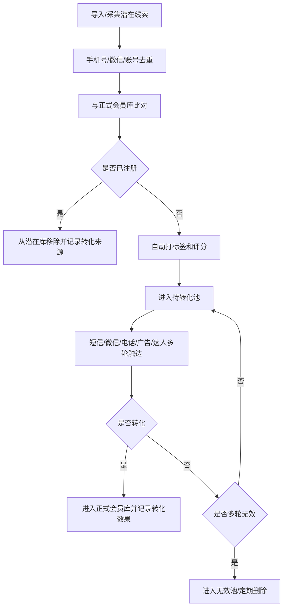

### 转化策略

潜在会员不应全部用同一种方式触达，应按标签分层：

| 线索类型 | 转化方式 |
|---|---|
| 厂家 | 邀请免费生成微官网、上传产品库、领取询盘 |
| 个人买家 | 邀请免费查厂家、看文审、生成配置单 |
| 业务员 | 邀请使用报价单、客户配置工具、商机线索 |
| 服务商 | 邀请入驻服务地图，获取本地装机/送货/维修订单 |
| 游戏机运营商 | 邀请参与场地调研、区域数据、运营知识 |
| 达人 | 邀请开通达人主页、内容展示、推广分佣 |

### 转化效果记录

每条线索应记录：

- 来源渠道
- 导入批次
- 标签和评分
- 触达方式
- 触达次数
- 是否注册
- 是否认证
- 是否发布产品/商机
- 是否付费
- 是否产生订单
- 转化成本
- 最终状态

### 无效池机制

建立无效会员池，避免反复浪费成本。

进入无效池的条件：

- 手机号无效
- 微信号无效
- 明确拒绝
- 多轮触达无响应
- 与行业无关
- 重复低质线索
- 投诉营销骚扰

无效池策略：

- 不再进入常规待转化队列。
- 定期复查少量高价值线索。
- 到期清理无价值数据。
- 避免重复导入、重复触达。

### 合规边界

潜在会员库涉及个人信息和营销触达，必须控制合规风险：

- 尽量使用合法来源和授权来源。
- 对手机号、微信号等个人信息进行权限控制。
- 营销触达要有退订、拒收和投诉机制。
- 避免骚扰式高频触达。
- 不向外部泄露潜在线索库。
- 对敏感字段进行脱敏展示和访问日志记录。

---

## 7. 用户调研奖励机制

平台需要持续获取行业最紧迫、最真实的信息。用户调研是重要数据来源。

### 调研对象

- 场地老板
- 厂家老板
- 厂家业务员
- 区域经销商
- 维修人员
- 玩家消费者

### 调研内容

| 对象 | 调研内容 |
|---|---|
| 场地老板 | 门店规模、品类结构、收入区间、热门机台、币值 |
| 厂家 | 收到无效信息情况、热门产品、客户预算 |
| 业务员 | 成交地区、客户需求、竞品情况 |
| 服务商 | 本地装机、送货、维修需求、热门配件、常见故障 |
| 用户 | 平台满意度、功能建议、数据准确性反馈 |

### 奖励形式

- 积分
- 现金红包
- 商机查看券
- 会员天数
- 资料下载券
- 询价加速
- 数据贡献者标识

需要防刷机制：

- 实名认证
- 设备限制
- 异常提交识别
- 交叉验证
- 人工抽查

---

## 8. 商业模式

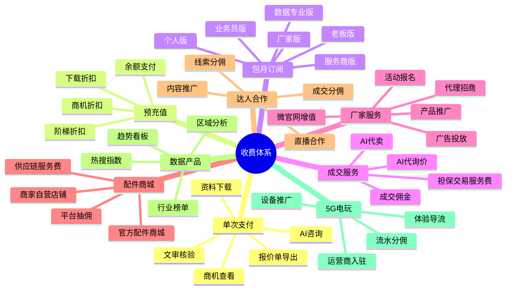

### 8.1 单次支付

- 查看商机联系方式
- 下载高价值资料
- 导出高级报价单
- 单次 AI 咨询
- 单次文审核验

### 8.2 预充值

充值越多折扣越高：

- 充值 100 元
- 充值 300 元
- 充值 1000 元
- 企业大额充值

可用于：

- 商机查看
- 资料下载
- AI 咨询
- 报价导出
- 推广服务

### 8.3 包月订阅

| 版本 | 适合用户 | 权益 |
|---|---|---|
| 免费版 | 普通用户 | 基础查询、部分日报 |
| 入门版 | 小老板、业务员 | 商机折扣、基础选品 |
| 老板版 | 场地经营者 | 高级选品、政策预警、运营资料 |
| 厂家版 | 厂家 | 微官网、产品管理、询盘管理 |
| 服务商版 | 周边服务商 | 服务地图展示、本地服务商机订阅 |
| 数据版 | 高级会员、企业用户、大客户 | 行业报告、区域数据、趋势看板 |

### 8.4 成交与服务费

- 向厂家收取成交佣金
- AI 代卖收取咨询费或服务费
- 担保交易收取服务费
- 区域厂家和周边服务线索收费
- 定制推广收费
- 配件订单平台抽佣
- 官方配件仓库服务费
- 达人推广分佣服务费

### 8.5 配件商城收入

| 收入类型 | 说明 |
|---|---|
| 商家自营抽佣 | 入驻配件店自行销售，平台按订单抽佣 |
| 官方商城差价/服务费 | 平台统一前端和服务标准，按供货价与售价差额或服务费盈利 |
| 供应商会员 | 优质展位、更多商品数、数据工具、批量导入能力 |
| 广告推广 | 配件搜索页、类目页、设备适配页广告 |
| 急件服务 | 加急发货、同城服务、维修配件包 |

### 8.6 达人与业务精英合作收入

| 收入类型 | 说明 |
|---|---|
| 推广服务费 | 厂家购买达人推广、探厂、直播活动 |
| 线索分佣 | 达人带来的有效询价、商机线索结算 |
| 成交分佣 | 达人或业务精英促成交易后分佣 |
| 直播活动费 | 平台组织专场直播、展会报名、招商会 |
| 知识服务分成 | 维修、运营、选品课程或咨询服务分成 |

### 8.7 5G 电玩收入

| 收入类型 | 说明 |
|---|---|
| 运营商入驻 | 5G 电玩运营商入驻专区 |
| 展示推广 | 专区推荐位、首页入口、榜单推广 |
| 导流分佣 | 按注册、充值、有效用户或流水分佣 |
| 设备方案推广 | 为厂家远程化设备做推广 |
| 场地接入服务 | 场地老板接入 5G 电玩方案的咨询服务 |

### 8.8 数据趋势收入

| 收入类型 | 说明 |
|---|---|
| 高级指数 | 热搜、点击、询价、成交趋势高级数据 |
| 行业报告 | 区域、品类、厂家、配件、政策专题报告 |
| 厂家数据包 | 厂家查看竞品热度、关注趋势和客户需求 |
| 服务商数据包 | 本地装机、送货、维修、配件、场地需求趋势 |

---

## 8.9 增长、收费与实施路线

平台收费模式要简单易懂、低门槛、可持续。早期核心目标不是把每个功能都收费，而是快速建立数据量、商家量、买家习惯和真实成交记录。

核心原则：

1. 对买家低门槛：先让用户觉得信息有用、规则简单、费用不贵。
2. 对商家给希望：让商家感受到能拿到询盘和订单，愿意完善资料。
3. 对平台控风险：联系方式、图片水印、担保交易、退款投诉要有规则。
4. 对增长友好：小程序利于转发裂变，APP 承载深度经营。

### 收费模块与定价开关

平台所有未来可能收费的模块，建议在开发阶段就按照“可收费能力”设计，但上线初期可以通过后台把价格设置为 0，实现限时免费推广。

后台应支持：

| 能力 | 说明 |
|---|---|
| 价格配置 | 每个功能可设置免费、固定价格、阶梯价格、会员价 |
| 限时免费 | 设置开始时间、结束时间、免费原因和前端提示 |
| 区域定价 | 不同地区可配置不同价格 |
| 身份定价 | 个人用户、厂家、业务员、服务商可配置不同价格 |
| 活动价 | 新用户、邀请用户、达人导流用户可享受活动价 |
| 价格为 0 | 功能走完整付费流程，但实际不扣费，便于后续平滑收费 |
| 收费灰度 | 先对部分城市、部分用户、部分功能开启收费 |

建议策略：

- 前期检索、信息查阅、圈子、基础商机浏览、基础厂家展示全部免费。
- 功能模块按收费标准开发完成，但后台价格统一配置为 0。
- 前端明确提示“限时免费”，为后续收费做心理预期。
- 待数据量、用户量、成交效果成熟后，再择机开启收费。
- 开始收费时优先从高价值、低争议功能开始，例如联系方式查看、AI 代询价、高级数据报告、推广位、成交服务。

### 阶段 1：冷启动期

目标：做大数据量和用户认知。

免费内容：

- 基础搜索
- 厂家名展示
- 产品信息展示
- 文审基础查询
- 热搜榜基础版
- 商家基础入驻
- 厂家微官网基础版
- 配置单基础生成
- 基础商机浏览

低价收费：

- 查看联系方式限时 1 元/次。
- 高价值商机可按 10-50 元/条试点。
- 资料下载部分免费，部分低价。

商家侧：

- 免费入驻。
- 免费上传产品。
- 免费生成基础微官网。
- 鼓励完善营业执照、产品图、视频、文审资料。
- 开通“商家买单主动询价”的商家优先展示。

### 阶段 2：验证付费期

目标：验证用户是否愿意为有效信息、报价和工具付费。

开始收费：

- 联系方式查看保持低价。
- 高价值商机分级收费。
- 配置单高级导出收费。
- AI 代询价按次数或服务包收费。
- 厂家推广位收费。
- 商家买单主动询价按线索收费。

免费继续保留：

- 基础查询。
- 基础商家展示。
- 基础微官网。
- 基础产品上传。
- 基础热搜和榜单。

### 阶段 3：规模化期

触发条件：

- 厂家入驻数量达到一定规模。
- 产品库和商机库能形成稳定流量。
- 平台有真实成交和询价数据。
- 买家开始习惯用平台比价和生成配置单。

新增收费：

- 厂家会员。
- 数据专业版。
- 配件商城抽佣。
- 担保交易服务费。
- 达人和推广分佣。
- 高级行业指数和区域报告。
- APP 深度经营工具订阅。

### 阶段 4：生态成熟期

目标：平台从信息平台升级成行业交易和数据基础设施。

成熟收入：

- 成交佣金。
- 配件商城佣金或官方仓库差价。
- 厂家会员和广告。
- 数据报告和指数订阅。
- 5G 电玩导流分佣。
- 线下活动、展会、探厂、招商会服务费。

### 简化收费表达

面向用户的规则应尽量简单：

| 用户看到的规则 | 说明 |
|---|---|
| 查信息免费 | 基础厂家、产品、文审、榜单免费查 |
| 看联系方式低价 | 限时 1 元查看联系方式，降低决策门槛 |
| 商家买单可免费联系 | 开通主动询价的商家，买家免费询价 |
| 深度工具再收费 | 高级导出、AI 代询价、数据报告收费 |
| 成交服务平台保障 | 使用平台收款、担保、协议，平台收服务费 |

消费者视角最佳体验：

- 先看到完整信息，再决定是否付费看联系方式。
- 价格低、规则短、按钮清楚。
- 被收费前明确告诉用户买到什么。
- 付费后如果信息无效，有反馈和补偿机制。
- 商家买单的内容清楚标识“免费询价”。
- 平台推荐理由清晰：匹配度、信用、热度、资料完整度。

平台长期增长路径：

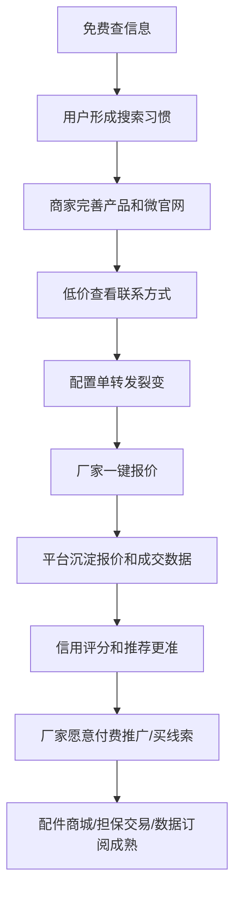

这条路线的重点是：早期不靠高价拦用户，而靠低价高频、商家买单、配置单裂变、数据沉淀和交易服务逐步变现。

---

## 9. 技术架构建议

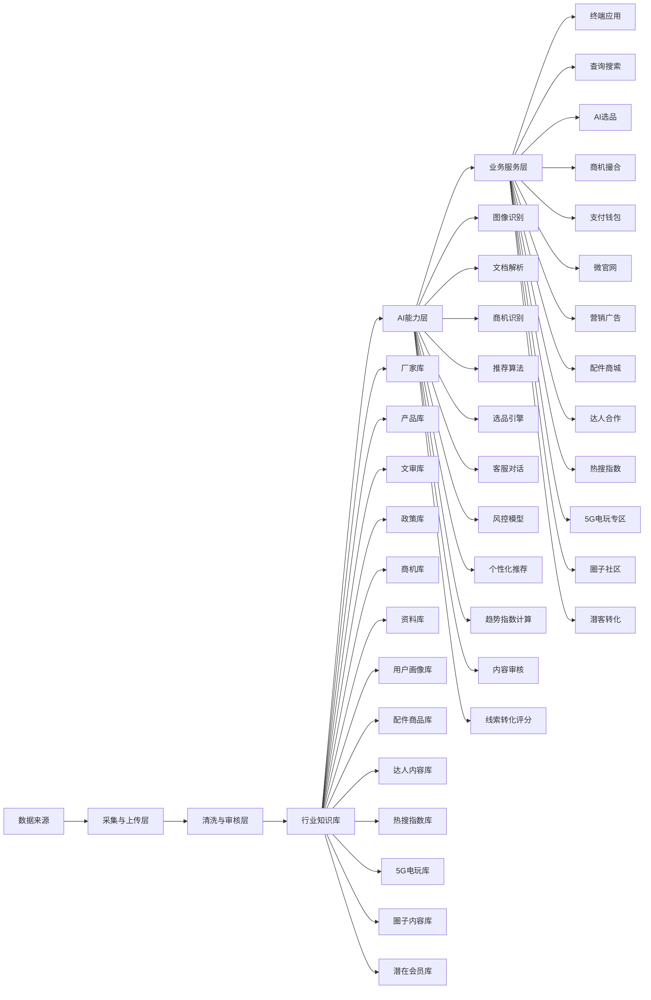

### 9.1 推荐技术组件

| 组件 | 说明 |
|---|---|
| 关系型数据库 | 用户、订单、产品、厂家、商机 |
| 搜索引擎 | 全文搜索、模糊匹配、拼音、别名 |
| 向量数据库 | 图片、文本、产品语义匹配 |
| 对象存储 | 图片、视频、PDF、程序包 |
| OCR 服务 | 图片文字、PDF、Word 解析 |
| AI 大模型 | 客服、摘要、分类、信息抽取 |
| 推荐系统 | 用户画像、行为、关联推荐 |
| 风控系统 | 支付、商机、资料下载、虚假信息 |
| 审核系统 | 人工审核、复核、投诉处理 |
| 商品系统 | 配件 SKU、库存、价格、适配机型、订单履约 |
| 分佣系统 | 达人、业务员、供应商、平台之间的佣金结算 |
| 埋点分析 | 搜索、点击、收藏、询价、支付、跳转等行为数据 |
| 指数计算 | 热搜榜、点击榜、区域趋势、品类趋势 |
| 个性化推荐 | 用户标签、关注内容、历史记录、兴趣排序 |
| 配置引擎 | 一站式选品流程、条件、排序、输出模板后台配置 |
| 报价系统 | 配置单转发、厂家一键报价、报价互相保密、买家汇总对比 |
| 水印风控 | 默认水印、联系方式识别、作弊水印打码和封禁策略 |
| 内容社区 | 圈子、发帖、评论、私聊、关注、话题和举报 |
| 审核系统 | AI 初审、人工复核、举报处理、封禁申诉 |
| 潜客系统 | 潜在会员导入、去重、标签、触达、转化、无效池 |
| 定价系统 | 功能价格、限时免费、价格为 0、灰度收费和会员价 |

---

## 10. 核心技术难点

| 难点 | 说明 | 优先级 |
|---|---|---|
| 数据采集合规 | 微信、平台、电商、短视频信息采集涉及授权、隐私和平台规则 | 极高 |
| 厂家资料标准化 | PDF、Word、图片、海报格式混乱，需要自动解析和人工复核 | 高 |
| AI 识图准确率 | 设备相似、贴牌、盗图、改名销售导致识别困难 | 高 |
| 文审核验 | 二维码识别、gov 链接判断、官方信息解析、下架状态同步 | 高 |
| 产品归属判断 | 同款设备可能多厂家销售、代理或贴牌 | 高 |
| 商机有效性 | 虚假、过期、重复、联系不上会严重影响体验 | 高 |
| 推荐算法公平性 | 需要兼顾采购用户体验、厂家竞争、广告推广和平台收益 | 高 |
| 支付合规 | 平台钱包、收款、担保交易涉及支付牌照和二清风险 | 极高 |
| 厂家权益保护 | 删除、屏蔽、认领、纠错、投诉必须流程化 | 高 |
| 资料下载安全 | 程序包、驱动可能带病毒或侵权，需要审核和杀毒 | 高 |
| 3D 探店采集 | 拍摄成本、更新频率、商户授权、地图交互 | 中 |
| 用户调研真实性 | 防刷、防假数据、奖励成本控制 | 中 |
| AI 广告体验 | 广告不能破坏客服和搜索可信度 | 中 |
| 配件 SKU 标准化 | 通用零配件型号多、叫法乱、适配复杂，容易买错 | 高 |
| 配件履约质量 | 库存不准、发货慢、售后差会伤害平台信任 | 高 |
| 官方商城分单 | 多供应商供货时要按库存、价格、距离、信用智能分单 | 高 |
| 达人合作归因 | 内容曝光、线索、订单、成交分佣需要可靠追踪 | 中 |
| 达人内容风控 | 防止虚假宣传、夸大承诺、私下交易和低质内容 | 中 |
| 热搜指数反作弊 | 防刷搜索、刷点击、刷榜，避免误导行业判断 | 高 |
| 个性化隐私 | 搜索历史、关注标签、行为画像需要用户可控和可清除 | 高 |
| 5G电玩合规表达 | 需要明确线下实体设备属性，避免与不合规线上娱乐混淆 | 高 |
| 产品分类标准化 | 大分类按场景、小分类按玩法/功能，既要通俗又要支撑搜索统计 | 高 |
| 电子协议签署 | 文审整机交易需自动生成协议、归档订单、明确平台责任边界 | 高 |
| 平台有限担保 | 收款、发货跟进、提现条件、售后争议需要规则化，避免无限责任 | 极高 |
| AI助理触达控制 | 代询价、代卖、合作开店撮合要控制人数、时间、频率和暂停机制 | 高 |
| 厂家保密报价 | 多厂家报价必须互相隔离，只让买家看到汇总，避免价格泄露和串价 | 高 |
| 图片联系方式识别 | 识别电话、微信、二维码和绕平台水印，误杀和漏检都要控制 | 高 |
| 收费规则简洁性 | 买家付费、商家买单、会员、佣金并存时，要避免用户理解成本过高 | 高 |
| 圈子内容审核 | 社交内容开放后，垃圾广告、违规信息、人身攻击和虚假宣传会增加 | 高 |
| 私聊骚扰控制 | 行业社交要促进关系，但要限制新号骚扰、广告私信和违规引流 | 高 |
| 潜在会员合规 | 手机号、微信号、短视频账号等线索涉及个人信息和营销触达边界 | 极高 |
| 潜客去重和转化归因 | 多渠道线索重复率高，需要准确判断是否已注册、已转化、已无效 | 高 |
| 定价开关一致性 | 功能走付费流程但价格为 0 时，订单、权限、统计和后续收费要一致 | 中 |

---

## 11. 合规与风险边界

### 11.1 数据采集

建议优先采用：

- 用户主动提交
- 厂家主动上传
- 公开政府数据
- 授权合作方数据
- 群主或行业情报员授权投稿
- 人工确认有效性

对微信群聊天记录、个人联系方式、私域社群内容的自动采集，要高度谨慎。未经明确授权的聊天内容、手机号、微信号、交易意向可能涉及隐私、个人信息保护和平台规则风险。

### 11.2 支付收款

平台收款钱包不能自行违规沉淀资金，建议接入合规第三方支付、分账、担保交易或电商交易解决方案。

重点关注：

- 实名认证
- 资金监管
- 分账合规
- 退款机制
- 投诉处理
- 反洗钱和异常交易
- 发票和税务后续安排

### 11.3 文审合规

平台应表述为：

> 根据公开文审信息、官方链接、二维码解析和人工复核结果，提供合规参考。

避免承诺“百分百合法”或替代监管部门判断。

### 11.4 配件商城

官方配件商城涉及平台统一展示、第三方供货和售后责任边界。早期应明确：

- 商品由谁提供
- 库存由谁维护
- 发货由谁负责
- 售后由谁承担
- 平台是否担保
- 买错配件如何处理
- 侵权配件、盗版程序和来源不明商品如何禁止

建议先做商家自营，积累履约数据后，再将高频标准品纳入官方配件商城。

### 11.5 达人合作

达人和业务精英合作需要明确广告标识、推广责任和分佣规则。

重点关注：

- 推广内容审核
- 虚假宣传责任
- 广告标识
- 私下交易风险
- 佣金归因规则
- 客户隐私保护
- 平台、达人、厂家之间的合作协议

### 11.6 个性化与行为数据

热搜、指数和个性化推荐依赖用户行为数据，但必须让用户有控制权。

重点关注：

- 搜索历史可清除
- 浏览历史可清除
- 个性化推荐可关闭
- 敏感搜索不用于公开展示
- 热搜榜防刷和异常过滤
- 数据看板展示聚合数据，避免暴露个人行为

### 11.7 5G 电玩专区

5G 电玩专区展示的是线上线下互联的线下游戏机远程体验模式，应明确：

- 是否有真实线下设备
- 设备是否有文审或相关合规资料
- 运营商资质和合作协议
- 外部跳转后的支付、充值、售后责任
- 平台导流和运营商服务责任边界

---

## 12. MVP 第一阶段建议

第一阶段目标：验证行业用户是否愿意持续使用，是否愿意为商机、选品、资料和询价付费。

### 12.1 第一阶段必须做

| 模块 | 功能 |
|---|---|
| 厂家库 | 录入 300-500 家核心厂家 |
| 产品库 | 录入 1000-3000 个常见产品 |
| 文审库 | 建立基础文审查询和二维码识别 |
| 商机 | 求购、出售、二手、转让 |
| AI 客服 | 文本、图片输入，支持找设备、找厂家 |
| AI 识图 | 先支持设备图、二维码、铭牌识别 |
| 选品工具 | 输入地区、面积、预算，生成基础清单 |
| 厂家微官网 | 自动生成厂家主页和产品列表 |
| 资料上传解析 | 支持 PDF/Word/图片解析，人工审核后上架 |
| 付费体系 | 单次支付、预充值、基础会员 |
| 后台审核 | 产品、商机、资料、厂家、投诉 |
| 配件商城基础 | 先支持商家自营店铺、商品录入、搜索和订单 |
| 达人主页基础 | 支持达人/业务精英入驻、主页、视频号链接、合作信息 |
| 热搜推荐基础 | 搜索框热词、热门点击、人气厂家、人气配件 |
| 个人历史基础 | 搜索历史、关注标签、可清除记录 |
| 5G 电玩基础 | 专区、运营商主页、体验区跳转 |
| 产品分类标准 | 三大产品类和两级分类后台维护 |
| 协议模板库 | 游戏机销售协议、文审整机免责协议、二手转让协议 |
| AI助理限制 | 默认人数/时间限制、阶段性同步、暂停功能 |
| 水印和风控 | 默认游艺圈水印、图片联系方式检测、违规处理 |
| 配置单报价 | 配置单转发、厂家一键报价、买家后台报价对比 |
| 主动询价服务 | 商家买单、优先展示、买家免费联系 |
| 圈子基础版 | 发帖、评论、点赞、关注、举报、AI 初审 |
| 潜在会员库 | 导入、去重、标签、转化状态、无效池 |
| 定价开关 | 功能价格配置、限时免费、价格为 0 |

### 12.2 第一阶段可选做

- 区域厂家和周边服务地图基础版
- 每日简报
- 报价单导出
- 平台收款基础订单
- 用户调研奖励
- 厂家认领
- 配件商品批量导入
- 达人内容推荐位
- 业务精英个人橱窗
- 热搜趋势图基础版
- 5G 电玩导流统计
- 在线电子签约
- 平台有限担保订单
- 私聊与好友
- 圈子话题进入日报
- 潜客触达效果统计

### 12.3 第一阶段暂缓

- 大规模 3D 线上探店
- 完全自动全网采集
- 深度竞品推荐算法
- 完整担保交易
- 大规模资料程序包下载
- 复杂知识图谱
- 官方配件商城全量分单
- 深度达人分佣自动结算
- 类百度指数的深度行业指数
- 复杂用户画像推荐模型
- 大规模私聊关系链
- 自动化多渠道营销触达

---

## 13. 建议开发阶段

### 阶段 1：数据与查询基础

- 厂家库
- 产品库
- 文审库
- 搜索
- 后台审核
- 基础小程序
- 配件类目和 SKU 标准
- 热搜词和基础埋点
- 定价开关和价格为 0

### 阶段 2：AI 工具与商机

- AI 客服
- AI 识图
- 商机发布和查看
- 选品工具
- 报价单导出
- 单次支付和预充值
- 商家自营配件店铺
- 达人/业务精英主页
- 搜索历史和关注标签
- 5G 电玩专区基础版
- 圈子基础版
- 潜在会员库基础版

### 阶段 3：厂家与服务商生态

- 厂家微官网
- 厂家认领
- 区域厂家和周边服务地图
- 厂家工作台
- 业务员工具
- AI 代询价和 AI 代卖
- 配件供应链后台
- 达人内容合作和直播活动
- 热搜榜单和趋势指数
- 5G 电玩运营商合作
- 圈子话题运营
- 潜客转化运营

### 阶段 4：交易与信用

- 平台收款
- 分账结算
- 担保交易
- 信用评分
- 成交记录
- 投诉风控
- 配件订单履约评分
- 达人推广归因和分佣
- 5G 电玩导流归因
- 个性化推荐
- 私聊风控
- 会员转化归因

### 阶段 5：行业权威与营销

- 每日简报
- 行业大数据看板
- 政策预警
- 文审动态
- 番禺线上探店
- 广告推广
- 活动报名
- AI 交互广告
- 官方配件商城
- 多供应商智能分单
- 行业达人矩阵
- 游艺圈行业指数
- 5G 电玩行业专区升级
- 圈子社区生态
- 营销自动化

---

## 14. 首页建议信息架构

首页需要同时体现“数据量大、工具好用、商机及时、平台可信”。

建议首页模块：

1. 顶部 AI 搜索框：支持文字、语音、图片。
2. 数据规模展示：厂家数、产品数、文审数、电玩城数、今日商机。
3. 快捷入口：查厂家、拍照找设备、查文审、AI 选品、找商机。
4. 今日商机：求购、出售、二手、转让。
5. 热门产品榜：全国榜、区域榜、品类榜。
6. 政策与文审动态。
7. 热搜指数：热搜词、热门点击、人气厂家、人气配件。
8. 个性化关注：关注厂家、关注品类、关注地区、最近搜索。
9. 厂家推荐、区域厂家和周边服务。
10. 每日简报。
11. 番禺产业带线上探店入口。
12. 配件商城入口：常用配件、急件、维修件。
13. 5G 电玩专区入口。
14. 圈子社区入口：区域圈、达人圈、运营圈、维修圈。
15. 行业达人和业务精英入口。
16. AI 客服悬浮入口。

---

## 15. 平台关键指标

### 数据指标

- 厂家收录数
- 已认证厂家数
- 产品收录数
- 文审设备数
- 全国电玩城数
- 具备区域服务能力的厂家数
- 周边服务商数
- 资料文件数
- 配件 SKU 数
- 入驻配件供应商数
- 达人/业务精英数
- 热搜关键词数
- 5G 电玩运营商数
- 圈子帖子数
- 圈子活跃用户数
- 潜在会员数
- 潜客转化数

### 商业指标

- 今日新增商机
- 商机付费查看率
- 询价转化率
- 成交撮合数
- 充值用户数
- 会员订阅数
- 厂家推广收入
- 配件订单数
- 配件复购率
- 达人带来的线索数
- 达人成交分佣金额
- 5G 电玩导流点击数
- 5G 电玩导流分佣收入
- 指数/数据报告付费数
- 潜客转化成本
- 限时免费功能转付费率

### 体验指标

- 搜索成功率
- AI 识图匹配率
- 商机有效率
- 用户投诉率
- 资料审核通过率
- 客服转人工率
- 用户建议采纳数
- 配件发货时效
- 配件售后率
- 达人内容点击转化率
- 搜索联想点击率
- 热搜点击率
- 个性化推荐点击率
- 历史记录清除入口使用率
- 圈子内容审核通过率
- 圈子举报处理时效
- 潜客重复率
- 潜客无效率

---

## 16. 总结

游艺圈最终要形成三个核心壁垒：

1. 数据壁垒：厂家、产品、文审、政策、商机、区域厂家、周边服务、场地数据长期沉淀。
2. 工具壁垒：AI 识图、AI 选品、AI 询价、AI 代卖、报价清单、文审核验。
3. 信用壁垒：厂家微官网、平台收款、成交记录、实地认证、投诉下架、信用评分。
4. 供应链壁垒：配件商城、官方配件仓库、区域厂家、周边服务和履约数据。
5. 流量壁垒：行业达人、业务精英、直播活动和内容种草网络。

这套平台真正有价值的地方，不是简单把信息搬到一起，而是让行业用户感觉：

> 我在游艺圈能更快找到靠谱信息，更快做决策，更快成交，也更少被骗。
