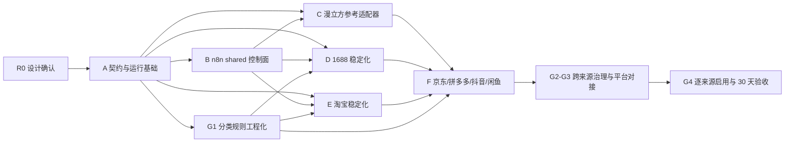

# 游艺圈数据工作流总纲

> **For agentic workers:** REQUIRED SUB-SKILL: Use `superpowers:subagent-driven-development` (recommended for the current session) or `superpowers:executing-plans` (for a separate execution session) to implement this plan task-by-task. Use `superpowers:test-driven-development` for every behavior change and `superpowers:verification-before-completion` before marking a task complete. Steps use checkboxes for status tracking.

版本：V1.0

日期：2026-07-15

状态：唯一现行总纲，设计已确认并进入实施

**Goal:** 建成一套可持续运行的数据资产生产线：以 n8n 作为共享控制面，以七个独立来源适配器作为执行面，在公开或授权边界内持续形成可追溯、可恢复、可比较的 L0-L2 资产，并按版本化契约生成可回执的 L3 交付。

**Architecture:** 所有来源共用请求、状态、锁、重试、质量、人工门禁、告警和回执契约；漫立方、1688、淘宝、京东、拼多多、抖音和闲鱼分别拥有独立采集与解析实现。公共核心字段、类型化属性事实和原始全字段并存。逻辑数据集先以版本化 Schema/JSONL 实现，正式数据库 DDL、迁移、业务表写入和前端渲染仍由平台负责人确认并实施。

**Tech Stack:** Python 3.11、pytest 9、JSON Schema Draft 2020-12、n8n、Playwright、requests、JSON/JSONL、SHA-256、现有 pandas/openpyxl/Pillow；n8n 运行方式、任务执行器和锁存储由 A1 现场核验后固定，不在未核验前虚构部署结论。

# 第一部分：项目与技术总纲

## 1. 文档权威与阅读方式

本文是游艺圈数据工作的唯一现行总纲，集中定义项目定位、职责边界、数据分层、跨来源技术设计、逻辑数据模型、n8n 控制面、平台对接边界、实施路线图、当前状态和下一执行点。

发生冲突时按以下顺序处理：

1. 用户最新明确指令。
2. 本总纲。
3. 当前来源的 `data-workflow/adapters/<source>/README.md`，仅负责来源特有边界、命令、能力、字段和运行证据。
4. `docs/游艺圈游戏游艺设备完整分类清单.md`，仅负责分类、平台类目映射、关键词和范围规则。
5. `游艺圈数据导入字段规范_v2.md`，仅负责当前 L3 Excel 兼容格式。
6. `docs/project-split/` 与 `docs/requirements/`，仅作受保护历史背景；只有 `docs/requirements/信息整理.md` 接收新增确认需求。

同一事实只在最高职责文件定义。`README.md` 与 `AGENTS.md` 只提供入口和执行约束，不复制业务规则、动态状态或实施内容。来源状态和启用值只读取 `data-workflow/orchestration/n8n/configs/source_registry.json`。

普通任务的最小阅读顺序为：本总纲 → 当前来源 README → 相关 Schema/测试。只有分类任务再读分类清单，只有 L3 Excel 兼容任务再读字段规范，只有明确需要历史产品背景时才读受保护历史文档。

## 2. 项目定位与确认决策

- 游艺圈是游戏游艺设施商品与厂家信息供应平台，不是商城，不负责交易功能。
- 数据目标是在公开或授权边界内建立可追溯的全量信息镜像，不代表绕过验证码、签名、权限、限流或平台规则。
- 1688、淘宝、京东、拼多多、抖音和闲鱼分别建设独立公开数据采集适配器；漫立方等邀约商户优先使用授权 API、授权文件或已验证链路。
- n8n 是共享控制面；Python/Node 和来源专用自动化是执行面。
- 总体结构采用“共享控制面、独立来源适配器”。
- 共享触发、状态、锁、重试、质量、人工门禁、告警和交付契约，不强行共享不同平台的登录、页面解析、字段、资质或风控实现。
- 数据侧尽可能完整保留来源字段、原值、证据和历史变化，不因当前平台缺少消费字段而裁剪 L0-L2。
- 字段融合采用“公共核心字段 + 类型化属性事实 + 原始全字段”，不强求每个平台字段完全对齐。
- 商品、SKU、店铺、公司、厂家角色、资质、媒体和文档分别建模；`shop ≠ company ≠ manufacturer`。
- 跨平台相似记录只建立匹配候选，不静默覆盖来源事实。
- 分类清单用于采集范围、平台类目映射、关键词覆盖和分类候选；数据侧不决定平台最终展示分类。
- 数据侧不设计、迁移或维护正式业务数据库，不直接写正式产品库。
- 不得由数据侧直接写入正式产品库，禁止绕过平台校验直接写正式业务表。
- 平台负责人按已确认 L3/API/权限隔离契约完成校验、审核、正式写库和渲染。

正式工作路径为：

- `data-workflow/orchestration/n8n/`
- `data-workflow/adapters/<source>/`
- `data-workflow/runtime/`
- `data-workflow/deliveries/`

六个大平台通过公开数据爬虫建立全量镜像；漫立方等邀约入驻行业店铺优先使用授权数据 API。

## 3. 职责边界

### 3.1 数据负责人

- 来源发现、能力矩阵、公开/授权边界和停止条件。
- 六个大平台独立爬虫，以及邀约商户授权 API、文件和公开资料适配。
- L0 原始响应、页面、文件、图片、请求元数据、来源证据和哈希归档。
- L1 来源实体、完整来源字段、原值与标准值。
- L2 关系、快照、变化、字段观测、匹配候选、质量问题和复核队列。
- n8n 数据工作流、触发、锁、重试、熔断、人工门禁、告警和运行报告。
- 按双方确认的版本化契约生成可重建 L3。

### 3.2 平台负责人

- 正式数据库、表结构、迁移、索引、权限和生产维护。
- 正式业务 ID、平台枚举、审核状态、分类发布、搜索和字段渲染。
- 导入 API 或权限隔离的 `ingest/staging` 接收区。
- L3 校验、错误回执、审核、晋级、发布和回滚。
- 小程序、APP、Web 后台及交易相关能力。

### 3.3 双方共同确认

- L3 契约版本、核心字段、扩展属性、长度、枚举和必填规则。
- 来源唯一键、交付幂等键、正式实体匹配和合并规则。
- 商品—SKU—店铺—公司—厂家关系及跨平台候选处理。
- 图片、视频、文档和对象存储引用方式。
- 分类候选、平台最终分类、错误回执、复核回传和回滚方式。

## 4. 数据分层与运行目录

| 层级 | 内容 | 约束 |
|---|---|---|
| L0 | 原始 JSON/HTML/CSV/XLSX/PDF/图片、请求响应元数据、来源链接、采集时间、批次和哈希 | 不覆盖，是重放和审计依据 |
| L1 | 来源商品、SKU、店铺、公司、厂家角色、资质、媒体、完整来源字段和标准化值 | 保留平台语义，不受正式库字段限制 |
| L2 | 关系、动态快照、属性事实、变化、实体匹配候选、分类候选、质量和复核 | 冲突、不确定性和缺失原因显式保存 |
| L3 | XLSX/CSV/JSONL/API 请求体、对象存储引用或约定接收包 | 可从 L0-L2 重建，不反向覆盖 L0-L2 |

```text
定时 / Webhook / 条件 / 人工触发
                  ↓
          n8n shared 控制面
                  ↓
       独立来源 workflow / adapter
                  ↓
             L0 → L1 → L2
                  ↓
       质量门禁 / 人工复核门禁
                  ↓
                 L3
                  ↓
       平台校验、审核、写库和发布
```

新运行统一保存为：

```text
data-workflow/runtime/runs/<source>/<run_id>/
├─ run_request.json
├─ run_manifest.json
├─ run_result.json
├─ stages/<NN>_<stage>/
│  ├─ stage_request.json
│  ├─ stage_result.json
│  └─ artifacts.json
├─ checkpoints/
├─ review/
├─ l0/
├─ l1/
└─ l2/
```

阶段幂等单位为 `run_id + stage + partition + input_fingerprint`。只有上次阶段成功、输入指纹一致且产物哈希仍有效时才允许恢复跳过；状态文件先写临时文件再原子替换。

## 5. 来源能力与独立适配器

| 来源 | 商品/SKU | 店铺 | 公司/厂家 | 资质 | 主要约束 | 定位 |
|---|---|---|---|---|---|---|
| 漫立方 | 已有完整批次 | 来源方信息 | 主体仍需按证据核验 | 正式授权 API 待提供 | 当前链路含人工抓包 | 离线 replay 与 L0-L3 参考 |
| 1688 | 丰富 | 丰富 | 公司、工厂、供应商信息丰富 | 公开主体和平台资质较丰富 | 登录、403/429、滑块 | 丰富字段和厂家关系参考 |
| 淘宝 | 商品与详情可采 | 可采 | 厂家通常稀疏 | 通常有限 | 登录、风控、结构变化 | 稀疏字段参考 |
| 京东 | 商品与店铺可采 | 可采 | 部分店铺可见主体 | 资质入口可能反复滑动验证 | 人工验证频繁 | 人工门禁参考 |
| 拼多多 | 商品为主 | 依公开页面 | 厂家字段可能稀疏 | 依公开能力 | 类目扁平、标题污染 | 二次范围判断参考 |
| 抖音 | 依公开能力 | 可变 | 厂家字段不稳定 | 依公开能力 | 类目变化、风控 | 类目快照参考 |
| 闲鱼 | 二手刊登为主 | 卖家语义不同 | 厂家通常不能确认 | 非核心 | 弱类目、强文本、状态波动 | 文本和人工复核参考 |

能力字段状态统一为 `supported`、`partial`、`gated`、`unavailable`、`unknown`，每次变更必须带版本、验证时间和证据批次。质量门禁按来源能力计算，不能要求淘宝达到 1688 的厂家字段覆盖率。

每个平台 adapter 分为：

| 阶段 | 作用 |
|---|---|
| `precheck` | 登录、凭据、磁盘、依赖、字段/类目版本检查 |
| `discover` | 类目、关键词、店铺和商品种子发现 |
| `product-list` | 低成本商品索引与变化发现 |
| `product-detail` | 详情、参数和 SKU |
| `shop` | 店铺来源记录，不推断工商主体 |
| `company` | 公司、工厂和资质证据，独立低频运行 |
| `media` | 内容寻址下载和实体关系 |
| `normalize` | L0 到 L1 来源实体 |
| `diff` | 与 accepted baseline 比较形成 L2 |
| `validate` | 来源能力感知质量和复核队列 |
| `package` | 通过门禁后生成 L3 |
| `resume/repair` | 按检查点局部补采 |

## 6. 字段融合、缺失和冲突

公共核心字段用于跨平台搜索、排序、基本展示和关系；平台特有和长尾字段进入类型化属性观测；原始字段名、字段路径、原值和未知扩展完整保留。

每条属性观测至少包含：属性码、原始标签、原始值、typed value、原始/标准单位、值状态、缺失原因、来源、观测时间、规则/模型版本、置信度、复核状态和证据引用。

缺失状态必须区分：

| 状态 | 含义 |
|---|---|
| `present` | 有有效观测值 |
| `not_provided` | 来源没有展示或明确未提供 |
| `not_accessible` | 当前公开/授权路径不可访问 |
| `not_applicable` | 对该实体不适用 |
| `not_requested` | 本次 mode 未请求 |
| `parse_failed` | 疑似有值但解析失败 |
| `source_changed` | 页面/接口结构变化 |
| `normalization_failed` | 原值存在但标准化失败 |
| `conflict` | 同一语义存在冲突观测 |
| `redacted` | 因权限或敏感策略脱敏 |
| `unknown` | 证据不足 |

未知不能用空字符串、`0`、`无` 或 `-` 伪造。工厂面积与厂房面积必须分别映射 `factory_area_sqm` 和 `factory_building_area_sqm`，不得互相回填。

冲突先保存全部 claim，再生成当前选择值。选择值记录 `selected_observation_id`、策略版本、理由和置信度；不同来源语义不设全局优先级。工商主体优先官方/主体资质，价格库存使用对应来源最新成功快照，各平台市场销量保持独立。低置信度实体合并、工商主体和认证结论必须人工或平台确认。

公共端有值才展示，未提供字段不占空位；价格、库存、销量、资质和厂家能力显示来源及截至时间；来源披露不能渲染为游艺圈认证。

## 7. 实体与关系

- `shop`：平台账号或经营店铺。
- `company`：来源展示的工商主体。
- `manufacturer`：公司或店铺相对于商品承担的厂家角色。
- `supplier`、`distributor`、`brand_owner`：其他业务角色。
- 同一公司可有多个店铺；店铺不能仅凭名称自动绑定公司。
- 每个平台商品是独立来源刊登，跨平台同款只建立匹配候选。

关系至少支持 `published_by`、`sold_by`、`supplied_by`、`manufactured_by`、`brand_owned_by`、`legal_entity_of`、`authorized_distributor_of`、`compatible_with`，并保存来源、有效时间、方法、置信度、复核状态、冲突原因和证据。

## 8. 数据侧推荐逻辑数据集

这些逻辑数据集可实现为 JSONL、Parquet、分析库或权限隔离 staging。它们是数据侧推荐逻辑模型，不是正式库迁移授权，不得直接写入正式业务表。

| 数据集 | 核心内容与键 |
|---|---|
| `source_definition` | 来源类型、授权方式、adapter/key/capability/boundary 版本；唯一键 `source` |
| `collection_run` | run、mode、baseline、版本、配置 hash、触发、状态、检查点和结果；唯一键 `run_id` |
| `source_product` | 来源商品 UID/ID、名称、URL、品牌/型号候选、来源类目、状态和时间；`UNIQUE (source, source_product_id)` |
| `source_sku` | 来源商品下的 SKU ID、规格、价格库存和状态；来源商品+SKU 唯一 |
| `sku_option` | 规格组、规格值、顺序和媒体关系 |
| `source_shop` | 店铺 UID/ID、member ID、名称、URL、地区、状态和时间 |
| `source_company` | 公司 UID/ID、工商原名/标准名、统一社会信用代码、注册信息和核验状态 |
| `entity_relation` | 左右实体、关系类型、有效期、方法、置信度、复核和证据 |
| `attribute_definition` | 属性码、类型、单位、适用实体、敏感度和版本 |
| `attribute_observation` | 原始/标准值、单位、值状态、时间、版本、置信度和证据 |
| `qualification_claim` | 资质类型、证书号、颁发方、有效期、来源声明与核验状态 |
| `platform_signal_snapshot` | 平台等级、认证、响应、交易等来源信号快照 |
| `source_evidence` | evidence ID、SHA-256、URI、媒体类型、大小、来源 URL、请求指纹、HTTP 状态和时间 |
| `evidence_locator` | evidence 内字段路径、CSS/JSONPath/页码/区域等定位信息 |
| `media_asset` / `entity_media` | 内容哈希媒体及其与实体的用途、顺序和状态关系 |
| `metric_snapshot` | 价格、库存、销量、供货状态等动态值和观测时间 |
| `change_event` | 实体字段/关系/状态变化、前后值、baseline、证据和确认状态 |
| `entity_match_candidate` | 左右 UID、matcher 版本、输入 hash、得分、信号、决定和复核 |
| `classification_candidate` | 来源类目、清单版本、候选分类、范围三态、置信度、理由和证据 |
| `quality_rule_result` | 规则版本、对象、实际/期望、严重度、结论和 evidence |
| `quality_issue` | 稳定 issue fingerprint、实体、路径、严重度、原因、状态和次数 |
| `review_item` | 复核类型、实体、字段、优先级、候选、状态、负责人、结论和证据 |
| `delivery_batch` | contract/version、delivery/source/run/baseline/mode、幂等、质量、限制和 checksums |
| `delivery_receipt` | receipt、批次状态、数量、Schema/记录错误、重试、平台 ID 和反馈 |

推荐唯一与查询索引遵循：来源实体使用 `source + source_id`；动态快照使用实体+指标+时间倒序；证据使用 SHA-256、run 和来源 URL；问题使用 fingerprint；复核使用状态+优先级+时间；交付使用幂等键和 delivery ID。正式索引仍由平台负责人按实际数据库确认。

## 9. 分类与采集范围

- 平台类目映射、专用关键词、同义词、排除词和边界规则只以分类清单为权威。
- 平台词库保持独立，不能把全平台词简单去重后在每个平台全部执行。
- 范围判断使用 `included`、`excluded`、`review_required` 三态。
- 无法确定时进入复核，不生成正式分类；A14 只表示真实综合/主题/非标设备，不是未知收容项。
- 规则带版本、平台、验证时间、证据、有效率和启用状态；平台类目树变化保存版本快照。
- 数据侧只产生分类候选、置信度和理由，平台侧负责正式分类晋级和展示。

## 10. n8n shared 控制面

Master 固定流程为：请求规范化 → 触发去重 → registry 门禁 → 获取锁 → 调用来源 workflow → 校验结果 → 状态路由 → 重试/人工/质量/交付分支 → 完成运行 → 释放锁 → 告警。

支持的触发方式：

| 触发方式 | 用途 |
|---|---|
| 定期/定时 | 全量基线、增量扫描、类目树和来源健康检查 |
| 自动触发 | 授权 API 事件、上游完成和依赖就绪 |
| 条件触发 | 新鲜度超限、结构变化、数量异常和质量下降 |
| Webhook | 入驻店铺同步、合作方文件和平台回执 |
| 人工任务 | 登录、验证码、异常补采和高风险复核 |

Shared 子工作流包括 request normalizer、trigger deduplicator、lock manager、stage runner、result validator、status router、retry breaker、review gate、quality gate、alert router、receipt handler 和 stale run reconciler。

锁至少包括：

- `source:<source>:write`
- `profile:<source>`
- `resource:<runner>:browser`

锁存储必须支持原子 compare-and-set、租约续期和 fencing token；部署拓扑未核验前不虚构具体 backend。

重试只用于明确可重试错误，配置最大次数、退避、抖动和熔断窗口。验证码、滑块、登录失效、权限不足和来源结构变化转人工或停止，不自动绕过或无限重试。

## 11. 统一状态与结果契约

正常状态：

```text
created → prechecking → ready → collecting → raw_archived
→ normalizing → matching → enriching → validating
→ waiting_review / packaging → delivered → completed
```

异常状态及控制动作：

| 状态 | 动作 |
|---|---|
| `retryable_failed` | 按策略退避重试，达到上限熔断 |
| `rate_limited` | 长退避、降频并告警 |
| `login_required` | 停止并创建人工登录任务 |
| `human_verification_required` | 停止受影响链路并保存恢复点 |
| `source_changed` / `parser_drift` | 禁止正常交付，进入结构复核 |
| `quality_rejected` | 禁止 package/delivery，进入质量复核 |
| `manual_stopped` | 保留检查点，不自动恢复 |
| `permanently_disabled` | 禁止触发，等待重新评估 |

`partial_success` 不是自动交付状态，必须映射为复核、质量拒绝或可重试失败；宽泛 `blocked` 必须拆成具体原因。失败、受限或局部扫描不得产生下架结论。

每次运行必须生成严格 `run_result.json`，至少包含 contract/workflow/adapter 版本、run/source/mode/status、时间、baseline、计数、artifacts/checksums、质量、复核、重试和结构化错误。n8n 只解析机器契约，不解析自然语言日志。

## 12. L3 交付与平台回执

每个交付包含：

- `delivery_manifest.json`：contract/version、delivery/source/run/baseline/mode、幂等键、数据集、质量、复核、限制和 checksums。
- `records.jsonl`：每条 record envelope 包含 record key、entity type、operation、source identity、core、attributes、relations、media、classification candidates、quality、evidence refs 和 observed time。
- 兼容 XLSX/CSV 或 API 请求体：只作为当前平台投影，不替代完整 L0-L2。

`delivery_receipt` 至少包含 contract/version、delivery/receipt ID、幂等键、接收/完成时间、批次状态、received/accepted/rejected/duplicate/pending_review 数量、Schema 错误、逐记录结果、平台契约版本、重试建议、平台 ID mapping 及分类/匹配反馈。

默认接入顺序：内部导入 API → 权限隔离 `ingest/staging` → L3 文件导入。平台校验、审核并写正式表，数据侧只在来源解析错误时修正 L0-L2，否则调整 L3 adapter。禁止绕过平台校验直接写 `public.product`、`public.accessory`、`public.manufacturer` 等正式业务表。

数据库快照仅作历史/当前环境和对接契约参考：PostgreSQL `192.168.1.98:5432`、数据库 `postgres`、Schema `public`、Navicat 连接名 `youyiquan`。工作区当前没有 `database/` 和 `database/public.sql`；这些信息不是直接写正式业务表的授权。密码只存未跟踪 `.env.local` 或受控凭据。

## 13. 全量、增量和下架

- 首次全量以类目、关键词、店铺等版本化分区建立 coverage ledger，记录游标、发现数、唯一数、重复数、完成证据和错误。
- “全量”只指公开/授权范围内所有已登记分区闭合；关键词结果不能单独证明平台全量。
- 后续按数据变化频率分层：价格/库存/销量高频，详情按变化补抓，店铺低频，公司资质独立低频，类目树和字段结构定期巡检。
- 内容哈希不变的图片不重复下载，但媒体关系和最后发现时间继续更新。
- accepted baseline 只由成功且通过质量门禁的运行推进。
- 只有完整遍历或来源明确状态才能确认下架；受限、解析失败、局部扫描和关键词漏覆盖只能形成疑似缺失。

## 14. 质量、安全和启用门禁

每批至少检查总数、成功数、唯一数、重复率、字段覆盖、图片成功率、新增/修改/下架/无变化、来源追溯、结构漂移和复核数量。

以下情况禁止自动交付：解析为 0、数量异常下降、关键字段或图片成功率显著下降、结构/枚举变化、大量价格归零、异常下架、AI Schema 失败或成本超限。

遇验证码、滑块、登录失效、403/429、权限不足、签名破解要求或非公开数据时停止当前路径，返回明确状态并转人工、降频或停用，不绕过限制。

来源申请启用必须同时具备：经过审查的来源 workflow JSON、受控凭据、严格离线 dry-run、在线小样本质量证据、失败/人工路由、全量/增量/恢复/幂等/回执验证和连续稳定运行证据。缺少任一项保持 `enabled=false`。

## 15. 平台接入前共同确认清单

平台接入前，用户和平台负责人共同确认：实体语义、自动/人工审核范围、业务 ID 与回传、稳定键与别名迁移、幂等作用域、API/staging/文件方式、版本兼容、字段类型长度精度单位时区、缺失/冲突枚举、分类与状态枚举、实体关系、资质展示条件、full/delta/下架/回滚、媒体存储与版权、质量/匹配阈值、复核 SLA、批次/记录回执和敏感数据权限。

这些确认完成前，数据侧可以建设 L0-L2 和 L3 候选契约，但不能把推荐逻辑模型当作正式数据库定稿。

## 16. 文档维护

- 本总纲只保留当前决策、技术设计、路线图和下一执行点，不保存对话或失败过程。
- 来源命令、能力、批次和证据只写对应 adapter README。
- 分类词、平台类目映射和范围规则只写分类清单。
- 当前 L3 Excel 列只写字段规范。
- 新确认业务需求只写 `docs/requirements/信息整理.md`。
- 已完成且结论进入本总纲的临时设计、计划和交接文档删除，不再建立平行入口。

# 第二部分：实施路线图

## 20. 执行规则

本部分只维护任务依赖、状态、产物、测试、验收和下一执行点；第一部分定义稳定业务与技术语义。

执行本路线图必须遵守：

- 不新增并行的“总体计划”“临时执行方案”或来源总计划；阶段进度只更新本文。
- 每次只允许一个任务处于 `进行中`。完成后勾选任务，并更新第 22 节当前执行点。
- 每个任务先增加失败测试或失败校验，再实现，再运行任务级和全量测试。
- 每个任务单独提交；提交不得混入运行资产、凭据、Cookie、浏览器 profile、图片库或无关用户改动。
- 需要真实登录、在线请求、人工滑块或平台侧契约时，先完成全部离线步骤，再停在明确门禁；不得用模拟成功替代缺失的外部条件。
- 平台来源的选择器、接口和字段路径只能来自脱敏证据或授权接口说明，不凭经验编造。
- 来源受限、登录失效、结构漂移或局部失败不能写成空成功、全量完成或下架。
- 所有来源保持 `enabled=false`，直到 G4 的逐来源启用门禁和稳定性验收完成。
- 数据侧只实现逻辑数据契约、L3 adapter 和接收回执处理，不创建或修改正式业务表。

## 21. 固定执行接口

### 21.1 统一命令

每个来源最终提供同一命令形态：

```powershell
python data-workflow/adapters/<source>/src/run_source.py `
  --request data-workflow/runtime/runs/<source>/<run_id>/run_request.json `
  --result data-workflow/runtime/runs/<source>/<run_id>/run_result.json
```

本文只有两个命令元变量：`<source>` 必须替换为 `manlifang`、`1688`、`taobao`、`jd`、`pinduoduo`、`douyin` 或 `xianyu`；`<run_id>` 必须替换为本次 `run_request.json` 中已经生成的 run ID。它们不是未决设计项。

离线门禁使用：

```powershell
python data-workflow/adapters/<source>/src/run_source.py `
  --request data-workflow/adapters/<source>/tests/fixtures/requests/dry_run.json `
  --result data-workflow/runtime/runs/<source>/<run_id>/run_result.json `
  --dry-run
```

命令退出约定：

| 退出码 | 含义 |
|---|---|
| `0` | Schema 合法且达到终态；终态仍可能是人工门禁或质量拒绝 |
| `2` | 请求或结果 Schema 不合法 |
| `3` | 配置、依赖、磁盘或凭据前置检查失败 |
| `4` | 来源受限、登录失效、人工验证或来源结构变化 |
| `5` | 可重试的采集/处理错误 |
| `6` | 不可重试的适配器错误 |

n8n 不以退出码单独判断业务状态；退出码用于进程级诊断，业务路由只读取通过 Schema 校验的 `run_result.json`。

### 21.2 Python 核心接口

`data-workflow/shared/src/data_workflow_core/models.py` 最终公开以下稳定接口：

```python
@dataclass(frozen=True)
class RunContext:
    run_id: str
    source: str
    mode: str
    run_dir: Path
    request: Mapping[str, Any]
    config_hash: str

class StageHandler(Protocol):
    def __call__(self, context: RunContext) -> Mapping[str, Any]: ...

def execute_stage(
    context: RunContext,
    stage: str,
    partition: str,
    handler: StageHandler,
) -> dict[str, Any]: ...
```

来源 `run_source.py` 只负责装配阶段，不复制原子写入、哈希、Schema 校验、幂等、状态映射和目录管理。

### 21.3 目录与机器契约

实施后机器契约集中在：

```text
data-workflow/contracts/
├─ schemas/
│  ├─ run_request.schema.json
│  ├─ stage_result.schema.json
│  ├─ checkpoint.schema.json
│  ├─ run_result.schema.json
│  ├─ source_entities.schema.json
│  ├─ observations.schema.json
│  ├─ quality_review.schema.json
│  ├─ delivery_manifest.schema.json
│  ├─ delivery_record.schema.json
│  └─ delivery_receipt.schema.json
└─ dictionaries/
   ├─ run_statuses.json
   ├─ error_codes.json
   ├─ missing_reasons.json
   ├─ relation_types.json
   └─ attribute_definitions.json
```

逻辑数据集到契约的唯一映射：

| 契约 | 包含的逻辑数据集 |
|---|---|
| `run_request` / `stage_result` / `checkpoint` / `run_result` | `source_definition`、`collection_run` 和运行控制 |
| `source_entities` | `source_product`、`source_sku`、`sku_option`、`source_shop`、`source_company`、`entity_relation` |
| `observations` | `attribute_definition`、`attribute_observation`、`qualification_claim`、`platform_signal_snapshot`、`source_evidence`、`evidence_locator`、`media_asset`、`entity_media`、`metric_snapshot`、`change_event` |
| `quality_review` | `entity_match_candidate`、`classification_candidate`、`quality_rule_result`、`quality_issue`、`review_item` |
| `delivery_manifest` / `delivery_record` / `delivery_receipt` | `delivery_batch`、L3 record envelope、`delivery_receipt` |

## 22. 当前状态与执行顺序

### 22.1 状态图例

| 标记 | 含义 |
|---|---|
| `[x]` | 产物、测试、验收和提交均完成 |
| `[ ]` | 未开始或尚未满足全部完成条件 |
| `阻塞` | 已完成所有内部步骤，缺少明确外部输入；必须记录缺项和恢复命令 |

### 22.2 当前执行点

- [x] R0：确认总体设计并建立唯一实施路线图。
- [ ] A1：核验 n8n、执行器、运行目录和锁存储部署拓扑。

下一执行命令：

```powershell
git status --short
Get-Command n8n -ErrorAction SilentlyContinue
docker compose version
```

如果本机没有 n8n 或 Docker，A1 仍需完成环境证据记录和可用性结论；B6 的真实导入/导出步骤保持阻塞，A2-A6 可继续。

### 22.3 阶段依赖



G1 是跨来源前置门禁：它在编号上位于 Phase G，但实际在 A4 完成后立即执行，不等待新平台 adapter；D3、E3 和 F1-F8 均依赖其机器规则。

建议投入估算为 85-160 人日，另加每个正式启用来源连续 30 个自然日的稳定性观察。范围差异主要来自平台在线验证、登录/风控、类目覆盖规模和平台接收契约到位时间；这不是交付日期承诺。

## 23. Phase A：契约与执行基础

### A1. 核验部署拓扑和运行边界

- [ ] 状态：未开始
- 依赖：R0
- 目标：用现场证据固定 n8n 版本/运行方式、Windows 浏览器执行器、运行目录、任务调用方式、锁存储和凭据边界。
- 新增文件：
  - `data-workflow/orchestration/n8n/deployment/inspect_environment.ps1`
  - `data-workflow/orchestration/n8n/deployment/topology.json`
  - `data-workflow/orchestration/n8n/deployment/README.md`
  - `data-workflow/tests/test_deployment_topology.py`

执行步骤：

1. 先写 `test_deployment_topology.py`，断言 `topology.json` 包含 `n8n`、`runner`、`runtime_storage`、`lock_store`、`credential_store`、`network_boundary`、`inspected_at`，且不含密码、Token 或 Cookie。
2. 运行测试并确认因文件缺失而失败：

   ```powershell
   .\.venv-data\Scripts\python.exe -m pytest data-workflow/tests/test_deployment_topology.py -q
   ```

3. 编写只读检查脚本，采集 `n8n --version`、`docker compose version`、Python 路径、工作区绝对路径、运行磁盘剩余空间和本机可用的调用方式；不读取凭据值。
4. `topology.json` 只能记录现场检测值。锁存储选择必须满足原子 compare-and-set 与租约续期；无法证明时写 `lock_store.status="unavailable"`，不得默认用普通文件锁宣称支持多执行器。
5. README 记录生产拓扑与本地开发拓扑、网络边界、凭据归属、n8n 到 runner 的最小调用接口和失败恢复命令。
6. 运行脚本和测试：

   ```powershell
   powershell -ExecutionPolicy Bypass -File data-workflow/orchestration/n8n/deployment/inspect_environment.ps1
   .\.venv-data\Scripts\python.exe -m pytest data-workflow/tests/test_deployment_topology.py -q
   ```

验收：测试通过；拓扑每个结论均可由检测命令复现；没有敏感值；若运行环境不可用，B6 明确阻塞但不影响离线基础建设。

提交：`git commit -m "chore: record workflow deployment topology"`

### A2. 建立严格 Schema 验证依赖和命令

- [ ] 状态：未开始
- 依赖：R0
- 修改文件：`data-workflow/pyproject.toml`
- 新增文件：
  - `data-workflow/tools/validate_contract.py`
  - `data-workflow/tests/test_validate_contract.py`

执行步骤：

1. 写失败测试，覆盖合法实例、缺少必填字段、未知字段、错误日期格式和错误枚举；CLI 对非法实例必须返回 `2` 并输出 JSON Pointer。
2. 在 dependencies 增加 `jsonschema>=4,<5`，不依赖当前 `.venv-data` 中并不存在的包。
3. `validate_contract.py` 使用 Draft 2020-12 validator 和 format checker，按 JSON Pointer 排序输出全部错误，不只返回第一条。
4. 更新本地环境：

   ```powershell
   .\.venv-data\Scripts\python.exe -m pip install -e "data-workflow[test]"
   ```

5. 验证：

   ```powershell
   .\.venv-data\Scripts\python.exe -m pytest data-workflow/tests/test_validate_contract.py -q
   .\.venv-data\Scripts\python.exe data-workflow/tools/validate_contract.py --help
   ```

验收：非法实例稳定返回退出码 `2`；错误包含实例路径和 Schema 路径；测试通过。

提交：`git commit -m "build: add strict json schema validation"`

### A3. 固化运行控制契约

- [ ] 状态：未开始
- 依赖：A2
- 新增文件：
  - `data-workflow/contracts/schemas/run_request.schema.json`
  - `data-workflow/contracts/schemas/stage_result.schema.json`
  - `data-workflow/contracts/schemas/checkpoint.schema.json`
  - `data-workflow/contracts/dictionaries/run_statuses.json`
  - `data-workflow/contracts/dictionaries/error_codes.json`
  - `data-workflow/tests/contracts/test_run_contracts.py`
- 修改文件：`data-workflow/contracts/schemas/run_result.schema.json`

执行步骤：

1. 写参数化失败测试，覆盖设计第 14、15 节的全部正常/异常状态，以及 `partial_success`、`blocked` 被拒绝。
2. `run_request` 必须含 `contract_version`、`run_id`、`source`、`mode`、`trigger`、`requested_scope`、`requested_at`；`mode` 限定为 `full`、`incremental`、`repair`、`dry_run`。
3. `stage_result` 必须含阶段、分区、输入指纹、状态、计数、产物及错误；成功状态禁止携带错误码，失败状态必须携带已登记错误码。
4. `checkpoint` 必须含 run/stage/partition、游标、输入指纹、已完成产物哈希和更新时间。
5. 把现有 `run_result` 改为 `additionalProperties:false`，对 source、status、counts、artifacts、quality_gate、错误组合增加严格约束；`status` 只引用机器字典中的状态集合。
6. 错误码至少覆盖登录、验证码/滑块、403、429、权限、来源变化、解析漂移、Schema、磁盘、网络、质量、人工停止和配置错误。
7. 验证：

   ```powershell
   .\.venv-data\Scripts\python.exe -m pytest data-workflow/tests/contracts/test_run_contracts.py -q
   .\.venv-data\Scripts\python.exe -m pytest data-workflow/tests -q
   ```

验收：全部状态有唯一控制语义；状态/错误/重试组合不一致时 Schema 拒绝；现有适配器不合规处被测试明确暴露，不通过放宽 Schema 迁就旧输出。

提交：`git commit -m "feat: define strict run control contracts"`

### A4. 固化逻辑数据集、缺失语义和交付契约

- [ ] 状态：未开始
- 依赖：A2、A3
- 新增文件：
  - `data-workflow/contracts/schemas/source_entities.schema.json`
  - `data-workflow/contracts/schemas/observations.schema.json`
  - `data-workflow/contracts/schemas/quality_review.schema.json`
  - `data-workflow/contracts/schemas/delivery_manifest.schema.json`
  - `data-workflow/contracts/schemas/delivery_record.schema.json`
  - `data-workflow/contracts/schemas/delivery_receipt.schema.json`
  - `data-workflow/contracts/dictionaries/missing_reasons.json`
  - `data-workflow/contracts/dictionaries/relation_types.json`
  - `data-workflow/contracts/dictionaries/attribute_definitions.json`
  - `data-workflow/tests/contracts/test_asset_contracts.py`
  - `data-workflow/tests/fixtures/contracts/`

执行步骤：

1. 从总体技术设计第 7-12、15-17 节逐项写失败测试和最小合法/非法 fixture。
2. `source_entities` 对每个来源实体强制 `source`、来源 ID/UID、首次/最后发现时间、来源状态和 evidence 引用；`shop`、`company` 和厂家角色使用不同定义。
3. `observations` 强制原始标签/值、typed value、单位、值状态、规则版本、时间、置信度和 evidence；无值必须使用已登记缺失原因，禁止用 `0` 或空文本表达未知。
4. 资质 claim 强制区分来源声明和游艺圈/颁发方核验，不允许来源披露自动变成认证。
5. `quality_review` 为匹配候选、分类候选、质量 issue 和人工任务提供稳定指纹、状态、理由和证据。
6. 交付 manifest/record/receipt 实现设计第 16 节的版本、幂等键、checksums、记录级错误和平台 ID 映射；所有 Schema 关闭未知顶层字段。
7. 字典先录入设计已确认的关系、缺失原因和 `factory_area_sqm`、`factory_building_area_sqm`；新增属性只能通过字典版本变更。
8. 验证：

   ```powershell
   .\.venv-data\Scripts\python.exe -m pytest data-workflow/tests/contracts -q
   ```

验收：第 21.3 节列出的全部逻辑数据集均有机器契约落点；店铺/公司/厂家不可混用；L3 与 receipt 可以独立校验。

提交：`git commit -m "feat: define data asset and delivery contracts"`

### A5. 建立共享 Python 运行内核

- [ ] 状态：未开始
- 依赖：A3、A4
- 新增文件：
  - `data-workflow/shared/src/data_workflow_core/__init__.py`
  - `data-workflow/shared/src/data_workflow_core/models.py`
  - `data-workflow/shared/src/data_workflow_core/atomic_io.py`
  - `data-workflow/shared/src/data_workflow_core/fingerprints.py`
  - `data-workflow/shared/src/data_workflow_core/contracts.py`
  - `data-workflow/shared/src/data_workflow_core/run_layout.py`
  - `data-workflow/shared/src/data_workflow_core/stage_runner.py`
  - `data-workflow/shared/tests/`
- 修改文件：`data-workflow/pyproject.toml`

执行步骤：

1. 先写测试覆盖原子 JSON/JSONL 写入、稳定 SHA-256、canonical JSON 指纹、run 目录创建、成功阶段恢复、产物哈希变化后重跑和异常结果落盘。
2. 在 pytest 配置加入 `shared/src` 的 Python path，保持现有 adapter 直接脚本命令可运行。
3. 实现第 2.2 节接口。状态文件先写同目录临时文件、flush/fsync 后 `os.replace`；异常也必须生成合法 stage result。
4. `execute_stage` 的跳过条件必须同时满足：同一幂等键、上次成功、输入指纹相同、全部产物存在且哈希相同。
5. Schema 校验失败不得写入正常结果；使用可诊断的 `schema_invalid` 错误结果和退出码 `2`。
6. 验证：

   ```powershell
   .\.venv-data\Scripts\python.exe -m pytest data-workflow/shared/tests -q
   ```

验收：断电/异常写入不会留下被误认作成功的半文件；恢复不会跳过被篡改或缺失的产物。

提交：`git commit -m "feat: add shared workflow execution core"`

### A6. 建立仓库级契约和 n8n 导出检查

- [ ] 状态：未开始
- 依赖：A3、A5
- 新增文件：
  - `data-workflow/tools/validate_repository.py`
  - `data-workflow/tools/validate_n8n_workflows.py`
  - `data-workflow/tests/test_validate_repository.py`
  - `data-workflow/tests/test_validate_n8n_workflows.py`
- 修改文件：`data-workflow/tests/test_governance_docs.py`

执行步骤：

1. 先写失败测试，覆盖缺少 adapter 入口、缺少 fixture、Schema 未引用、workflow 含凭据值、未知来源、未通过门禁却 enabled、重复 workflow 名称和不允许的 n8n Code 大任务。
2. repository validator 校验七来源目录、契约、registry、README 链接和忽略路径；运行资产不得被 Git 跟踪。
3. n8n validator 校验 JSON 可解析、workflow name/version/source 唯一、没有敏感值、节点引用的环境变量已登记、所有终态有路由、来源启用值与门禁证据一致。
4. governance 测试加入本总纲存在、设计状态已确认、README/AGENTS 指向唯一总纲的断言。
5. 验证：

   ```powershell
   .\.venv-data\Scripts\python.exe -m pytest data-workflow/tests/test_validate_repository.py data-workflow/tests/test_validate_n8n_workflows.py data-workflow/tests/test_governance_docs.py -q
   ```

验收：仓库能够在无 n8n 服务时完成静态离线门禁；workflow 导出中的敏感值或伪启用状态会导致测试失败。

提交：`git commit -m "test: enforce workflow repository contracts"`

## 24. Phase B：n8n shared 控制面

### B1. 版本化来源、状态、重试和质量配置

- [ ] 状态：未开始
- 依赖：A3、A4、A6
- 新增文件：
  - `data-workflow/orchestration/n8n/configs/status_routes.json`
  - `data-workflow/orchestration/n8n/configs/retry_policies.json`
  - `data-workflow/orchestration/n8n/configs/quality/manlifang.json`
  - `data-workflow/orchestration/n8n/configs/quality/1688.json`
  - `data-workflow/orchestration/n8n/configs/quality/taobao.json`
  - `data-workflow/orchestration/n8n/configs/quality/jd.json`
  - `data-workflow/orchestration/n8n/configs/quality/pinduoduo.json`
  - `data-workflow/orchestration/n8n/configs/quality/douyin.json`
  - `data-workflow/orchestration/n8n/configs/quality/xianyu.json`
  - `data-workflow/tests/orchestration/test_control_configs.py`
- 修改文件：`data-workflow/orchestration/n8n/configs/source_registry.json`

执行步骤：

1. 写失败测试，确保全部状态和错误码都有唯一动作，重试次数有上限，人工状态不可自动重试，七个平台质量配置互相独立。
2. 扩展 registry：加入 `workflow_version`、`adapter_version`、`contract_version`、`capability_matrix_ref`、`activation_evidence`、`last_promoted_at`；所有来源继续禁用。
3. `status_routes` 明确 `deliver`、`retry`、`wait_human`、`reject_quality`、`stop` 五类动作；`partial_success` 和宽泛 `blocked` 不得登记。
4. `retry_policies` 按错误码配置最大次数、退避、抖动、熔断窗口；登录、验证、权限和来源变化直接人工/停止。
5. 质量配置只登记已证实能力；未验证字段用 capability 状态控制，不设置虚构阈值。
6. 验证：

   ```powershell
   .\.venv-data\Scripts\python.exe -m pytest data-workflow/tests/orchestration/test_control_configs.py -q
   ```

验收：任何来源都不能通过修改一个布尔值绕过证据门禁；淘宝不会被要求达到 1688 厂家字段覆盖率。

提交：`git commit -m "feat: version workflow control policies"`

### B2. 实现请求规范化和触发去重

- [ ] 状态：未开始
- 依赖：A5、B1
- 新增文件：
  - `data-workflow/shared/src/data_workflow_core/request_normalizer.py`
  - `data-workflow/shared/src/data_workflow_core/deduplication.py`
  - `data-workflow/shared/tests/test_request_normalizer.py`
  - `data-workflow/shared/tests/test_deduplication.py`
  - `data-workflow/orchestration/n8n/fixtures/requests/`

执行步骤：

1. 先测试 scheduled、webhook、conditional、manual 四种触发归一到同一 run request。
2. `run_id` 按 `<source>_<mode>_<YYYYMMDD_HHMMSS>` 生成；测试固定时钟，避免非确定断言。
3. 幂等键使用 `source + mode + requested_scope_hash + scheduled_window`；scope canonical JSON 后再哈希。
4. 重复触发返回现有 `run_id` 和 `duplicate=true`，不得创建第二个运行目录。
5. fixture 不含账号、Cookie 或真实个人信息。
6. 验证：

   ```powershell
   .\.venv-data\Scripts\python.exe -m pytest data-workflow/shared/tests/test_request_normalizer.py data-workflow/shared/tests/test_deduplication.py -q
   ```

验收：四类触发产生同构请求；同一窗口重复消息可证明幂等。

提交：`git commit -m "feat: normalize and deduplicate run requests"`

### B3. 实现来源锁、浏览器锁和租约

- [ ] 状态：未开始
- 依赖：A1、B2
- 新增文件：
  - `data-workflow/shared/src/data_workflow_core/locks.py`
  - `data-workflow/shared/tests/test_locks.py`
  - `data-workflow/orchestration/n8n/configs/lock_policies.json`

执行步骤：

1. 先用可控时钟写并发测试：同一 `source:<source>:write` 只能有一个 owner；不同来源可并行；租约过期后可接管；旧 owner 不能释放新 owner 的锁。
2. 实现 `acquire`、`renew`、`release`、`inspect`，每次操作携带 fencing token。
3. 支持设计确定的 `source:<source>:write`、`profile:<source>`、`resource:<runner>:browser` 三类锁。
4. 生产 backend 只使用 A1 已证明具有 compare-and-set 的存储；内存 backend 仅用于单进程测试并在返回值标记 `test_only=true`。
5. n8n 等待锁时不得无限轮询；达到策略上限后生成可路由状态。
6. 验证：

   ```powershell
   .\.venv-data\Scripts\python.exe -m pytest data-workflow/shared/tests/test_locks.py -q
   ```

验收：并发和租约竞争测试稳定通过；不存在旧执行器覆盖新执行器结果的路径。

提交：`git commit -m "feat: add fenced workflow leases"`

### B4. 实现阶段调用、结果校验和状态路由

- [ ] 状态：未开始
- 依赖：A5、B1、B3
- 新增文件：
  - `data-workflow/shared/src/data_workflow_core/process_runner.py`
  - `data-workflow/shared/src/data_workflow_core/result_router.py`
  - `data-workflow/shared/tests/test_process_runner.py`
  - `data-workflow/shared/tests/test_result_router.py`

执行步骤：

1. 写测试覆盖正常、超时、进程异常、无结果文件、结果 JSON 破损、Schema 错误、人工门禁和质量拒绝。
2. 进程调用使用参数数组，不拼接 shell 字符串；stdout/stderr 只保存到运行日志，n8n 只接收摘要。
3. result validator 同时验证 Schema、run/source 一致、产物存在、哈希一致和时间顺序。
4. router 只读取 `status_routes.json`；未知状态必须 `schema_invalid` 并停止，不能走默认成功分支。
5. 失败、受限、部分遍历不得推进 accepted baseline 或产生下架事件。
6. 验证：

   ```powershell
   .\.venv-data\Scripts\python.exe -m pytest data-workflow/shared/tests/test_process_runner.py data-workflow/shared/tests/test_result_router.py -q
   ```

验收：每个终态恰有一个路由；不存在“脚本退出 0 但结果无效仍交付”的路径。

提交：`git commit -m "feat: validate and route stage results"`

### B5. 实现重试熔断、质量/人工门禁、告警和回执处理

- [ ] 状态：未开始
- 依赖：B1、B4
- 新增文件：
  - `data-workflow/shared/src/data_workflow_core/retry.py`
  - `data-workflow/shared/src/data_workflow_core/quality.py`
  - `data-workflow/shared/src/data_workflow_core/review.py`
  - `data-workflow/shared/src/data_workflow_core/alerts.py`
  - `data-workflow/shared/src/data_workflow_core/receipts.py`
  - `data-workflow/shared/tests/test_retry.py`
  - `data-workflow/shared/tests/test_quality.py`
  - `data-workflow/shared/tests/test_review.py`
  - `data-workflow/shared/tests/test_receipts.py`

执行步骤：

1. 先测试退避上限、同错熔断、质量阈值、稳定 review fingerprint、重复回执和记录级回执合并。
2. retry 只接受配置允许的 `retryable_failed`/`rate_limited`；验证码、登录和权限不自动重试。
3. quality 输出规则级实际值、期望值、严重度、结论和证据；门禁失败禁止 package。
4. review task 保存 actor、理由、恢复点和 evidence；恢复生成新审计事件，不覆盖原任务。
5. alert payload 只含运行标识、状态、指标和受控链接，不含原始页面或敏感值。
6. receipt 以 delivery idempotency key 去重，保留批次级和记录级结果；平台拒绝不反向改写 L0-L2。
7. 验证：

   ```powershell
   .\.venv-data\Scripts\python.exe -m pytest data-workflow/shared/tests/test_retry.py data-workflow/shared/tests/test_quality.py data-workflow/shared/tests/test_review.py data-workflow/shared/tests/test_receipts.py -q
   ```

验收：异常不会无限重试；人工结论可追溯；相同回执重复到达不重复处理。

提交：`git commit -m "feat: add workflow gates retries and receipts"`

### B6. 建设并导出 Master 与 shared n8n 工作流

- [ ] 状态：未开始
- 依赖：A1、A6、B2-B5
- 新增文件：
  - `data-workflow/orchestration/n8n/workflows/master/master_all_v1.0.0.json`
  - `data-workflow/orchestration/n8n/workflows/shared/request-normalizer_all_v1.0.0.json`
  - `data-workflow/orchestration/n8n/workflows/shared/lock-manager_all_v1.0.0.json`
  - `data-workflow/orchestration/n8n/workflows/shared/stage-runner_all_v1.0.0.json`
  - `data-workflow/orchestration/n8n/workflows/shared/result-router_all_v1.0.0.json`
  - `data-workflow/orchestration/n8n/workflows/shared/retry-breaker_all_v1.0.0.json`
  - `data-workflow/orchestration/n8n/workflows/shared/review-gate_all_v1.0.0.json`
  - `data-workflow/orchestration/n8n/workflows/shared/quality-gate_all_v1.0.0.json`
  - `data-workflow/orchestration/n8n/workflows/shared/alert-router_all_v1.0.0.json`
  - `data-workflow/orchestration/n8n/workflows/shared/receipt-handler_all_v1.0.0.json`
  - `data-workflow/orchestration/n8n/workflows/shared/stale-run-reconciler_all_v1.0.0.json`
  - `data-workflow/tests/orchestration/test_n8n_routes.py`

Master 固定节点顺序：

```text
Trigger → Normalize Request → Deduplicate → Registry Gate → Acquire Lease
→ Execute Source Workflow → Validate Result → Route Status
→ Quality/Review/Retry/Delivery Branch → Finalize Run → Release Lease → Alert
```

执行步骤：

1. 先写静态路由测试：每个节点名唯一、连接无悬空、所有状态有分支、任何交付分支前必须经过 result validator 和 quality gate、结束分支释放 lease。
2. 按 A1 检测到的 n8n 版本在受控实例创建工作流；Code 节点只做小型 payload 映射，不处理采集、图片、批量表格或 AI。
3. 所有凭据从 n8n credential store/environment 引用；导出 JSON 不包含 credential 值，且在仓库中保持 inactive。
4. 导入脱敏 fixture，验证成功、重复触发、锁冲突、Schema 失败、rate limit、login required、human verification、quality rejected、receipt duplicate 和 stale run。
5. 从同一实例重新导出上述文件，运行静态检查：

   ```powershell
   .\.venv-data\Scripts\python.exe data-workflow/tools/validate_n8n_workflows.py data-workflow/orchestration/n8n/workflows
   .\.venv-data\Scripts\python.exe -m pytest data-workflow/tests/orchestration/test_n8n_routes.py -q
   ```

6. 若 A1 没有可用 n8n 实例，只能完成测试和节点契约，任务状态记录为阻塞；不得手写一个伪装成真实导出的 JSON。

验收：真实导出可重新导入；十一条 fixture 路由通过；导出无敏感值；所有来源仍禁用。

提交：`git commit -m "feat: add n8n shared control plane"`

## 25. Phase C：漫立方参考适配器

### C1. 增加统一入口和离线 replay

- [ ] 状态：未开始
- 依赖：A5、B4
- 新增文件：
  - `data-workflow/adapters/manlifang/src/run_source.py`
  - `data-workflow/adapters/manlifang/tests/fixtures/requests/dry_run.json`
  - `data-workflow/adapters/manlifang/tests/unit/test_run_source.py`
- 修改文件：`data-workflow/adapters/manlifang/README.md`

执行步骤：

1. 使用现有脱敏 JSONL/测试 fixture 写失败测试，不读取被 Git 忽略的大批次作为单元测试依赖。
2. `--dry-run` 依次执行 precheck、normalize、validate、package 的最小离线链路并生成严格 run result。
3. 把现有清洗/交付函数作为 handler 调用，不复制业务逻辑；捕获异常并映射已登记错误码。
4. run result 的 artifact 只保存相对运行目录引用和 SHA-256。
5. README 增加统一命令、输入边界、离线/在线差异和停止条件。
6. 验证：

   ```powershell
   .\.venv-data\Scripts\python.exe -m pytest data-workflow/adapters/manlifang/tests -q
   ```

验收：漫立方成为第一个严格契约参考来源；原有单测保持通过。

提交：`git commit -m "feat: add manlifang unified offline runner"`

### C2. 形成漫立方 L0-L2、diff 和质量基线

- [ ] 状态：未开始
- 依赖：C1、A4、B5
- 新增文件：
  - `data-workflow/adapters/manlifang/src/normalize_assets.py`
  - `data-workflow/adapters/manlifang/src/diff_assets.py`
  - `data-workflow/adapters/manlifang/src/validate_assets.py`
  - `data-workflow/adapters/manlifang/tests/unit/test_normalize_assets.py`
  - `data-workflow/adapters/manlifang/tests/unit/test_diff_assets.py`
  - `data-workflow/adapters/manlifang/tests/unit/test_validate_assets.py`

执行步骤：

1. 从现有结构化 JSONL 构造小 fixture，先断言 1 商品、多图片、价格库存、类目关系和来源证据的预期记录。
2. 规范化到 A4 契约；原始字段保留在 L0/L1，不因 L3 列缺少而删除。
3. diff 只比较最近 accepted baseline；失败批次不推进 baseline。新增、修改、无变化、疑似下架分别输出。
4. 只有完整来源遍历证据才允许确认下架；离线小 fixture 默认只能产生 `suspected_missing`。
5. 质量规则覆盖唯一键、图片哈希、字段覆盖、空批次、重复率和证据可追溯。
6. 验证：

   ```powershell
   .\.venv-data\Scripts\python.exe -m pytest data-workflow/adapters/manlifang/tests/unit/test_normalize_assets.py data-workflow/adapters/manlifang/tests/unit/test_diff_assets.py data-workflow/adapters/manlifang/tests/unit/test_validate_assets.py -q
   ```

验收：最小样本可重放形成 Schema 合法的 L0-L2；失败/局部输入不会制造下架。

提交：`git commit -m "feat: normalize and diff manlifang assets"`

### C3. 对齐漫立方 L3 v2 和新交付 envelope

- [ ] 状态：未开始
- 依赖：C2、A4
- 修改文件：
  - `data-workflow/adapters/manlifang/src/build_manlifang_delivery_package.py`
  - `data-workflow/adapters/manlifang/tests/unit/test_build_manlifang_delivery_package.py`
  - `data-workflow/adapters/manlifang/README.md`
- 新增文件：`data-workflow/adapters/manlifang/tests/fixtures/receipts/accepted.json`

执行步骤：

1. 先增加回归测试，固定当前已知漂移：v2 列必须使用字段规范中的“厂家名称”，分类只能输出当前十类兼容候选，`real_category` 仅保留在扩展资产中。
2. 生成 `delivery_manifest.json`、`records.jsonl`、checksums 和兼容 XLSX；三者引用相同 source record key。
3. 占位图必须标记 `placeholder`，不能计为来源图片采集成功。
4. 用 accepted receipt fixture 验证 idempotency key、批次计数和平台 ID 映射可回灌 L2 receipt 资产。
5. 验证：

   ```powershell
   .\.venv-data\Scripts\python.exe -m pytest data-workflow/adapters/manlifang/tests/unit/test_build_manlifang_delivery_package.py -q
   ```

验收：现有 L3 兼容交付与新 envelope 同批生成且可校验；真实来源分类不被十类兼容列覆盖。

提交：`git commit -m "fix: align manlifang delivery contracts"`

## 26. Phase D：1688 稳定化

### D1. 拆分工厂面积和厂房面积

- [ ] 状态：未开始
- 依赖：A4
- 修改文件：
  - `data-workflow/adapters/1688/src/company_profile.py`
  - `data-workflow/adapters/1688/tests/test_company_profile.py`
  - `data-workflow/contracts/schemas/1688_company_asset.schema.json`
  - `data-workflow/adapters/1688/README.md`

执行步骤：

1. 先增加两个同时出现、只出现一个、单位换算和非数值四组 fixture/测试。
2. “工厂面积”只写 `factory_area_sqm`；“厂房面积”只写 `factory_building_area_sqm`；两者不得互相回填。
3. 保存原始标签、原始值、标准值、单位和 evidence locator；解析失败保留原值并标 `normalization_failed`。
4. Schema 同时允许两个独立字段并禁止含混旧字段。
5. README 删除“代码尚未拆分”的当前阻断说明，改写为已实现命令和测试证据。
6. 验证：

   ```powershell
   .\.venv-data\Scripts\python.exe -m pytest data-workflow/adapters/1688/tests/test_company_profile.py -q
   ```

验收：两个来源标签在同一主体上可并存；没有任何映射路径把一方写入另一方。

提交：`git commit -m "fix: separate 1688 factory area fields"`

### D2. 统一 1688 阶段、检查点和 run result

- [ ] 状态：未开始
- 依赖：A5、B4、D1
- 修改文件：
  - `data-workflow/adapters/1688/src/run_source.py`
  - `data-workflow/adapters/1688/src/multi_product_workflow.py`
  - `data-workflow/adapters/1688/tests/test_run_1688_workflow.py`
  - `data-workflow/adapters/1688/tests/test_multi_product_workflow.py`
- 新增文件：
  - `data-workflow/adapters/1688/src/stages.py`
  - `data-workflow/adapters/1688/tests/fixtures/requests/dry_run.json`

执行步骤：

1. 先写失败测试：统一 CLI、严格 run result、分页 checkpoint、同指纹恢复、受限即停、403/429/登录/滑块具体状态。
2. 用 `stages.py` 装配 precheck、discover、product-list、product-detail、shop、company、normalize、diff、validate、package；保留现有解析函数。
3. 任何分区首次受限后停止当前受影响链路，写 checkpoint 和具体错误；不得继续产出空字段。
4. company/资质链路与商品更新链路使用独立阶段和锁；人工状态不自动重试。
5. 输出严格 A3 run result，并将旧的非统一汇总仅作为 artifact，不作为 n8n 契约。
6. 验证：

   ```powershell
   .\.venv-data\Scripts\python.exe -m pytest data-workflow/adapters/1688/tests -q
   ```

验收：1688 离线 dry-run 可由 shared stage runner 完成；受限不会被误写为部分成功。

提交：`git commit -m "feat: conform 1688 adapter to shared runtime"`

### D3. 建立 1688 全量覆盖台账和分层增量

- [ ] 状态：未开始
- 依赖：D2、G1 可并行准备分类输入，但在线扩量前必须完成 G1
- 新增文件：
  - `data-workflow/adapters/1688/config/capability_matrix.json`
  - `data-workflow/adapters/1688/config/coverage_plan.json`
  - `data-workflow/adapters/1688/src/coverage.py`
  - `data-workflow/adapters/1688/src/update_plan.py`
  - `data-workflow/adapters/1688/tests/test_coverage.py`
  - `data-workflow/adapters/1688/tests/test_update_plan.py`
  - `data-workflow/orchestration/n8n/workflows/sources/1688/source_1688_v1.0.0.json`

执行步骤：

1. 先测试类目/关键词/店铺分区去重、覆盖完成条件、失败分区补采、动态字段与低频资质的不同刷新计划。
2. coverage ledger 保存 partition id、策略版本、游标、发现数、唯一数、重复数、完成证据、最后成功时间和错误。
3. 全量完成必须满足全部已启用分区闭合且无受限空洞；关键词结果不能单独证明平台全量。
4. 更新计划将价格/库存/销量、详情、店铺、公司资质、类目树按不同新鲜度调度；不重复下载内容哈希未变化的图片。
5. 在离线 fixture 和在线小样本门禁通过后，从真实 n8n 实例导出来源 workflow；保持 inactive 和 registry disabled。
6. 验证：

   ```powershell
   .\.venv-data\Scripts\python.exe -m pytest data-workflow/adapters/1688/tests/test_coverage.py data-workflow/adapters/1688/tests/test_update_plan.py -q
   .\.venv-data\Scripts\python.exe data-workflow/tools/validate_n8n_workflows.py data-workflow/orchestration/n8n/workflows/sources/1688
   ```

验收：能够回答“已覆盖哪些分区、哪些失败、哪些待补、为什么可称基线完成”；仍不启用来源。

提交：`git commit -m "feat: add 1688 coverage and update planning"`

## 27. Phase E：淘宝稳定化

### E1. 修复受限停止语义并建立 L0/checkpoint

- [ ] 状态：未开始
- 依赖：A5、B4
- 修改文件：
  - `data-workflow/adapters/taobao/src/run_source.py`
  - `data-workflow/adapters/taobao/tests/unit/test_run_source.py`
  - `data-workflow/adapters/taobao/README.md`
- 新增文件：`data-workflow/adapters/taobao/tests/fixtures/requests/dry_run.json`

执行步骤：

1. 先写测试证明搜索页或详情页首次出现登录、验证码、滑块、访问受限时立即停止对应分区，不继续遍历。
2. 把当前宽泛阻塞说明映射为 `login_required`、`human_verification_required`、`rate_limited`、`source_changed` 等具体状态。
3. 每次请求/页面先以哈希和元数据归档到 L0，再解析；保存 URL、时间、状态、请求指纹和 evidence locator。
4. 每个关键词/分页/详情队列写 A3 checkpoint；恢复只处理未完成项。
5. 局部或受限运行禁止生成下架和空成功。
6. 验证：

   ```powershell
   .\.venv-data\Scripts\python.exe -m pytest data-workflow/adapters/taobao/tests/unit/test_run_source.py -q
   ```

验收：受限后的网络/页面动作数量为零；失败运行仍有合法 run result 和可恢复 checkpoint。

提交：`git commit -m "fix: stop taobao runs on access restrictions"`

### E2. 建立淘宝 L1-L2、稀疏字段和覆盖台账

- [ ] 状态：未开始
- 依赖：E1、A4、B5
- 新增文件：
  - `data-workflow/adapters/taobao/src/normalize_assets.py`
  - `data-workflow/adapters/taobao/src/diff_assets.py`
  - `data-workflow/adapters/taobao/src/validate_assets.py`
  - `data-workflow/adapters/taobao/src/coverage.py`
  - `data-workflow/adapters/taobao/config/capability_matrix.json`
  - `data-workflow/adapters/taobao/config/coverage_plan.json`
  - `data-workflow/adapters/taobao/tests/unit/test_normalize_assets.py`
  - `data-workflow/adapters/taobao/tests/unit/test_diff_assets.py`
  - `data-workflow/adapters/taobao/tests/unit/test_coverage.py`

执行步骤：

1. 先测试商品、SKU、店铺、动态快照、来源属性和稀疏厂家信息；店铺名称相似不得自动生成 company/manufacturer。
2. 厂家字段未公开时使用 `not_provided`/`not_accessible`，不以空串伪造，也不降低商品链路成功计数。
3. 保存淘宝原始字段和来源类目；公共核心字段只映射已证实语义。
4. diff 与下架规则沿用 accepted baseline 和完整遍历证据。
5. coverage 按淘宝专用类目/关键词/店铺计划，不复制 1688 计划。
6. 验证：

   ```powershell
   .\.venv-data\Scripts\python.exe -m pytest data-workflow/adapters/taobao/tests -q
   ```

验收：淘宝质量门禁感知其稀疏厂家能力；L1-L2 可追溯且不产生虚假厂家关系。

提交：`git commit -m "feat: add taobao normalized asset pipeline"`

### E3. 建设淘宝来源 n8n workflow

- [ ] 状态：未开始
- 依赖：B6、E2、G1
- 新增文件：`data-workflow/orchestration/n8n/workflows/sources/taobao/source_taobao_v1.0.0.json`
- 新增测试：`data-workflow/tests/orchestration/test_taobao_workflow.py`

执行步骤：

1. 先测试 workflow 必须调用统一 CLI、获取 source/profile/browser 锁、受限路由人工、质量门禁前不 package、所有结束分支释放锁。
2. 在受控 n8n 实例导入脱敏请求，验证 dry-run、重复、登录、滑块、结构变化、质量拒绝和恢复。
3. 导出 inactive JSON，清理敏感引用值，保留 credential 名称/ID 只在本地部署说明，不提交真实账号信息。
4. 验证：

   ```powershell
   .\.venv-data\Scripts\python.exe -m pytest data-workflow/tests/orchestration/test_taobao_workflow.py -q
   .\.venv-data\Scripts\python.exe data-workflow/tools/validate_n8n_workflows.py data-workflow/orchestration/n8n/workflows/sources/taobao
   ```

验收：真实导出可重导入；来源仍为 disabled；在线扩量必须另经 G4。

提交：`git commit -m "feat: add taobao source workflow"`

## 28. Phase F：新增四个平台适配器

新增平台统一先完成“边界证据任务”，再写解析代码。边界任务的产物不是过程文档，而是 adapter README、版本化 capability/coverage 配置和脱敏 fixture；没有这些产物，不允许编造选择器或接口。

### F1. 建立京东能力、边界和脱敏证据

- [ ] 状态：未开始
- 依赖：A4、G1
- 新增/修改文件：
  - `data-workflow/adapters/jd/README.md`
  - `data-workflow/adapters/jd/config/capability_matrix.json`
  - `data-workflow/adapters/jd/config/coverage_plan.json`
  - `data-workflow/adapters/jd/config/source_mapping.json`
  - `data-workflow/adapters/jd/tests/fixtures/sanitized/`
  - `data-workflow/adapters/jd/tests/unit/test_fixtures.py`

执行步骤：

1. 在公开或授权边界内对商品列表、详情、SKU、店铺、主体/资质入口各取最小样本；遇滑块立即停止并记录门禁状态，不尝试绕过。
2. fixture 脱敏后保留结构、字段路径和错误标记；记录 SHA-256、采集时间、页面/接口类型和来源 URL 模式。
3. capability 对每能力标 `supported`、`partial`、`gated`、`unavailable` 或 `unknown`，并引用具体 fixture evidence。
4. coverage_plan 使用京东平台类目和关键词映射；source_mapping 只登记证据中实际存在的字段。
5. fixture 测试确保无 Cookie/Token/手机号/个人地址，JSON/HTML 可解析，所有配置 evidence_ref 存在。

验收：能够明确商品链路与资质人工门禁边界；没有任何未被证据支持的字段/接口声明。

提交：`git commit -m "test: establish jd source evidence"`

### F2. 实现京东 adapter、资质人工门禁和来源 workflow

- [ ] 状态：未开始
- 依赖：F1、B6
- 新增文件：
  - `data-workflow/adapters/jd/src/run_source.py`
  - `data-workflow/adapters/jd/src/stages.py`
  - `data-workflow/adapters/jd/src/parser.py`
  - `data-workflow/adapters/jd/src/normalize_assets.py`
  - `data-workflow/adapters/jd/src/coverage.py`
  - `data-workflow/adapters/jd/tests/unit/test_run_source.py`
  - `data-workflow/adapters/jd/tests/unit/test_parser.py`
  - `data-workflow/adapters/jd/tests/unit/test_normalize_assets.py`
  - `data-workflow/orchestration/n8n/workflows/sources/jd/source_jd_v1.0.0.json`

执行步骤：

1. 先用 F1 fixture 测试商品/SKU/店铺解析和资质滑块状态，不做在线单测。
2. 实现统一阶段和 CLI；资质作为独立低频 company/qualification 阶段。
3. 资质遇验证返回 `human_verification_required`，建立 review task 和恢复点；不自动拖动滑块。
4. 商品链路是否继续由已确认的 source policy 决定，但资质不得写成无数据成功。
5. 形成 L0-L2、coverage ledger、严格 run result 和 inactive n8n 导出。
6. 验证 adapter 全测、contract 校验和 workflow 静态门禁。

验收：京东商品与资质链路解耦；人工验证可恢复；来源仍禁用。

提交：`git commit -m "feat: add jd adapter and qualification gate"`

### F3. 建立拼多多能力、边界和脱敏证据

- [ ] 状态：未开始
- 依赖：A4、G1
- 新增/修改文件：
  - `data-workflow/adapters/pinduoduo/README.md`
  - `data-workflow/adapters/pinduoduo/config/capability_matrix.json`
  - `data-workflow/adapters/pinduoduo/config/coverage_plan.json`
  - `data-workflow/adapters/pinduoduo/config/source_mapping.json`
  - `data-workflow/adapters/pinduoduo/tests/fixtures/sanitized/`
  - `data-workflow/adapters/pinduoduo/tests/unit/test_fixtures.py`

执行步骤：

1. 采集平台类目、搜索结果、详情、SKU 和店铺最小证据，受限即停止。
2. 特别保存扁平类目、标题噪声、疑似非游艺商品和边界商品样本。
3. capability/coverage/source mapping 全部引用 evidence；不把标题命中当作 included。
4. fixture 测试检查脱敏、结构可读、边界正反例齐全。

验收：范围判定所需正例、排除例和复核例均有脱敏证据。

提交：`git commit -m "test: establish pinduoduo source evidence"`

### F4. 实现拼多多 adapter、二次范围判断和来源 workflow

- [ ] 状态：未开始
- 依赖：F3、B6、G1
- 新增文件：
  - `data-workflow/adapters/pinduoduo/src/run_source.py`
  - `data-workflow/adapters/pinduoduo/src/stages.py`
  - `data-workflow/adapters/pinduoduo/src/parser.py`
  - `data-workflow/adapters/pinduoduo/src/scope_filter.py`
  - `data-workflow/adapters/pinduoduo/src/normalize_assets.py`
  - `data-workflow/adapters/pinduoduo/src/coverage.py`
  - `data-workflow/adapters/pinduoduo/tests/unit/`
  - `data-workflow/orchestration/n8n/workflows/sources/pinduoduo/source_pinduoduo_v1.0.0.json`

执行步骤：

1. 先测试 included/excluded/review_required 三态及理由、规则版本、evidence；未知不能归 A14。
2. 平台类目只作为候选信号，结合标题、属性、店铺和排除词做二次范围判断。
3. 实现统一阶段、L0-L2、覆盖台账、质量门禁和严格 run result。
4. review_required 进入 review gate，不自动交付为正式分类。
5. 从受控 n8n 实例导出 inactive workflow 并通过静态门禁。

验收：扁平类目和标题污染不会扩大为无边界全收；来源仍禁用。

提交：`git commit -m "feat: add pinduoduo scoped adapter"`

### F5. 建立抖音能力、类目版本和脱敏证据

- [ ] 状态：未开始
- 依赖：A4、G1
- 新增/修改文件：
  - `data-workflow/adapters/douyin/README.md`
  - `data-workflow/adapters/douyin/config/capability_matrix.json`
  - `data-workflow/adapters/douyin/config/coverage_plan.json`
  - `data-workflow/adapters/douyin/config/source_mapping.json`
  - `data-workflow/adapters/douyin/tests/fixtures/sanitized/`
  - `data-workflow/adapters/douyin/tests/unit/test_fixtures.py`

执行步骤：

1. 获取类目树/搜索/详情/店铺最小证据，记录不同时间的类目结构样本；受限即停止。
2. 类目 evidence 必须有采集时间、树版本哈希、节点 ID/父 ID/名称/状态。
3. capability 和 source mapping 只声明样本支持字段；变化频繁字段不得硬编码为长期固定枚举。
4. fixture 测试检查两版类目树能产生结构 diff，且敏感字段已清除。

验收：能够检测类目新增、删除、改名、移动和 ID 复用风险。

提交：`git commit -m "test: establish douyin source evidence"`

### F6. 实现抖音 adapter、类目快照和来源 workflow

- [ ] 状态：未开始
- 依赖：F5、B6
- 新增文件：
  - `data-workflow/adapters/douyin/src/run_source.py`
  - `data-workflow/adapters/douyin/src/stages.py`
  - `data-workflow/adapters/douyin/src/parser.py`
  - `data-workflow/adapters/douyin/src/category_snapshots.py`
  - `data-workflow/adapters/douyin/src/normalize_assets.py`
  - `data-workflow/adapters/douyin/src/coverage.py`
  - `data-workflow/adapters/douyin/tests/unit/`
  - `data-workflow/orchestration/n8n/workflows/sources/douyin/source_douyin_v1.0.0.json`

执行步骤：

1. 先测试类目快照 content hash、结构 diff、映射失效和 review task。
2. 类目结构变化先生成 `source_changed`/review，未复核的新映射不得直接影响全量范围或正式分类。
3. 实现商品/店铺 L0-L2、覆盖台账、严格 run result 和质量规则。
4. 从受控实例导出 inactive workflow，验证类目巡检触发和商品更新触发互不覆盖。

验收：类目变化可追溯、可告警、可回滚到上一个 accepted mapping；来源仍禁用。

提交：`git commit -m "feat: add douyin adapter with category snapshots"`

### F7. 建立闲鱼能力、二手语义和脱敏证据

- [ ] 状态：未开始
- 依赖：A4、G1
- 新增/修改文件：
  - `data-workflow/adapters/xianyu/README.md`
  - `data-workflow/adapters/xianyu/config/capability_matrix.json`
  - `data-workflow/adapters/xianyu/config/coverage_plan.json`
  - `data-workflow/adapters/xianyu/config/source_mapping.json`
  - `data-workflow/adapters/xianyu/tests/fixtures/sanitized/`
  - `data-workflow/adapters/xianyu/tests/unit/test_fixtures.py`

执行步骤：

1. 获取搜索、详情、卖家语义、商品状态和边界样本；移除个人昵称、手机号、精确地址等非必要个人信息。
2. 样本覆盖二手/全新声明、已售/下架/失效、求购/服务/配件误命中和弱类目。
3. capability 明确 seller/shop/company 语义差异，禁止从个人卖家推断厂家。
4. fixture 测试检查隐私最小化、三态范围样本和状态样本完整。

验收：个人信息不进入仓库；二手状态和卖家语义均有证据支持。

提交：`git commit -m "test: establish xianyu source evidence"`

### F8. 实现闲鱼 adapter、隐私最小化和来源 workflow

- [ ] 状态：未开始
- 依赖：F7、B6、G1
- 新增文件：
  - `data-workflow/adapters/xianyu/src/run_source.py`
  - `data-workflow/adapters/xianyu/src/stages.py`
  - `data-workflow/adapters/xianyu/src/parser.py`
  - `data-workflow/adapters/xianyu/src/privacy_filter.py`
  - `data-workflow/adapters/xianyu/src/scope_filter.py`
  - `data-workflow/adapters/xianyu/src/normalize_assets.py`
  - `data-workflow/adapters/xianyu/src/coverage.py`
  - `data-workflow/adapters/xianyu/tests/unit/`
  - `data-workflow/orchestration/n8n/workflows/sources/xianyu/source_xianyu_v1.0.0.json`

执行步骤：

1. 先测试隐私字段删除、卖家不等于店铺/公司、二手状态快照、三态范围和弱类目复核比例。
2. L0 只保存完成业务目标所需的公开证据；非必要个人字段在落盘前剔除或受控脱敏。
3. 商品状态按时间保存 metric/status snapshot；页面消失在完整重查前只形成疑似状态。
4. 实现 L0-L2、覆盖台账、严格 run result、质量/人工门禁和 inactive workflow。

验收：弱类目不造成静默误分类；个人卖家不被建成厂家；来源仍禁用。

提交：`git commit -m "feat: add privacy aware xianyu adapter"`

## 29. Phase G：跨来源治理、平台对接和启用

### G1. 将分类清单工程化为版本化规则

- [ ] 状态：未开始
- 依赖：A4；执行时点为 A4 后、D3/E3/F1 前
- 新增文件：
  - `data-workflow/configs/classification/platform_category_mappings.json`
  - `data-workflow/configs/classification/search_terms.json`
  - `data-workflow/configs/classification/scope_rules.json`
  - `data-workflow/shared/src/data_workflow_core/classification.py`
  - `data-workflow/shared/tests/test_classification.py`
  - `data-workflow/tools/compile_classification_rules.py`

执行步骤：

1. 先从分类清单附录提取正例、排除例、复核例写 golden tests。
2. compiler 将 Markdown 权威清单编译为三个 JSON；生成物带 source document hash、规则版本、平台、验证时间和启用状态。
3. search terms 保持平台专用，不做全平台简单并集；记录命中率/有效率只能作为后续运行指标，不回写历史规则。
4. classifier 输出 `included`、`excluded`、`review_required`、候选分类、置信度、理由、规则版本和 evidence；未知不得归 A14。
5. Markdown 与 JSON hash 不一致时仓库门禁失败，避免文档修改未同步机器规则。
6. 验证：

   ```powershell
   .\.venv-data\Scripts\python.exe -m pytest data-workflow/shared/tests/test_classification.py -q
   .\.venv-data\Scripts\python.exe data-workflow/tools/compile_classification_rules.py --check
   ```

验收：附录 A/B/C 均有机器产物；每个平台可独立验证采集范围和分类候选。

提交：`git commit -m "feat: compile versioned classification rules"`

### G2. 实现属性观测、实体匹配候选和统一质量汇总

- [ ] 状态：未开始
- 依赖：A4、C2、D2、E2
- 新增文件：
  - `data-workflow/shared/src/data_workflow_core/attributes.py`
  - `data-workflow/shared/src/data_workflow_core/entity_matching.py`
  - `data-workflow/shared/src/data_workflow_core/quality_summary.py`
  - `data-workflow/shared/tests/test_attributes.py`
  - `data-workflow/shared/tests/test_entity_matching.py`
  - `data-workflow/shared/tests/test_quality_summary.py`

执行步骤：

1. 先测试 typed values、单位转换、缺失原因、多观测冲突、选择值审计和属性字典未知项。
2. matching 只生成 candidate，输入包括标准名、信用代码、品牌/型号、地址弱信号和来源关系；店铺名相似不得自动合并公司。
3. 强冲突信号必须覆盖相似度并进入 review；模型/规则版本和输入快照 hash 必须保存。
4. quality summary 汇总来源级、分区级、实体级指标，按 capability matrix 决定适用规则。
5. 人工接受匹配只产生决定记录，不覆盖来源实体；平台回执可以附加正式 ID 映射。
6. 验证：

   ```powershell
   .\.venv-data\Scripts\python.exe -m pytest data-workflow/shared/tests/test_attributes.py data-workflow/shared/tests/test_entity_matching.py data-workflow/shared/tests/test_quality_summary.py -q
   ```

验收：跨平台融合不会丢失来源事实；所有当前选择值和匹配决定可追溯。

提交：`git commit -m "feat: add cross source data governance"`

### G3. 确认平台接收契约并实现 L3 adapter/receipt 闭环

- [ ] 状态：未开始
- 依赖：A4、B5、C3、G2
- 外部门禁：平台负责人提供平台源码或版本化接收契约、测试环境和错误回执格式。
- 新增文件：
  - `data-workflow/contracts/platform/contract.json`
  - `data-workflow/contracts/platform/field_mapping.json`
  - `data-workflow/shared/src/data_workflow_core/platform_delivery.py`
  - `data-workflow/shared/tests/test_platform_delivery.py`
  - `data-workflow/tests/fixtures/platform/receipts/`
- 修改文件：`游艺圈数据导入字段规范_v2.md`（仅当双方确认新版本时更新版本和兼容说明）

执行步骤：

1. 在不写正式表的前提下核对平台接收方式：内部 API 优先，其次权限隔离 `ingest/staging`，文件导入兜底。
2. 把双方确认的 contract/version、字段长度/类型/枚举、必填规则、幂等键、媒体引用、分类/匹配回传和错误码写入机器契约。
3. 先写 contract tests：合法批次、缺字段、未知枚举、重复批次、部分拒绝、记录重试、平台 ID 映射和分类/匹配反馈。
4. 实现 L0-L2 到 L3 的纯 adapter；平台字段缺少时不得删除上游字段，只在 L3 投影。
5. 在测试环境发送小批次，保存脱敏 request/receipt evidence；数据侧不执行正式业务表 SQL。
6. 若平台契约尚未提供，先完成通用 contract/receipt 测试，任务记录为阻塞并列出需要平台负责人确认的第 15 节清单；不得猜正式表结构。

验收：同一 delivery 重发幂等；逐记录错误可定位、可修复、可重试；平台拒绝不会污染 L0-L2。

提交：`git commit -m "feat: close platform delivery receipt loop"`

### G4. 逐来源晋级、启用和连续 30 天稳定性验收

- [ ] 状态：未开始
- 依赖：B6、G1-G3，以及被启用来源对应的全部阶段任务
- 修改文件：
  - `data-workflow/orchestration/n8n/configs/source_registry.json`
  - 对应 `data-workflow/adapters/<source>/README.md`
  - 本路线图第 3 节
- 新增运行证据（默认不进 Git）：`data-workflow/runtime/acceptance/<source>/`

每个来源独立按以下顺序晋级，不批量打开：

1. `fixture_verified`：严格 offline dry-run、全部异常路由和 Schema 故障通过。
2. `sample_verified`：在线最小样本通过，凭据、限速、停止和人工门禁有证据。
3. `partition_verified`：至少一个真实分区完成全量、增量、恢复、幂等、diff、质量和 L3 receipt。
4. `shadow_scheduled`：n8n 定时运行但禁止正式交付，连续观察数量、覆盖、失败和漂移。
5. `delivery_enabled`：平台测试/受控接收开启，正式表晋级仍由平台负责。
6. `stable`：连续 30 个自然日无未发现的空成功、重复并发、错误下架、未路由异常或不可恢复断点。

每次启用前必须运行：

```powershell
.\.venv-data\Scripts\python.exe data-workflow/tools/validate_repository.py
.\.venv-data\Scripts\python.exe data-workflow/tools/validate_n8n_workflows.py data-workflow/orchestration/n8n/workflows
.\.venv-data\Scripts\python.exe -m pytest -q
git diff --check
git ls-files | Select-String -Pattern "runtime/|deliveries/|browser-profiles|\.env\.local"
```

只有六项 registry activation evidence 都为通过、验收报告 hash 存在、用户明确批准后，才把该来源 `enabled` 改为 `true`。来源顺序按当前基础和风险执行：漫立方 → 1688 → 淘宝 → 京东 → 拼多多 → 抖音 → 闲鱼；前一来源不阻塞后续来源离线开发，但未通过来源不能随下一来源一起启用。

验收：七来源分别拥有可审计状态；禁用与启用有证据；任何来源都可单独暂停、恢复和回滚，不影响其他来源。

提交：每个来源单独提交，格式 `git commit -m "chore: promote <source> workflow"`。

## 30. 每任务通用完成检查

每个任务勾选前执行并记录结果：

```powershell
git status --short
git diff --check
.\.venv-data\Scripts\python.exe -m pytest -q
rg -n "password|passwd|secret|token|cookie|authorization" data-workflow docs README.md AGENTS.md
git diff --name-only
```

人工检查：

- 变更文件与任务列出的文件一致，无无关用户改动。
- 测试先红后绿，失败原因与实现行为一致。
- Schema、fixture、代码、n8n 路由和 README 使用相同字段名、状态和错误码。
- 未使用未决占位语句、伪成功、虚构接口、虚构选择器或虚构正式数据库字段。
- 新增事实只写到正确权威文件；README 不复制跨来源技术定义。
- 受保护目录未改动，敏感资产未被跟踪。
- `source_registry.json` 未在缺少证据时启用来源。
- 任务验收证据和提交 hash 已写回本路线图的状态记录。

## 31. 里程碑完成定义

| 里程碑 | 完成条件 | 不代表 |
|---|---|---|
| M0 设计确认 | R0 完成 | 爬虫或 n8n 已实现 |
| M1 基础就绪 | A1-A6 完成 | 任何来源可上线 |
| M2 控制面就绪 | B1-B6 完成，shared workflow 可重导入 | 来源已启用 |
| M3 参考来源闭环 | C1-C3 完成 | 大平台覆盖完成 |
| M4 现有大平台稳定化 | D1-D3、E1-E3 完成 | 京东等新平台已实现 |
| M5 七来源实现 | F1-F8 完成且七 adapter 均通过离线门禁 | 已达到全量或生产稳定 |
| M6 平台对接闭环 | G1-G3 完成 | 平台自动发布已授权 |
| M7 稳定运行 | G4 对每个来源分别完成 | 所有平台永不发生结构变化 |

项目完成不是“脚本能跑一次”，而是：每个平台的公开/授权覆盖边界可证明；失败能停止和恢复；L0-L2 可重放；L3 可幂等交付和回执；质量、人工门禁、告警和变更巡检持续有效。
