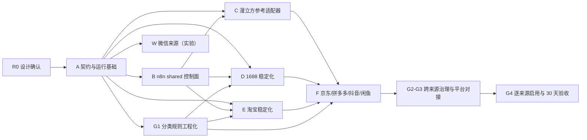

# 游艺圈数据工作流总纲

版本：V1.4

日期：2026-08-14（V1.4：平台库实测与直写通道定案——正式库确认为 `192.168.1.43`（`192.168.1.98` 为已废弃旧环境）；厂家经 `manufacturer` 表 `import_batch` 直导、商品/SKU 经 `industry_source_1688_*` 接收表直写（幂等键 `import_delivery_id` + 唯一键 `(source_platform, product_id)`），文件交付降级为审计快照兜底，§12/§12.1 重写；V1.2 变更见 2026-08-13：按实际工作区收敛文档——路线图状态与产物对齐，未落地的任务全部回退为未开始；D1/D2 契约改写为实际产物、shared 浏览器内核按四模块补齐；D2.1 于 2026-08-12 交付、微信 H3 于 2026-08-11 实现；删除与总纲重复的 `docs/游艺圈项目总体规划.md`）

状态：唯一现行总纲，设计已确认并进入实施

**Goal:** 建成一套可持续运行的数据资产生产线：以 n8n 作为共享控制面，以七个独立商品来源适配器作为执行面，并支持实验性个人微信来源（Phase H），在来源可访问范围内持续形成可追溯、可恢复、可比较的 L0-L2 资产，并按版本化契约生成可回执的 L3 交付。

**Architecture:** 所有来源共用请求、状态、锁、重试、质量、人工门禁、告警和回执契约；漫立方、1688、淘宝、京东、拼多多、抖音和闲鱼分别拥有独立采集与解析实现；个人微信来源以自建本地库解密管道为实验链路（Phase H，vendored MIT 原语 + 自写采集脚本），独立于商品适配器。公共核心字段、类型化属性事实和原始全字段并存。逻辑数据集先以版本化 Schema/JSONL 实现，正式数据库 DDL、迁移、业务表写入和前端渲染仍由平台负责人确认并实施。

**Tech Stack:** Python 3.11、pytest 9、JSON Schema Draft 2020-12、n8n、Playwright、requests、JSON/JSONL、SHA-256、现有 pandas/openpyxl/Pillow。A1 已核验部署拓扑：n8n 未安装、lock_store 未验证（现场值以 `orchestration/n8n/deployment/topology.json` 为准）；B6 真实导入/导出在 n8n 落地前保持阻塞。

# 第一部分：项目与技术总纲

## 1. 文档权威与阅读方式

本文是游艺圈数据工作唯一现行总纲：定位、职责边界、数据分层、技术设计、逻辑模型、n8n 控制面、平台对接、路线图和下一执行点。

发生冲突时按以下顺序处理：

1. 用户最新明确指令。
2. 本总纲。
3. 当前来源的 `adapters/<source>/README.md`，仅负责来源特有边界、命令、能力、字段和运行证据。
4. `docs/游艺圈游戏游艺设备完整分类清单.md`，仅负责分类、平台类目映射、关键词和范围规则。
5. `docs/数据字段规范.md`，仅负责数据字段契约（采集全量字段、数据库表结构与入库映射、值规则）。
6. `docs/requirements/游艺圈历史总体需求.md`，仅作历史背景（原 `project-split/` 与需求框架的合并档）；只有 `docs/requirements/信息整理.md` 接收新增确认需求。

同一事实只在最高职责文件定义。`README.md` 与 `AGENTS.md` 只提供入口和执行约束，不复制业务规则、动态状态或实施内容。来源状态和启用值只读取 `orchestration/n8n/configs/source_registry.json`。

普通任务的最小阅读顺序为：本总纲 → 当前来源 README → 相关 Schema/测试。只有分类任务再读分类清单，只有 L3 Excel 兼容任务再读字段规范，只有明确需要历史产品背景时才读受保护历史文档。

## 2. 项目定位与确认决策

- 游艺圈是游戏游艺设施商品与厂家信息供应平台，不是商城，不负责交易功能。
- 数据目标是在来源可访问范围内建立可追溯的全量信息镜像，不做采集范围自设限制；允许一切手段降低或解除来源风控（拟人化、指纹伪装、无痕环境、代理/IP 轮换、自动处理验证码/滑块、跟随签名等）。
- 1688、淘宝、京东、拼多多、抖音和闲鱼分别建设独立数据采集适配器；漫立方等邀约商户优先使用授权 API、授权文件或已验证链路。
- 个人微信来源（实验性，2026-08-06 确认；2026-08-10 落地自建）：采用自建本地库解密管道（vendored MIT 原语 + 自写脚本）采集群聊、朋友圈与部分私聊；仅自有账号与白名单授权范围数据，不进入正式商品管线（详见 Phase H）。
- n8n 是共享控制面；Python/Node 和来源专用自动化是执行面。
- 共享控制契约（触发、状态、锁、重试、质量、人工门禁、告警、交付）；平台采集与解析实现各自独立。
- 数据侧尽可能完整保留来源字段、原值、证据和历史变化，不因当前平台缺少消费字段而裁剪 L0-L2。
- 字段融合采用“公共核心字段 + 类型化属性事实 + 原始全字段”，不强求每个平台字段完全对齐。
- 商品、SKU、店铺、公司、厂家角色、资质、媒体和文档分别建模；`shop ≠ company ≠ manufacturer`。
- 跨平台相似记录只建立匹配候选，不静默覆盖来源事实。
- 分类清单用于采集范围、平台类目映射、关键词覆盖和分类候选；数据侧不决定平台最终展示分类。
- 数据侧不设计、迁移或维护正式业务数据库；不直写正式产品库，禁止绕过平台校验直接写正式业务表。
- 初版工作流以现有数据库真实表字段为基准（字段清单唯一维护于 `docs/数据字段规范.md`），数据侧入库落点为已存在的 `staging_manufacturer` 接收区；`product`、`accessory` 尚无 staging 对应表，平台确认前不直写正式表。
- 平台负责人按已确认 L3/API/权限隔离契约完成校验、审核、正式写库和渲染。

正式工作路径为：

- `orchestration/n8n/`
- `adapters/<source>/`
- `runtime/`
- `deliveries/`

## 3. 职责边界

### 3.1 数据负责人

- 来源发现、能力矩阵、采集边界和停止条件。
- 六个大平台独立爬虫，以及邀约商户授权 API、文件和资料适配。
- L0 原始响应、页面、文件、图片、请求元数据、来源证据和哈希归档。
- L1 来源实体、完整来源字段、原值与标准值。
- L2 关系、快照、变化、字段观测、匹配候选、质量问题和复核队列。
- n8n 数据工作流、触发、锁、重试、熔断、人工门禁、告警和运行报告。
- 按双方确认的版本化契约生成可重建 L3。

### 3.2 平台负责人

- 正式数据库、表结构、迁移、索引、权限和生产维护。
- 正式业务 ID、平台枚举、审核状态、分类发布、搜索和字段渲染。
- 导入 API 或权限隔离的 `ingest/staging` 接收区。
- L3 校验、错误回执、审核、晋级、发布和回滚。
- 小程序、APP、Web 后台及交易相关能力。

### 3.3 双方共同确认

- L3 契约版本、核心字段、扩展属性、长度、枚举和必填规则。
- 来源唯一键、交付幂等键、正式实体匹配和合并规则。
- 商品—SKU—店铺—公司—厂家关系及跨平台候选处理。
- 图片、视频、文档和对象存储引用方式。
- 分类候选、平台最终分类、错误回执、复核回传和回滚方式。

## 4. 数据分层与运行目录

| 层级 | 内容 | 约束 |
|---|---|---|
| L0 | 原始 JSON/HTML/CSV/XLSX/PDF/图片、请求响应元数据、来源链接、采集时间、批次和哈希 | 不覆盖，是重放和审计依据 |
| L1 | 来源商品、SKU、店铺、公司、厂家角色、资质、媒体、完整来源字段和标准化值 | 保留平台语义，不受正式库字段限制 |
| L2 | 关系、动态快照、属性事实、变化、实体匹配候选、分类候选、质量和复核 | 冲突、不确定性和缺失原因显式保存 |
| L3 | XLSX/CSV/JSONL/API 请求体、对象存储引用或约定接收包 | 可从 L0-L2 重建，不反向覆盖 L0-L2 |

```text
定时 / Webhook / 条件 / 人工触发
                  ↓
          n8n shared 控制面
                  ↓
       独立来源 workflow / adapter
                  ↓
             L0 → L1 → L2
                  ↓
       质量门禁 / 人工复核门禁
                  ↓
                 L3
                  ↓
       平台校验、审核、写库和发布
```

新运行统一保存为：

```text
runtime/runs/<source>/<run_id>/
├─ run_request.json
├─ run_manifest.json
├─ run_result.json
├─ stages/<NN>_<stage>/
│  ├─ stage_request.json
│  ├─ stage_result.json
│  └─ artifacts.json
├─ checkpoints/
├─ review/
├─ l0/
├─ l1/
└─ l2/
```

阶段幂等单位为 `run_id + stage + partition + input_fingerprint`。只有上次阶段成功、输入指纹一致且产物哈希仍有效时才允许恢复跳过；状态文件先写临时文件再原子替换。

## 5. 来源能力与独立适配器

| 来源 | 商品/SKU | 店铺 | 公司/厂家 | 资质 | 主要约束 | 定位 |
|---|---|---|---|---|---|---|
| 漫立方 | 已有完整批次 | 来源方信息 | 主体仍需按证据核验 | 正式授权 API 待提供 | 当前链路含人工抓包 | 离线 replay 与 L0-L3 参考 |
| 1688 | 丰富 | 丰富 | 公司、工厂、供应商信息丰富 | 公开主体和平台资质较丰富 | 登录、403/429、滑块 | 丰富字段和厂家关系参考 |
| 淘宝 | 商品与详情可采 | 可采 | 厂家通常稀疏 | 通常有限 | 登录、风控、结构变化 | 稀疏字段参考 |
| 京东 | 商品与店铺可采 | 可采 | 部分店铺可见主体 | 资质入口可能反复滑动验证 | 人工验证频繁 | 人工门禁参考 |
| 拼多多 | 商品为主 | 依公开页面 | 厂家字段可能稀疏 | 依公开能力 | 类目扁平、标题污染 | 二次范围判断参考 |
| 抖音 | 依公开能力 | 可变 | 厂家字段不稳定 | 依公开能力 | 类目变化、风控 | 类目快照参考 |
| 闲鱼 | 二手刊登为主 | 卖家语义不同 | 厂家通常不能确认 | 非核心 | 弱类目、强文本、状态波动 | 文本和人工复核参考 |
| 微信（实验） | 不适用 | 不适用 | 不适用 | 不适用 | 无官方 API、本地库解密、需锁定微信版本、ToS/DMCA 风险 | 群聊/朋友圈/部分私聊情报（实验） |

能力字段状态统一为 `supported`、`partial`、`gated`、`unavailable`、`unknown`，每次变更必须带版本、验证时间和证据批次。质量门禁按来源能力计算，不能要求淘宝达到 1688 的厂家字段覆盖率。

微信为实验性社交来源，不参与商品能力门禁；其能力按 `adapters/wechat/config/capability_matrix.json` 单独记录（Phase H），工具决策与来源行为唯一入口为 `adapters/wechat/README.md`。

每个平台 adapter 分为：

| 阶段 | 作用 |
|---|---|
| `precheck` | 登录、凭据、磁盘、依赖、字段/类目版本检查 |
| `discover` | 类目、关键词、店铺和商品种子发现 |
| `product-list` | 低成本商品索引与变化发现 |
| `product-detail` | 详情、参数和 SKU |
| `shop` | 店铺来源记录，不推断工商主体 |
| `company` | 公司、工厂和资质证据，独立低频运行 |
| `media` | 内容寻址下载和实体关系 |
| `normalize` | L0 到 L1 来源实体 |
| `diff` | 与 accepted baseline 比较形成 L2 |
| `validate` | 来源能力感知质量和复核队列 |
| `package` | 通过门禁后生成 L3 |
| `resume/repair` | 按检查点局部补采 |

## 6. 字段融合、缺失和冲突

公共核心字段用于跨平台搜索、排序、基本展示和关系；平台特有和长尾字段进入类型化属性观测；原始字段名、字段路径、原值和未知扩展完整保留。

每条属性观测至少包含：属性码、原始标签、原始值、typed value、原始/标准单位、值状态、缺失原因、来源、观测时间、规则/模型版本、置信度、复核状态和证据引用。

缺失状态必须区分：

| 状态 | 含义 |
|---|---|
| `present` | 有有效观测值 |
| `not_provided` | 来源没有展示或明确未提供 |
| `not_accessible` | 当前来源路径不可访问 |
| `not_applicable` | 对该实体不适用 |
| `not_requested` | 本次 mode 未请求 |
| `parse_failed` | 疑似有值但解析失败 |
| `source_changed` | 页面/接口结构变化 |
| `normalization_failed` | 原值存在但标准化失败 |
| `conflict` | 同一语义存在冲突观测 |
| `redacted` | 因权限或敏感策略脱敏 |
| `unknown` | 证据不足 |

未知不能用空字符串、`0`、`无` 或 `-` 伪造。工厂面积与厂房面积必须分别映射 `factory_area_sqm` 和 `factory_building_area_sqm`，不得互相回填。

冲突先保存全部 claim，再生成当前选择值。选择值记录 `selected_observation_id`、策略版本、理由和置信度；不同来源语义不设全局优先级。工商主体优先官方/主体资质，价格库存使用对应来源最新成功快照，各平台市场销量保持独立。低置信度实体合并、工商主体和认证结论必须人工或平台确认。

1688 厂家采集以工厂档案为调度主入口（发现工厂能力、认证与主体资质链接），法律主体字段以官方工商详情/主体资质接口为证据；工厂档案不是唯一证据，商品页、店铺页、主体资质页和工厂接口各自保留来源与时间；无工厂档案的卖家走主体资质主链路，不自动建立厂家角色。

公共端有值才展示，未提供字段不占空位；价格、库存、销量、资质和厂家能力显示来源及截至时间；来源披露不能渲染为游艺圈认证。

## 7. 实体与关系

- `shop`：平台账号或经营店铺。
- `company`：来源展示的工商主体。
- `manufacturer`：公司或店铺相对于商品承担的厂家角色。
- `supplier`、`distributor`、`brand_owner`：其他业务角色。
- 同一公司可有多个店铺；店铺不能仅凭名称自动绑定公司。
- 每个平台商品是独立来源刊登，跨平台同款只建立匹配候选。

关系至少支持 `published_by`、`sold_by`、`supplied_by`、`manufactured_by`、`brand_owned_by`、`legal_entity_of`、`authorized_distributor_of`、`compatible_with`，并保存来源、有效时间、方法、置信度、复核状态、冲突原因和证据。

## 8. 数据侧推荐逻辑数据集

这些逻辑数据集可实现为 JSONL、Parquet、分析库或权限隔离 staging。它们是数据侧推荐逻辑模型，不是正式库迁移授权，不得直接写入正式业务表。

| 数据集 | 核心内容与键 |
|---|---|
| `source_definition` | 来源类型、授权方式、adapter/key/capability/boundary 版本；唯一键 `source` |
| `collection_run` | run、mode、baseline、版本、配置 hash、触发、状态、检查点和结果；唯一键 `run_id` |
| `source_product` | 来源商品 UID/ID、名称、URL、品牌/型号候选、来源类目、状态和时间；`UNIQUE (source, source_product_id)` |
| `source_sku` | 来源商品下的 SKU ID、规格、价格库存和状态；来源商品+SKU 唯一 |
| `sku_option` | 规格组、规格值、顺序和媒体关系 |
| `source_shop` | 店铺 UID/ID、member ID、名称、URL、地区、状态和时间 |
| `source_company` | 公司 UID/ID、工商原名/标准名、统一社会信用代码、注册信息和核验状态 |
| `entity_relation` | 左右实体、关系类型、有效期、方法、置信度、复核和证据 |
| `attribute_definition` | 属性码、类型、单位、适用实体、敏感度和版本 |
| `attribute_observation` | 原始/标准值、单位、值状态、时间、版本、置信度和证据 |
| `qualification_claim` | 资质类型、证书号、颁发方、有效期、来源声明与核验状态 |
| `platform_signal_snapshot` | 平台等级、认证、响应、交易等来源信号快照 |
| `source_evidence` | evidence ID、SHA-256、URI、媒体类型、大小、来源 URL、请求指纹、HTTP 状态和时间 |
| `evidence_locator` | evidence 内字段路径、CSS/JSONPath/页码/区域等定位信息 |
| `media_asset` / `entity_media` | 内容哈希媒体及其与实体的用途、顺序和状态关系 |
| `metric_snapshot` | 价格、库存、销量、供货状态等动态值和观测时间 |
| `change_event` | 实体字段/关系/状态变化、前后值、baseline、证据和确认状态 |
| `entity_match_candidate` | 左右 UID、matcher 版本、输入 hash、得分、信号、决定和复核 |
| `classification_candidate` | 来源类目、清单版本、候选分类、范围三态、置信度、理由和证据 |
| `quality_rule_result` | 规则版本、对象、实际/期望、严重度、结论和 evidence |
| `quality_issue` | 稳定 issue fingerprint、实体、路径、严重度、原因、状态和次数 |
| `review_item` | 复核类型、实体、字段、优先级、候选、状态、负责人、结论和证据 |
| `delivery_batch` | contract/version、delivery/source/run/baseline/mode、幂等、质量、限制和 checksums |
| `delivery_receipt` | receipt、批次状态、数量、Schema/记录错误、重试、平台 ID 和反馈 |

推荐唯一与查询索引遵循：来源实体使用 `source + source_id`；动态快照使用实体+指标+时间倒序；证据使用 SHA-256、run 和来源 URL；问题使用 fingerprint；复核使用状态+优先级+时间；交付使用幂等键和 delivery ID。正式索引仍由平台负责人按实际数据库确认。

## 9. 分类与采集范围

- 平台类目映射、专用关键词、同义词、排除词和边界规则只以分类清单为权威。
- 平台词库保持独立，不能把全平台词简单去重后在每个平台全部执行。
- 范围判断使用 `included`、`excluded`、`review_required` 三态。
- 无法确定时进入复核，不生成正式分类；A14 只表示真实综合/主题/非标设备，不是未知收容项。
- 规则带版本、平台、验证时间、证据、有效率和启用状态；平台类目树变化保存版本快照。
- 数据侧只产生分类候选、置信度和理由，平台侧负责正式分类晋级和展示。

### 9.1 采集方式与关键词适用范围

不同来源的采集方式不同，关键词库只服务于"搜索采集"类来源；分类清单（A-E 主分类、附录边界规则）是所有来源统一的分类权威。

| 采集方式 | 说明 | 来源 | 分类清单/关键词的用法 |
|---|---|---|---|
| 搜索采集 search-keyword | 用关键词在平台内搜索并抓取商品 | 1688、淘宝、京东、拼多多、抖音、闲鱼 | 消费生成的关键词视图（`adapters/1688/config/keywords.json` 等）；只展开 `status=active` 概念 |
| 全量直取 full-direct | 来源直接提供全量商品数据，不经搜索 | 漫立方 | 不依赖关键词；分类清单仅用于交付分类映射和范围校验 |
| AI 分析 ai-analysis | 接入后由 AI 对非结构化内容做商品信息分析 | 微信（实验） | 词表仅作信号预筛（`adapters/wechat/config/product_keywords.json`）；最终分类由 AI 精筛产出 |

执行约定：
- 关键词产物必须由生成器（`adapters/1688/src/build_keyword_library.py`）从分类清单生成，禁止手改；产物头部记录 `taxonomy_version` / `source_sha256` / `generated_at` 用于识别过期。
- 分类清单变更后必须重新生成关键词产物并运行 `tests/test_keyword_library_fresh.py`（防漂移门，不一致即失败），再导出 xlsx/sqlite（`tools/export_keyword_library.py`）。
- 搜索采集类来源的平台类目映射（分类清单附录 A）与边界规则（附录 C）按平台独立验证。

## 10. n8n shared 控制面

Master 固定流程为：请求规范化 → 触发去重 → registry 门禁 → 获取锁 → 调用来源 workflow → 校验结果 → 状态路由 → 重试/人工/质量/交付分支 → 完成运行 → 释放锁 → 告警。

支持的触发方式：

| 触发方式 | 用途 |
|---|---|
| 定期/定时 | 全量基线、增量扫描、类目树和来源健康检查 |
| 自动触发 | 授权 API 事件、上游完成和依赖就绪 |
| 条件触发 | 新鲜度超限、结构变化、数量异常和质量下降 |
| Webhook | 入驻店铺同步、合作方文件和平台回执 |
| 人工任务 | 登录、验证码、异常补采和高风险复核 |

Shared 子工作流包括 request normalizer、trigger deduplicator、lock manager、stage runner、result validator、status router、retry breaker、review gate、quality gate、alert router、receipt handler 和 stale run reconciler。

锁至少包括：

- `source:<source>:write`
- `profile:<source>`
- `resource:<runner>:browser`

锁存储必须支持原子 compare-and-set、租约续期和 fencing token；部署拓扑未核验前不虚构具体 backend。

重试只用于明确可重试错误，配置最大次数、退避、抖动和熔断窗口。验证码、滑块、登录失效、权限不足和来源结构变化优先自动处理（自动验证、环境/指纹/代理切换、跟随签名），自动处理无效时转人工或停止；不做无熔断的无限重试。

### 10.1 执行载体：浏览器执行层与反爬基础（shared Python 内核）

上述自动处理策略（指纹切换、退避、验证处理）在 Python 执行平面的载体为 shared 浏览器内核，各来源采集脚本统一引用：

| 模块 | 职责 |
|---|---|
| `shared/src/data_workflow_core/browser/stealth.py` | stealth 指纹注入（环境层）：抹除 `navigator.webdriver`、补齐 chrome.runtime/plugins/语言/硬件参数/窗口尺寸、WebGL 与 Canvas 一致性伪装 |
| `shared/src/data_workflow_core/browser/pacing.py` | 自适应频控（执行节奏）：成功回落、失败指数退避、验证拦截冷却、每日请求上限、JSON 检查点跨批次续跑 |
| `shared/src/data_workflow_core/browser/detection.py` | 统一反爬检测：页面文本/URL 标记映射为 `human_verification_required` / `login_required` / `rate_limited`，各来源共用 `restriction_from_page` |
| `shared/src/data_workflow_core/browser/session.py` | `PlaywrightBrowserSession` 持久化会话：真实 Chrome + profile 登录态复用、stealth/频控集成、页面捕获和人工验证等待 |

约束与默认：

- stealth 仅做一致性伪装，不绕过登录、授权或访问控制；验证码/滑块仍进入既有 `human_verification_required` 检测与人工接管流程。
- 浏览器采集脚本默认注入 stealth（`--no-stealth` 可关闭）；自适应频控需显式传入 `--pacing-config` 启用（示例：`adapters/1688/config/pacing.example.json`），未启用时保持原固定延时行为。
- 频控检查点默认 `runtime/state/<source>_pacing.json`（git 忽略）：跨天自动重置计数、保留节奏；达到每日上限后停止并提示，不做无熔断的无限重试。
- 人工验证等待由共享 `wait_for_human_verification` 提供（检测→等待→恢复）；主动通知、会话生命周期和多账号轮换为后续增量。

### 10.2 反风控爬虫引擎（2026-08-14 落地，E1 完成）

独立、解耦、可移植的浏览器采集执行层，位于 `shared/src/data_workflow_core/engine/`。平台逻辑（搜索词、选择器、字段映射）不进入引擎，由各 adapter 的任务描述 JSON 承载。

| 模块 | 职责 |
|---|---|
| `engine/cdp.py` | 真实 Chrome + 持久 profile 的 CDP 会话（登录态复用，不依赖 Playwright 自带 Chromium） |
| `engine/antibot.py` | 滑块检测、人工接管等待、验证后冷却、触发即停铁律；受限状态复用 browser.detection |
| `engine/tasks.py` | 任务描述校验与受控执行（动作词表：goto/evaluate/write_jsonl/sleep/loop） |
| `engine/result.py` | run_id、运行目录、原子写 run_result.json、JSONL 追加 |
| `engine/cli.py` | 统一 CLI：`run` / `selfcheck` / `login`（n8n 与人工共用入口） |

- 命令：`python -m data_workflow_core.engine run --task <任务.json> --engine-config <引擎.json> --result <结果.json>`；退出码 0 完成、2 任务不合法、3 自检失败、4 受限停止（滑块/登录/限流）、6 执行失败。
- 触发即停（2026-08-14 收紧）：`goto_guarded` 默认 `stop_on_slider=True`——探测到验证**立即停止整批**并保存断点，不等待人工、不继续下一项；人工过验证走独立 login/prepare 流程。探测覆盖顶层文档 + 同源 iframe；任务层每次跳转后做 URL+文本双查受限检测，并在每个休眠间隔前加"间隙哨兵"扫描。
- 新环境移植三步：装依赖 → 配置 `engine.example.json`（Chrome 路径/profile/端口）→ `selfcheck` 通过后 `login` 人工登录一次，登录态永久存 profile。
- 引擎测试 27 个离线用例全过（`tests/test_engine_*.py`）；原 CDP 采集的 0 滑块行为（搜索 15s、商品 3s、厂家 4s、触发即停）由引擎保持。
- 后续：E2 已完成（2026-08-14：`adapters/1688/tasks/` 任务层落地，旧 `cdp_collector.py`/`pipeline_v1.py` 已删）；E3 接入 n8n 工作流；E4 移植包验收。

## 11. 统一状态与结果契约

正常状态：

```text
created → prechecking → ready → collecting → raw_archived
→ normalizing → matching → enriching → validating
→ waiting_review / packaging → delivered → completed
```

异常状态及控制动作：

| 状态 | 动作 |
|---|---|
| `retryable_failed` | 按策略退避重试，达到上限熔断 |
| `rate_limited` | 长退避、降频并告警 |
| `login_required` | 优先自动处理登录，无效时创建人工登录任务 |
| `human_verification_required` | 自动处理无效后停止受影响链路并保存恢复点 |
| `source_changed` / `parser_drift` | 禁止正常交付，进入结构复核 |
| `quality_rejected` | 禁止 package/delivery，进入质量复核 |
| `manual_stopped` | 保留检查点，不自动恢复 |
| `permanently_disabled` | 禁止触发，等待重新评估 |

`partial_success` 不是自动交付状态，必须映射为复核、质量拒绝或可重试失败；宽泛 `blocked` 必须拆成具体原因。失败、受限或局部扫描不得产生下架结论。

每次运行必须生成严格 `run_result.json`，至少包含 contract/workflow/adapter 版本、run/source/mode/status、时间、baseline、计数、artifacts/checksums、质量、复核、重试和结构化错误。n8n 只解析机器契约，不解析自然语言日志。

## 12. L3 交付与平台回执

每个交付包含：

- `delivery_manifest.json`：contract/version、delivery/source/run/baseline/mode、幂等键、数据集、质量、复核、限制和 checksums。
- `records.jsonl`：每条 record envelope 包含 record key、entity type、operation、source identity、core、attributes、relations、media、classification candidates、quality、evidence refs 和 observed time。
- 兼容 XLSX/CSV 或 API 请求体：只作为当前平台投影，不替代完整 L0-L2。

`delivery_receipt` 至少包含 contract/version、delivery/receipt ID、幂等键、接收/完成时间、批次状态、received/accepted/rejected/duplicate/pending_review 数量、Schema 错误、逐记录结果、平台契约版本、重试建议、平台 ID mapping 及分类/匹配反馈。

接入顺序已落地（2026-08-14 实测）：数据侧直写平台库接收表（`industry_source_1688_*` 与 `manufacturer.import_batch` 批次，均以 `status='pending'` 走平台审核）；文件交付作为审计快照兜底；内部导入 API 就绪后可再切换。数据侧绝不写 `product`、`accessory`、订单/交易等正式业务表；平台校验、审核并晋级正式记录。

数据库环境（2026-08-14 实测）：平台工作库 PostgreSQL `192.168.1.43:5432`（陆开发环境）、数据库 `postgres`、Schema `public`（46 张表，含商机/圈子/交易/结算等业务表）；生产库已部署于云服务器 `47.119.113.170`（SSH root 隧道，库仅监听其本机 127.0.0.1:5432），**当前只备案不动，待 .43 验证通过后再迁移**；`192.168.1.98:5432` 为已废弃旧环境（7 月 ingest 试验库，勿再使用）。表结构与入库映射唯一维护于 `docs/数据字段规范.md` §3（实测版）。密码只存未跟踪 `.env.local` 或受控凭据。

### 12.1 交付通道与存储归属（2026-08-14 实测定案）

平台库实测（`.43`）：陆已按交付格式建好接收表并完成首批导入——`industry_source_1688_product` 707 行（`import_delivery_id='1688_full_image_fix_20260812'`，schema 1.2.0，唯一键 `(source_platform, product_id)`）、`industry_source_1688_sku` 4469 行、`industry_source_1688_binding` 31 行（晋级绑定）；厂家 38 家经 `manufacturer.import_batch='1688_20260807'` 直进正式表且全部 `status='pending'`；`staging_manufacturer` 存在但平台未启用（0 行）。

通道定案：**数据侧直写平台库接收表为主，文件交付降级为审计快照兜底，媒体继续走 NAS。**

| 数据类型 | 落点 | 规则 |
|---|---|---|
| 厂家 | 平台库 `manufacturer`（32 列，已扩展 established_year/factory_area/qualifications/service_tags/logo_url/image_urls/video_url 等） | `import_batch`=批次号、`status='pending'`、`claim_status='unclaimed'`、`cert_level='unverified'`；跨批按 `source_url`（含 memberId）查重防重复厂家 |
| 商品 | 平台库 `industry_source_1688_product`（56 列） | `ON CONFLICT (source_platform, product_id) DO UPDATE`（表上现成唯一键）；`import_delivery_id`=delivery_id |
| SKU | 平台库 `industry_source_1688_sku`（10 列） | 批内先 `DELETE WHERE import_delivery_id=本批` 再插入（幂等） |
| 图片/视频 | NAS `\\tdd-nas\ai应用部\游艺圈\data\media`（18419 文件，数据库不存二进制） | 库内 image_url 维持 CDN 原链不干扰平台展示；NAS 转存作资产保全，NAS 相对路径进交付快照，切换时机由平台侧决定 |
| L0-L2 原始资产与证据 | 本地 `runtime/`（不进 NAS、不交付） | 仅供数据侧重建交付 |
| 交付快照 | 本地 `deliveries/<source>/<batch>/` + NAS `data/deliveries/` 镜像 | 每批先写快照再写库；`delivery_id`=库内 `import_delivery_id`，库坏可从快照重建 |

NAS 目录标准（2026-08-14 清理定稿）：`\\tdd-nas\ai应用部\游艺圈\data\` 下**只保留两个目录**——`media/`（媒体资产）与 `deliveries/`（交付快照与 AI 底座镜像）。旧架构遗留的 `raw/`、`normalized/`、`processed/`、`runs/`、`backups/` 已全部清理（其中本地缺失的 master L1、cdp_collector 运行记录、master 交付快照已先回拷本地再删除）；NAS 不承担 L0-L2 资产与数据库角色。

执行约定：

- 写入账号（平台方 2026-08-14 决定）：开发期直接用 `postgres` 账号（双方开发用最高权限）；最小权限账号待"专人管数据库运营"时再建。前提提醒：两处 postgres 密码均为弱密码，建议平台方尽快改强。
- 写入顺序：先文件快照 → 再单事务写库 → SELECT 自验行数与抽查。异常按 `import_delivery_id` 删除本批回滚。
- 查验：`tools/db_inspect.py`（会话级强制只读）。
- 平台审核与晋级（`industry_source_1688_binding` 登记、`status` 变更、正式 ID 分配）由平台负责，数据侧不碰。
- `.env.local` 只保留 `LOCAL_DATABASE_URL`（本机开发联调）与 `REMOTE_DATABASE_URL`（.43 工作库）；生产库连接信息（SSH + 库密码）暂存同一文件，未启用。

停止清单（此前错误对接方式一律停止）：

1. 不再人肉搬运交付文件并等待平台手动导入——批次直写库。
2. 不再把易失效的 1688 图床链接当作唯一图片来源——NAS 转存保全 + 快照双链。
3. 不再使用 `192.168.1.98` 旧环境。
4. 不再用 `postgres` 超管做日常写入。
5. 不再重复讨论"NAS 还是数据库"——本表即答案，变更必须走本文档版本更新。

## 13. 全量、增量和下架

- 首次全量以类目、关键词、店铺等版本化分区建立 coverage ledger，记录游标、发现数、唯一数、重复数、完成证据和错误。
- “全量”只指来源可访问范围内所有已登记分区闭合；关键词结果不能单独证明平台全量。
- 后续按数据变化频率分层：价格/库存/销量高频，详情按变化补抓，店铺低频，公司资质独立低频，类目树和字段结构定期巡检。
- 内容哈希不变的图片不重复下载，但媒体关系和最后发现时间继续更新。
- accepted baseline 只由成功且通过质量门禁的运行推进。
- 只有完整遍历或来源明确状态才能确认下架；受限、解析失败、局部扫描和关键词漏覆盖只能形成疑似缺失。

## 14. 质量、安全和启用门禁

每批至少检查总数、成功数、唯一数、重复率、字段覆盖、图片成功率、新增/修改/下架/无变化、来源追溯、结构漂移和复核数量。

以下情况禁止自动交付：解析为 0、数量异常下降、关键字段或图片成功率显著下降、结构/枚举变化、大量价格归零、异常下架、AI Schema 失败或成本超限。

遇验证码、滑块、登录失效、403/429、权限不足或签名要求时，先按来源采集策略自动处理（自动验证、环境/指纹/代理切换、跟随签名）或降频，仍失败则停止当前路径，返回明确状态并转人工；不把受限结果写成空成功。

来源申请启用必须同时具备：经过审查的来源 workflow JSON、受控凭据、严格离线 dry-run、在线小样本质量证据、失败/人工路由、全量/增量/恢复/幂等/回执验证和连续稳定运行证据。缺少任一项保持 `enabled=false`。

## 15. 平台接入前共同确认清单

平台接入前，用户和平台负责人共同确认：实体语义、自动/人工审核范围、业务 ID 与回传、稳定键与别名迁移、幂等作用域、API/staging/文件方式、版本兼容、字段类型长度精度单位时区、缺失/冲突枚举、分类与状态枚举、实体关系、资质展示条件、full/delta/下架/回滚、媒体存储与版权、质量/匹配阈值、复核 SLA、批次/记录回执和敏感数据权限。

这些确认完成前，数据侧可以建设 L0-L2 和 L3 候选契约，但不能把推荐逻辑模型当作正式数据库定稿。

## 16. 文档维护

- 本总纲只保留当前决策、技术设计、路线图和下一执行点，不保存对话或失败过程。
- 来源命令、能力、批次和证据只写对应 adapter README。
- 分类词、平台类目映射和范围规则只写分类清单。
- 分类清单变更后必须同步重新生成关键词产物（`adapters/1688/src/build_keyword_library.py`）并通过 `tests/test_keyword_library_fresh.py` 防漂移门，防止文档与执行产物漂移。
- 当前 L3 Excel 列只写字段规范。
- 新确认业务需求只写 `docs/requirements/信息整理.md`。
- 已完成且结论进入本总纲的临时设计、计划和交接文档删除，不再建立平行入口。

# 第二部分：实施路线图

## 20. 执行规则

本部分只维护任务依赖、状态、产物、测试、验收和下一执行点；第一部分定义稳定业务与技术语义。

执行本路线图必须遵守：

- 不新增并行的“总体计划”“临时执行方案”或来源总计划；阶段进度只更新本文。
- 路线图同一时间只标记一个任务为 `进行中`（进度单线程记录，不限制并行实现）；完成后更新第 22 节执行点。
- 每个任务先增加失败测试或失败校验，再实现，再运行任务级和全量测试。
- 每个任务单独提交；提交不得混入运行资产、凭据、Cookie、浏览器 profile、图片库或无关用户改动。
- 需要真实登录、在线请求、滑块处理或平台侧契约时，先完成全部离线步骤；滑块允许自动处理或人工接管，但不得用模拟成功替代缺失的外部条件。
- 平台来源的选择器、接口和字段路径只能来自脱敏证据或授权接口说明，不凭经验编造。
- 来源受限、登录失效、结构漂移或局部失败不能写成空成功、全量完成或下架。
- 所有来源保持 `enabled=false`，直到 G4 的逐来源启用门禁和稳定性验收完成。
- 数据侧只实现逻辑数据契约、L3 adapter 和接收回执处理，不创建或修改正式业务表。

## 21. 固定执行接口

### 21.1 统一命令

每个来源最终提供同一命令形态：

```powershell
python adapters/<source>/src/run_source.py `
  --request runtime/runs/<source>/<run_id>/run_request.json `
  --result runtime/runs/<source>/<run_id>/run_result.json
```

本文只有两个命令元变量：`<source>` 必须替换为 `manlifang`、`1688`、`taobao`、`jd`、`pinduoduo`、`douyin` 或 `xianyu`；`<run_id>` 必须替换为本次 `run_request.json` 中已经生成的 run ID。它们不是未决设计项。

离线门禁使用：

```powershell
python adapters/<source>/src/run_source.py `
  --request adapters/<source>/tests/fixtures/requests/dry_run.json `
  --result runtime/runs/<source>/<run_id>/run_result.json `
  --dry-run
```

命令退出约定：

| 退出码 | 含义 |
|---|---|
| `0` | Schema 合法且达到终态；终态仍可能是人工门禁或质量拒绝 |
| `2` | 请求或结果 Schema 不合法 |
| `3` | 配置、依赖、磁盘或凭据前置检查失败 |
| `4` | 来源受限、登录失效、人工验证或来源结构变化 |
| `5` | 可重试的采集/处理错误 |
| `6` | 不可重试的适配器错误 |

n8n 不以退出码单独判断业务状态；退出码用于进程级诊断，业务路由只读取通过 Schema 校验的 `run_result.json`。

### 21.2 Python 核心接口

`shared/src/data_workflow_core/models.py` 最终公开以下稳定接口：

```python
@dataclass(frozen=True)
class RunContext:
    run_id: str
    source: str
    mode: str
    run_dir: Path
    request: Mapping[str, Any]
    config_hash: str

class StageHandler(Protocol):
    def __call__(self, context: RunContext) -> Mapping[str, Any]: ...

def execute_stage(
    context: RunContext,
    stage: str,
    partition: str,
    handler: StageHandler,
) -> dict[str, Any]: ...
```

来源 `run_source.py` 只负责装配阶段，不复制原子写入、哈希、Schema 校验、幂等、状态映射和目录管理。

### 21.3 目录与机器契约

实施后机器契约集中在：

```text
contracts/
├─ schemas/
│  ├─ run_request.schema.json
│  ├─ stage_result.schema.json
│  ├─ checkpoint.schema.json
│  ├─ run_result.schema.json
│  ├─ source_entities.schema.json
│  ├─ observations.schema.json
│  ├─ quality_review.schema.json
│  ├─ delivery_manifest.schema.json
│  ├─ delivery_record.schema.json
│  └─ delivery_receipt.schema.json
└─ dictionaries/
   ├─ run_statuses.json
   ├─ error_codes.json
   ├─ missing_reasons.json
   ├─ relation_types.json
   └─ attribute_definitions.json
```

逻辑数据集到契约的唯一映射：

| 契约 | 包含的逻辑数据集 |
|---|---|
| `run_request` / `stage_result` / `checkpoint` / `run_result` | `source_definition`、`collection_run` 和运行控制 |
| `source_entities` | `source_product`、`source_sku`、`sku_option`、`source_shop`、`source_company`、`entity_relation` |
| `observations` | `attribute_definition`、`attribute_observation`、`qualification_claim`、`platform_signal_snapshot`、`source_evidence`、`evidence_locator`、`media_asset`、`entity_media`、`metric_snapshot`、`change_event` |
| `quality_review` | `entity_match_candidate`、`classification_candidate`、`quality_rule_result`、`quality_issue`、`review_item` |
| `delivery_manifest` / `delivery_record` / `delivery_receipt` | `delivery_batch`、L3 record envelope、`delivery_receipt` |

### 21.4 新环境初始化（clone 后接续开发）

```powershell
# 1. 克隆并安装依赖（Python >= 3.11）
git clone https://github.com/Tobeicer/data-workflow.git
cd data-workflow
python -m venv .venv-data
.\.venv-data\Scripts\Activate.ps1
pip install -e ".[test,capture]"
playwright install chromium

# 2. 凭据与运行目录（runtime/ 与 deliveries/ 不进入 Git，首次运行自动创建）
Copy-Item .env.example .env.local   # 按需填入 N8N、微信 AI 等凭据

# 3. 就绪验证（全量测试含关键词防漂移门）
python -m pytest tests adapters -q
python adapters/1688/src/build_keyword_library.py   # 重新生成关键词产物
python tools/export_keyword_library.py              # 导出 xlsx/sqlite 交付件
```

历史运行批次（1688 采集结果、漫立方全量、微信证据）与交付包不进入 Git，需要时单独同步；1688 需要浏览器登录态（`runtime/browser-profiles/1688/`），微信采集需要本地微信库与解密工具（vendor 已随仓库提供），凭据与步骤见对应 adapter README。

## 22. 当前状态与执行顺序

### 22.1 状态图例

| 标记 | 含义 |
|---|---|
| `[x]` | 产物、测试、验收和提交均完成 |
| `[ ]` | 未开始或尚未满足全部完成条件 |
| `阻塞` | 已完成所有内部步骤，缺少明确外部输入；必须记录缺项和恢复命令 |

### 22.2 当前执行点

- [x] R0：确认总体设计并建立唯一实施路线图。
- [x] A1：核验 n8n、执行器、运行目录和锁存储部署拓扑（2026-07-15，提交 `c3a5d55`）。
- [x] R1：确认数据侧职责边界与初版字段基准（2026-08-05；职责只到“获取→清洗→入库”，字段基准=`docs/数据字段规范.md`，入库落点=`staging_manufacturer`）。
- [x] R2：收敛字段契约（2026-08-05 定稿，2026-08-12 随 707 商品全量批次更新；历史 v2 规范与字段基准合并为唯一 `docs/数据字段规范.md`，字段清单与列数只在该文件维护；平台渲染/展示不归数据侧管）。
- [ ] A2：建立严格 Schema 验证依赖和命令（按用户要求暂缓，先完成 1688 纵向闭环）。
- [ ] A3-A6、B1-B6、C1-C3、D3、E1-E3、F1-F8、G1-G4：未开始（任务契约见对应 Phase 章节；计划目录与文件随任务启动时按契约创建）。
- [x] D1：拆分 1688 工厂面积和厂房面积（2026-07-15，提交 `7186678`）。
- [x] D2：统一 1688 阶段、检查点和 run result（2026-08-10 冒烟验证；2026-08-12 以 707 商品全量在线批次完成稳定性验证：0 验证触发、0 重定向、价格/属性/memberId 100% 覆盖，交付质量门禁 0 错误）。
- [x] D2.1：收敛 1688 图片链路正确方法并全量修复重采（2026-08-12 完成：707/707 断点续采，主图+轮播 706/707、详情图 704/707、视频 525/707；交付 `deliveries/1688/1688_20260812/`，delivery_id=`1688_full_image_fix_20260812`，schema 1.2.0；已删除 `detail_content_url`/`price_missing_reason`/`quality_report_number`，质量门禁 0 错误 0 警告；厂家本期不采集，交付采用商品+SKU）。
- [x] H1：建立微信来源能力、边界和脱敏证据（2026-08-10 完成：本机密钥提取 18/18、解密 18/18、朋友圈/消息脱敏样本与能力矩阵证据；详见 Phase H）。
- [x] H2：实现自建采集管道原型（本地库增量监听 → L0 JSONL → staging；2026-08-10 冒烟通过，详见 Phase H）。
- [x] H3：微信商品信号抽取层（2026-08-11 已实现：真实数据 1354 条消息 → 123 条 confirmed 商品线索，含图片多模态；详见 Phase H）。
- [x] EN1（引擎）：反风控爬虫引擎落地（2026-08-14：`shared/src/data_workflow_core/engine/`，CLI run/selfcheck/login + 任务描述 JSON + 27 个离线测试全过；详见 §10.2）。

下一执行点（2026-08-14 定案顺序）：

1. [x] EN2：1688 采集任务化（2026-08-14 完成：`adapters/1688/tasks/` 六模块 records/context/cli/search/detail/company/collect + `js/` 双提取器，全部只用引擎原语；删除旧 `cdp_collector.py`、`pipeline_v1.py`、`src/detail_extract.js`，precheck 收编入 `pipeline.py`，master_ingest 运行前缀适配；任务层新增 15 个离线测试，全量 212 通过无回归；真实小批验收通过：`1688_collect_20260814_143618`，0 滑块、3 商品 + 1 厂家）。
2. [x] S1：SKU 规格结构化（设计定稿于字段规范 §2.3；三步全部完成：①解析器 v2 + L1 回溯 + 交付投影；②4 商品实页抽查并修复提取器漂移与右对齐映射；③改库加 4 列 + 全量推送 `1688_full_20260814`——SKU 覆盖 583→701 商品、4674 行带规格字段，0 旧批残留）。
3. [x] DB 直写推送器：`adapters/1688/src/db_delivery.py` 建成（push-products/push-manufacturers，先快照→写库→自验，8 单测）；商品+SKU 已全量直写 `.43`；厂家推送待厂家数据扩量后使用。
4. [x] 厂家解析补全（2026-08-14）：工厂页文本兜底六项——面积（含「值在标签前」排版与厂房面积变体）、员工规模、工厂地址（工厂真实性保障卡片行 + 与注册地址相同则置空）、回头率（「38 % 回头率」值前排版）、工厂牌级（「X 工厂牌级」，暂无牌级不伪造）、资质证书（「资质证书(N)」文本块，API 缺失时兜底）；另加能力标签文本提取、主营类目/店铺链接回退、source_url 回退工厂档案页 URL（含 memberId 查重键）。三重防线防污染：店铺域排除表（rule/picman/img 等基础设施域）、`src/page_guards.py` 淘宝页哨兵（质量层标记 + 规范化层丢弃，曾拦截「千牛卖家中心」误当公司名）、工商页空文本重试一次。回归 256 通过（3 个环境失败不变）。
5. [ ] 厂家验收与补全轮入库（2026-08-14 采集完成，待库恢复后直写）：验收轮 10 家重抓（`1688_company_20260814_183852`，0 滑块 0 质量问题；员工规模 7/10、回头率 8/10、面积 6/10、证书 3/10、能力标签 7/10，空值均为页面未披露；验收报告 `deliveries/1688/1688_accept_20260814_v2/`）；补全轮 20 家（`1688_company_20260814_185035`）+ 5 家重抓（`1688_company_20260814_191614`）+ 16 家工商页重采（`1688_company_20260814_194732`）+ 19 家媒体补采（`1688_company_20260814_200206`）→ 合并归一（`1688_company_20260814_merged`）行级校验 19/25 合格、6 家工商页不渲染无公司名按规则跳过；逐格空值审计 285 格全部判定「页面未披露」并附已查页面证据（`deliveries/1688/1688_mfr_backfill_20260814/空值审计.xlsx`），0 格「有值未取到」；待 `192.168.1.43` 恢复后 `push-manufacturers --import-batch 1688_20260814_backfill` 直写并出快照。媒体补下收尾：19018 下载 / 23 条源图 404（15 个商品，卖家务删，记录 `download_error`）。
6. EN3/EN4：n8n 工作流接任务 CLI；新环境移植包验收。

当前状态：本地与平台对接已打通——正式库实测为 `192.168.1.43`（生产库已备案 `47.119.113.170`，未启用），平台已导入 707 商品/4469 SKU/38 厂家并晋级绑定 31 个商品。厂家扩量批 `1688_20260814_backfill`（19 家）已采集校验完毕，等 `.43` 恢复即直写；n8n 工作流保持未激活，等引擎任务化（EN2）与四道启用门禁完成后再启用。

### 22.3 阶段依赖


```mermaid
flowchart LR
  R0["R0 设计确认"] --> A["A 契约与运行基础"]
  A --> B["B n8n shared 控制面"]
  A --> C["C 漫立方参考适配器"]
  A --> D["D 1688 稳定化"]
  A --> E["E 淘宝稳定化"]
  A --> G1["G1 分类规则工程化"]
  B --> C
  B --> D
  B --> E
  G1 --> D
  G1 --> E
  C --> F["F 京东/拼多多/抖音/闲鱼"]
  D --> F
  E --> F
  G1 --> F
  F --> G23["G2-G3 跨来源治理与平台对接"]
  G23 --> H["G4 逐来源启用与 30 天验收"]
  A --> WX["W 微信来源（实验）"]
```

G1 是跨来源前置门禁：它在编号上位于 Phase G，但实际在 A4 完成后立即执行，不等待新平台 adapter；D3、E3 和 F1-F8 均依赖其机器规则。

建议投入估算为 85-160 人日，另加每个正式启用来源连续 30 个自然日的稳定性观察。范围差异主要来自平台在线验证、登录/风控、类目覆盖规模和平台接收契约到位时间；这不是交付日期承诺。

微信实验来源为独立增量，不包含在上述估算内，另行评估。

## 23. Phase A：契约与执行基础

### A1. 核验部署拓扑和运行边界

- [x] 状态：已完成（2026-07-15，提交 `c3a5d55`）
- 依赖：R0
- 目标：用现场证据固定 n8n 版本/运行方式、Windows 浏览器执行器、运行目录、任务调用方式、锁存储和凭据边界。
- 新增文件：
  - `orchestration/n8n/deployment/inspect_environment.ps1`
  - `orchestration/n8n/deployment/topology.json`
  - `orchestration/n8n/deployment/README.md`
  - `tests/test_deployment_topology.py`

执行步骤：

1. 写 `test_deployment_topology.py`，断言 `topology.json` 含 `n8n`、`runner`、`runtime_storage`、`lock_store`、`credential_store`、`network_boundary`、`inspected_at`，且不含密码/Token/Cookie；先运行确认因文件缺失而失败。
2. 写只读检查脚本，采集 n8n、`docker compose`、Python 版本、工作区路径、磁盘余量和本机调用方式；不读取凭据值。
3. `topology.json` 只记录现场检测值；锁存储必须满足原子 compare-and-set 与租约续期，无法证明时写 `lock_store.status="unavailable"`。
4. README 记录生产/本地拓扑、网络边界、凭据归属、n8n→runner 最小调用接口和失败恢复命令。
5. 运行脚本和测试：

   ```powershell
   powershell -ExecutionPolicy Bypass -File orchestration/n8n/deployment/inspect_environment.ps1
   .\.venv-data\Scripts\python.exe -m pytest tests/test_deployment_topology.py -q
   ```

验收：测试通过；拓扑每个结论均可由检测命令复现；没有敏感值；若运行环境不可用，B6 明确阻塞但不影响离线基础建设。

完成证据：`inspect_environment.ps1` 已生成现场 `topology.json`；当时 n8n=`unavailable`、runner=`available`、lock_store=`unavailable`，任务级和全量测试均为 `3 passed`；现值以 `topology.json` 现场快照为准。

提交：`git commit -m "chore: record workflow deployment topology"`

### A2. 建立严格 Schema 验证依赖和命令

- [ ] 状态：未开始（按用户要求暂缓，先完成 1688 纵向闭环）
- 依赖：R0
- 修改文件：`pyproject.toml`
- 新增文件：
  - `tools/validate_contract.py`
  - `tests/test_validate_contract.py`

执行步骤：

1. 失败测试覆盖合法实例、缺必填、未知字段、错误日期/枚举；CLI 对非法实例返回 `2` 并输出 JSON Pointer。
2. dependencies 增加 `jsonschema>=4,<5`。
3. `validate_contract.py` 用 Draft 2020-12 + format checker，按 JSON Pointer 输出全部错误。
4. 更新本地环境：

   ```powershell
   .\.venv-data\Scripts\python.exe -m pip install -e ".[test]"
   ```

5. 验证：

   ```powershell
   .\.venv-data\Scripts\python.exe -m pytest tests/test_validate_contract.py -q
   .\.venv-data\Scripts\python.exe tools/validate_contract.py --help
   ```

验收：非法实例稳定返回退出码 `2`；错误包含实例路径和 Schema 路径；测试通过。

提交：`git commit -m "build: add strict json schema validation"`

### A3. 固化运行控制契约

- [ ] 状态：未开始
- 依赖：A2
- 新增文件：
  - `contracts/schemas/run_request.schema.json`
  - `contracts/schemas/stage_result.schema.json`
  - `contracts/schemas/checkpoint.schema.json`
  - `contracts/dictionaries/run_statuses.json`
  - `contracts/dictionaries/error_codes.json`
  - `tests/contracts/test_run_contracts.py`
- 修改文件：`contracts/schemas/run_result.schema.json`

执行步骤：

1. 参数化失败测试覆盖第 14、15 节全部正常/异常状态；`partial_success`、`blocked` 被拒绝。
2. `run_request` 必含 `contract_version`/`run_id`/`source`/`mode`/`trigger`/`requested_scope`/`requested_at`；`mode` ∈ `full`/`incremental`/`repair`/`dry_run`。
3. `stage_result` 必含阶段/分区/输入指纹/状态/计数/产物/错误；成功态禁带错误码，失败态必带已登记错误码。
4. `checkpoint` 必含 run/stage/partition、游标、输入指纹、产物哈希、更新时间。
5. `run_result` 改 `additionalProperties:false`，`status` 只引用机器字典状态集合。
6. 错误码覆盖登录、验证码/滑块、403、429、权限、来源变化、解析漂移、Schema、磁盘、网络、质量、人工停止、配置错误。
7. 验证：

   ```powershell
   .\.venv-data\Scripts\python.exe -m pytest tests/contracts/test_run_contracts.py -q
   .\.venv-data\Scripts\python.exe -m pytest tests -q
   ```

验收：全部状态有唯一控制语义；状态/错误/重试组合不一致时 Schema 拒绝；现有适配器不合规处被测试明确暴露，不通过放宽 Schema 迁就旧输出。

提交：`git commit -m "feat: define strict run control contracts"`

### A4. 固化逻辑数据集、缺失语义和交付契约

- [ ] 状态：未开始
- 依赖：A2、A3
- 新增文件：
  - `contracts/schemas/source_entities.schema.json`
  - `contracts/schemas/observations.schema.json`
  - `contracts/schemas/quality_review.schema.json`
  - `contracts/schemas/delivery_manifest.schema.json`
  - `contracts/schemas/delivery_record.schema.json`
  - `contracts/schemas/delivery_receipt.schema.json`
  - `contracts/dictionaries/missing_reasons.json`
  - `contracts/dictionaries/relation_types.json`
  - `contracts/dictionaries/attribute_definitions.json`
  - `tests/contracts/test_asset_contracts.py`
  - `tests/fixtures/contracts/`

执行步骤：

1. 按第 7-12、15-17 节逐项写失败测试和最小 fixture。
2. `source_entities` 强制 source、来源 ID/UID、首末发现时间、来源状态、evidence；shop/company/厂家角色独立定义。
3. `observations` 强制原始标签/值、typed value、单位、值状态、规则版本、时间、置信度、evidence；无值用已登记缺失原因，不用 `0`/空文本表达未知。
4. 资质 claim 区分来源声明与核验，来源披露不自动成为认证。
5. `quality_review` 为匹配/分类候选、质量 issue、人工任务提供稳定指纹、状态、理由、证据。
6. 交付 manifest/record/receipt 实现版本、幂等键、checksums、记录级错误和平台 ID 映射；Schema 关闭未知顶层字段。
7. 字典先录入已确认关系、缺失原因和面积字段；新增属性走字典版本变更。
8. 验证：

   ```powershell
   .\.venv-data\Scripts\python.exe -m pytest tests/contracts -q
   ```

验收：第 21.3 节列出的全部逻辑数据集均有机器契约落点；店铺/公司/厂家不可混用；L3 与 receipt 可以独立校验。

提交：`git commit -m "feat: define data asset and delivery contracts"`

### A5. 建立共享 Python 运行内核

- [ ] 状态：未开始
- 依赖：A3、A4
- 新增文件：
  - `shared/src/data_workflow_core/__init__.py`
  - `shared/src/data_workflow_core/models.py`
  - `shared/src/data_workflow_core/atomic_io.py`
  - `shared/src/data_workflow_core/fingerprints.py`
  - `shared/src/data_workflow_core/contracts.py`
  - `shared/src/data_workflow_core/run_layout.py`
  - `shared/src/data_workflow_core/stage_runner.py`
  - `shared/tests/`
- 修改文件：`pyproject.toml`

执行步骤：

1. 测试覆盖原子 JSON/JSONL 写入、SHA-256、canonical JSON 指纹、run 目录创建、阶段恢复、产物哈希变化重跑、异常结果落盘。
2. pytest 配置加入 `shared/src` Python path，保持现有 adapter 脚本可直跑。
3. 状态文件先写同目录临时文件，flush/fsync 后 `os.replace`；异常也生成合法 stage result。
4. `execute_stage` 跳过条件：同幂等键 + 上次成功 + 输入指纹相同 + 全部产物存在且哈希相同。
5. Schema 失败不写入正常结果，返回 `schema_invalid` 与退出码 `2`。
6. 验证：

   ```powershell
   .\.venv-data\Scripts\python.exe -m pytest shared/tests -q
   ```

验收：断电/异常写入不会留下被误认作成功的半文件；恢复不会跳过被篡改或缺失的产物。

提交：`git commit -m "feat: add shared workflow execution core"`

### A6. 建立仓库级契约和 n8n 导出检查

- [ ] 状态：未开始
- 依赖：A3、A5
- 新增文件：
  - `tools/validate_repository.py`
  - `tools/validate_n8n_workflows.py`
  - `tests/test_validate_repository.py`
  - `tests/test_validate_n8n_workflows.py`
- 修改文件：`tests/test_governance_docs.py`

执行步骤：

1. 失败测试覆盖：缺 adapter 入口、缺 fixture、Schema 未引用、workflow 含凭据、未知来源、无门禁却 enabled、重复 workflow 名、不允许的 n8n Code 大任务。
2. repository validator 校验七来源目录、契约、registry、README 链接、忽略路径；运行资产不被 Git 跟踪。
3. n8n validator 校验 JSON 可解析、name/version/source 唯一、无敏感值、环境变量已登记、终态有路由、启用值与门禁证据一致。
4. governance 测试断言总纲存在、设计状态已确认、README/AGENTS 指向唯一总纲。
5. 验证：

   ```powershell
   .\.venv-data\Scripts\python.exe -m pytest tests/test_validate_repository.py tests/test_validate_n8n_workflows.py tests/test_governance_docs.py -q
   ```

验收：仓库能够在无 n8n 服务时完成静态离线门禁；workflow 导出中的敏感值或伪启用状态会导致测试失败。

提交：`git commit -m "test: enforce workflow repository contracts"`

## 24. Phase B：n8n shared 控制面

### B1. 版本化来源、状态、重试和质量配置

- [ ] 状态：未开始
- 依赖：A3、A4、A6
- 新增文件：
  - `orchestration/n8n/configs/status_routes.json`
  - `orchestration/n8n/configs/retry_policies.json`
  - `orchestration/n8n/configs/quality/manlifang.json`
  - `orchestration/n8n/configs/quality/1688.json`
  - `orchestration/n8n/configs/quality/taobao.json`
  - `orchestration/n8n/configs/quality/jd.json`
  - `orchestration/n8n/configs/quality/pinduoduo.json`
  - `orchestration/n8n/configs/quality/douyin.json`
  - `orchestration/n8n/configs/quality/xianyu.json`
  - `tests/orchestration/test_control_configs.py`
- 修改文件：`orchestration/n8n/configs/source_registry.json`

执行步骤：

1. 失败测试：状态/错误码唯一动作、重试上限、人工状态不自动重试、七平台质量配置独立。
2. registry 增加 `workflow_version`/`adapter_version`/`contract_version`/`capability_matrix_ref`/`activation_evidence`/`last_promoted_at`；来源保持禁用。
3. `status_routes` 定义 `deliver`/`retry`/`wait_human`/`reject_quality`/`stop`；`partial_success`、宽泛 `blocked` 不登记。
4. `retry_policies` 按错误码配置上限/退避/抖动/熔断；登录、验证、权限、来源变化直接人工/停止。
5. 质量配置只登记已证实能力，不设虚构阈值。
6. 验证：

   ```powershell
   .\.venv-data\Scripts\python.exe -m pytest tests/orchestration/test_control_configs.py -q
   ```

验收：任何来源都不能通过修改一个布尔值绕过证据门禁；淘宝不会被要求达到 1688 厂家字段覆盖率。

提交：`git commit -m "feat: version workflow control policies"`

### B2. 实现请求规范化和触发去重

- [ ] 状态：未开始
- 依赖：A5、B1
- 新增文件：
  - `shared/src/data_workflow_core/request_normalizer.py`
  - `shared/src/data_workflow_core/deduplication.py`
  - `shared/tests/test_request_normalizer.py`
  - `shared/tests/test_deduplication.py`
  - `orchestration/n8n/fixtures/requests/`

执行步骤：

1. 测试 scheduled/webhook/conditional/manual 四类触发归一。
2. `run_id` 按 `<source>_<mode>_<YYYYMMDD_HHMMSS>` 生成；测试固定时钟。
3. 幂等键 `source + mode + requested_scope_hash + scheduled_window`，scope canonical JSON 后哈希；重复触发返回 `duplicate=true`，不建第二个目录。
4. fixture 不含账号或 Cookie。
5. 验证：

   ```powershell
   .\.venv-data\Scripts\python.exe -m pytest shared/tests/test_request_normalizer.py shared/tests/test_deduplication.py -q
   ```

验收：四类触发产生同构请求；同一窗口重复消息可证明幂等。

提交：`git commit -m "feat: normalize and deduplicate run requests"`

### B3. 实现来源锁、浏览器锁和租约

- [ ] 状态：未开始
- 依赖：A1、B2
- 新增文件：
  - `shared/src/data_workflow_core/locks.py`
  - `shared/tests/test_locks.py`
  - `orchestration/n8n/configs/lock_policies.json`

执行步骤：

1. 可控时钟并发测试：同 source 写锁单 owner、不同来源并行、租约过期接管、旧 owner 不能释放新锁。
2. 实现 `acquire`/`renew`/`release`/`inspect`，携带 fencing token；支持三类锁（source write、profile、runner browser）。
3. 生产 backend 只用 A1 证明的 CAS 存储；内存 backend 仅单进程测试并标记 `test_only=true`。
4. n8n 等锁不无限轮询，达上限生成可路由状态。
5. 验证：

   ```powershell
   .\.venv-data\Scripts\python.exe -m pytest shared/tests/test_locks.py -q
   ```

验收：并发和租约竞争测试稳定通过；不存在旧执行器覆盖新执行器结果的路径。

提交：`git commit -m "feat: add fenced workflow leases"`

### B4. 实现阶段调用、结果校验和状态路由

- [ ] 状态：未开始
- 依赖：A5、B1、B3
- 新增文件：
  - `shared/src/data_workflow_core/process_runner.py`
  - `shared/src/data_workflow_core/result_router.py`
  - `shared/tests/test_process_runner.py`
  - `shared/tests/test_result_router.py`

执行步骤：

1. 测试覆盖正常、超时、进程异常、无结果、JSON 破损、Schema 错误、人工门禁、质量拒绝。
2. 进程调用用参数数组，不拼 shell 字符串；stdout/stderr 只进运行日志，n8n 只收摘要。
3. validator 同时校验 Schema、run/source 一致、产物存在、哈希一致、时间顺序。
4. router 只读 `status_routes.json`；未知状态 `schema_invalid` 并停止，不走默认成功。
5. 失败/受限/部分遍历不推进 baseline、不产生下架事件。
6. 验证：

   ```powershell
   .\.venv-data\Scripts\python.exe -m pytest shared/tests/test_process_runner.py shared/tests/test_result_router.py -q
   ```

验收：每个终态恰有一个路由；不存在“脚本退出 0 但结果无效仍交付”的路径。

提交：`git commit -m "feat: validate and route stage results"`

### B5. 实现重试熔断、质量/人工门禁、告警和回执处理

- [ ] 状态：未开始
- 依赖：B1、B4
- 新增文件：
  - `shared/src/data_workflow_core/retry.py`
  - `shared/src/data_workflow_core/quality.py`
  - `shared/src/data_workflow_core/review.py`
  - `shared/src/data_workflow_core/alerts.py`
  - `shared/src/data_workflow_core/receipts.py`
  - `shared/tests/test_retry.py`
  - `shared/tests/test_quality.py`
  - `shared/tests/test_review.py`
  - `shared/tests/test_receipts.py`

执行步骤：

1. 测试退避上限、同错熔断、质量阈值、review 稳定指纹、重复回执、记录级回执合并。
2. retry 只接受 `retryable_failed`/`rate_limited`；验证码/登录/权限按来源采集策略自动处理，不纳入通用重试。
3. quality 输出规则级实际/期望/严重度/结论/证据；门禁失败禁止 package。
4. review task 保存 actor、理由、恢复点、evidence；恢复生成新审计事件。
5. alert 只含运行标识、状态、指标和受控链接，不含原始页面或敏感值。
6. receipt 按幂等键去重，保留批次/记录级结果；平台拒绝不改写 L0-L2。
7. 验证：

   ```powershell
   .\.venv-data\Scripts\python.exe -m pytest shared/tests/test_retry.py shared/tests/test_quality.py shared/tests/test_review.py shared/tests/test_receipts.py -q
   ```

验收：异常不会无限重试；人工结论可追溯；相同回执重复到达不重复处理。

提交：`git commit -m "feat: add workflow gates retries and receipts"`

### B6. 建设并导出 Master 与 shared n8n 工作流

- [ ] 状态：未开始
- 依赖：A1、A6、B2-B5
- 新增文件：
  - `orchestration/n8n/workflows/master/master_all_v1.0.0.json`
  - `orchestration/n8n/workflows/shared/request-normalizer_all_v1.0.0.json`
  - `orchestration/n8n/workflows/shared/lock-manager_all_v1.0.0.json`
  - `orchestration/n8n/workflows/shared/stage-runner_all_v1.0.0.json`
  - `orchestration/n8n/workflows/shared/result-router_all_v1.0.0.json`
  - `orchestration/n8n/workflows/shared/retry-breaker_all_v1.0.0.json`
  - `orchestration/n8n/workflows/shared/review-gate_all_v1.0.0.json`
  - `orchestration/n8n/workflows/shared/quality-gate_all_v1.0.0.json`
  - `orchestration/n8n/workflows/shared/alert-router_all_v1.0.0.json`
  - `orchestration/n8n/workflows/shared/receipt-handler_all_v1.0.0.json`
  - `orchestration/n8n/workflows/shared/stale-run-reconciler_all_v1.0.0.json`
  - `tests/orchestration/test_n8n_routes.py`

Master 固定节点顺序：

```text
Trigger → Normalize Request → Deduplicate → Registry Gate → Acquire Lease
→ Execute Source Workflow → Validate Result → Route Status
→ Quality/Review/Retry/Delivery Branch → Finalize Run → Release Lease → Alert
```

执行步骤：

1. 静态路由测试：节点名唯一、连接无悬空、状态全分支、交付前必经 validator+quality gate、结束分支释放 lease。
2. 按 A1 检测版本在受控实例建工作流；Code 节点只做小 payload 映射。
3. 凭据全部从 credential store/environment 引用；导出不含凭据值且保持 inactive。
4. 导入脱敏 fixture 验证成功、重复触发、锁冲突、Schema 失败、rate limit、login required、human verification、quality rejected、receipt duplicate、stale run。
5. 从同一实例重新导出并运行静态检查：

   ```powershell
   .\.venv-data\Scripts\python.exe tools/validate_n8n_workflows.py orchestration/n8n/workflows
   .\.venv-data\Scripts\python.exe -m pytest tests/orchestration/test_n8n_routes.py -q
   ```

6. 无可用 n8n 实例时只完成测试和节点契约，任务标阻塞；不手写伪导出。

验收：真实导出可重新导入；十一条 fixture 路由通过；导出无敏感值；所有来源仍禁用。

提交：`git commit -m "feat: add n8n shared control plane"`

## 25. Phase C：漫立方参考适配器

### C1. 增加统一入口和离线 replay

- [ ] 状态：未开始
- 依赖：A5、B4
- 新增文件：
  - `adapters/manlifang/src/run_source.py`
  - `adapters/manlifang/tests/fixtures/requests/dry_run.json`
  - `adapters/manlifang/tests/unit/test_run_source.py`
- 修改文件：`adapters/manlifang/README.md`

执行步骤：

1. 用现有脱敏 JSONL/fixture 写失败测试，不依赖被 Git 忽略的大批次。
2. `--dry-run` 依次执行 precheck/normalize/validate/package 最小离线链路并生成严格 run result。
3. 现有清洗/交付函数作为 handler 调用，不复制业务逻辑；异常映射已登记错误码。
4. artifact 只保存相对运行目录引用和 SHA-256。
5. README 增加统一命令、输入边界、离线/在线差异、停止条件。
6. 验证：

   ```powershell
   .\.venv-data\Scripts\python.exe -m pytest adapters/manlifang/tests -q
   ```

验收：漫立方成为第一个严格契约参考来源；原有单测保持通过。

提交：`git commit -m "feat: add manlifang unified offline runner"`

### C2. 形成漫立方 L0-L2、diff 和质量基线

- [ ] 状态：未开始
- 依赖：C1、A4、B5
- 新增文件：
  - `adapters/manlifang/src/normalize_assets.py`
  - `adapters/manlifang/src/diff_assets.py`
  - `adapters/manlifang/src/validate_assets.py`
  - `adapters/manlifang/tests/unit/test_normalize_assets.py`
  - `adapters/manlifang/tests/unit/test_diff_assets.py`
  - `adapters/manlifang/tests/unit/test_validate_assets.py`

执行步骤：

1. 从现有结构化 JSONL 构造小 fixture，断言商品/多图/价格库存/类目关系/来源证据预期记录。
2. 规范化到 A4 契约；原始字段保留在 L0/L1。
3. diff 只比较最近 accepted baseline；失败批次不推进 baseline；新增/修改/无变化/疑似下架分别输出。
4. 仅完整来源遍历证据可确认下架；离线小 fixture 默认 `suspected_missing`。
5. 质量规则覆盖唯一键、图片哈希、字段覆盖、空批次、重复率、证据可追溯。
6. 验证：

   ```powershell
   .\.venv-data\Scripts\python.exe -m pytest adapters/manlifang/tests/unit/test_normalize_assets.py adapters/manlifang/tests/unit/test_diff_assets.py adapters/manlifang/tests/unit/test_validate_assets.py -q
   ```

验收：最小样本可重放形成 Schema 合法的 L0-L2；失败/局部输入不会制造下架。

提交：`git commit -m "feat: normalize and diff manlifang assets"`

### C3. 对齐漫立方 L3 v2 和新交付 envelope

- [ ] 状态：未开始
- 依赖：C2、A4
- 修改文件：
  - `adapters/manlifang/src/build_manlifang_delivery_package.py`
  - `adapters/manlifang/tests/unit/test_build_manlifang_delivery_package.py`
  - `adapters/manlifang/README.md`
- 新增文件：`adapters/manlifang/tests/fixtures/receipts/accepted.json`

执行步骤：

1. 回归测试固定已知漂移：历史 v2 列用"厂家名称"、分类只输出十类兼容候选、`real_category` 仅留扩展资产。
2. 生成 `delivery_manifest.json`/`records.jsonl`/checksums/兼容 XLSX，引用相同 source record key。
3. 占位图标记 `placeholder`，不计为来源图片成功。
4. accepted receipt fixture 验证幂等键、批次计数、平台 ID 映射回灌 L2。
5. 验证：

   ```powershell
   .\.venv-data\Scripts\python.exe -m pytest adapters/manlifang/tests/unit/test_build_manlifang_delivery_package.py -q
   ```

验收：现有 L3 兼容交付与新 envelope 同批生成且可校验；真实来源分类不被十类兼容列覆盖。

提交：`git commit -m "fix: align manlifang delivery contracts"`

## 26. Phase D：1688 稳定化

### D1. 拆分工厂面积和厂房面积

- [x] 状态：已完成（2026-07-15，提交 `7186678`）
- 依赖：A4（实施时按 1688 来源专属 Schema 先行落地；通用契约随 A4 回补）
- 修改文件：
  - `adapters/1688/src/company_profile.py`
  - `adapters/1688/tests/test_company_profile.py`
  - `contracts/schemas/1688_company_asset.schema.json`
  - `adapters/1688/README.md`

执行步骤：

1. 增加两字段同时出现/只出现一个/单位换算/非数值四组 fixture。
2. 两字段分别映射 `factory_area_sqm`/`factory_building_area_sqm`，互不回填；保存原始标签/值/标准值/单位/evidence，解析失败标 `normalization_failed`。
3. Schema 同时允许两字段，禁止含混旧字段。
4. README 改写为已实现命令和测试证据。
5. 验证：

   ```powershell
   .\.venv-data\Scripts\python.exe -m pytest adapters/1688/tests/test_company_profile.py -q
   ```

验收：两个来源标签在同一主体上可并存；没有任何映射路径把一方写入另一方。

完成证据：9 个 1688 来源级测试通过；真实单商品批次成功采集 5 个页面、34 个接口响应和 64 条字段证据，`factory_area_sqm=6600`、`factory_building_area_sqm=3100`，原始标签、原值、标准单位、规范化状态和证据路径均已落盘。

提交：`git commit -m "fix: separate 1688 factory area fields"`

### D2. 统一 1688 阶段、检查点和 run result

- [x] 状态：已完成（2026-08-10 本机冒烟验证；2026-08-12 以 707 商品全量在线批次完成稳定性验证：0 验证触发、0 重定向、价格/属性/memberId 100% 覆盖，交付质量门禁 0 错误，详见 §22.2）
- 依赖：D1（本任务先完成 1688 本地统一；接入 shared stage runner 与全来源统一契约随 A3-A5 回补）
- 修改文件：
  - `adapters/1688/src/run_source.py`
  - `adapters/1688/src/multi_product_workflow.py`
  - `adapters/1688/tests/test_run_source.py`
  - `adapters/1688/tests/test_multi_product_workflow.py`
  - `adapters/1688/README.md`

执行步骤（实际完成记录）：

1. `run_source.py` 收敛为唯一 CLI 入口，子命令 `prepare-login` / `prepare-verification` / `sample` / `company` / `multi` / `validate`，全部支持 `--dry-run` 计划预览。
2. `multi_product_workflow.py` 承载商品+公司批次主链路：checkpoint 记录输入指纹、输入清单与商品/公司逐项状态；同指纹恢复跳过已成功项；触发验证/登录失效/限流立即停止并保存断点，不写成空成功。
3. 批次输出 `run_manifest.json` + `run_result.json` + 质量报告，旧汇总仅作 artifact。
4. 验证：

   ```powershell
   .\.venv-data\Scripts\python.exe -m pytest adapters/1688/tests/test_run_source.py adapters/1688/tests/test_multi_product_workflow.py -q
   ```

验收：1688 单来源具备统一命令入口、可恢复检查点和机器可读 run result；受限不会被误写为部分成功；接入 shared stage runner 与全来源统一契约留待 A3-A5。

提交：`git commit -m "feat: conform 1688 adapter to shared runtime"`

### D3. 建立 1688 全量覆盖台账和分层增量

- [ ] 状态：未开始
- 依赖：D2、G1 可并行准备分类输入，但在线扩量前必须完成 G1
- 新增文件：
  - `adapters/1688/config/capability_matrix.json`
  - `adapters/1688/config/coverage_plan.json`
  - `adapters/1688/src/coverage.py`
  - `adapters/1688/src/update_plan.py`
  - `adapters/1688/tests/test_coverage.py`
  - `adapters/1688/tests/test_update_plan.py`
  - `orchestration/n8n/workflows/sources/1688/source_1688_v1.0.0.json`

执行步骤：

1. 测试分区去重、覆盖完成条件、失败补采、动态字段与低频资质不同刷新计划。
2. coverage ledger 保存 partition id、策略版本、游标、发现/唯一/重复数、完成证据、最后成功时间、错误。
3. 全量完成 = 全部启用分区闭合且无受限空洞；关键词结果不单独证明全量。
4. 更新计划按新鲜度调度价格/库存/销量、详情、店铺、资质、类目树；图片内容哈希不变不重复下载。
5. 离线 fixture 与在线小样本门禁通过后，从真实 n8n 实例导出来源 workflow，保持 inactive/disabled。
6. 验证：

   ```powershell
   .\.venv-data\Scripts\python.exe -m pytest adapters/1688/tests/test_coverage.py adapters/1688/tests/test_update_plan.py -q
   .\.venv-data\Scripts\python.exe tools/validate_n8n_workflows.py orchestration/n8n/workflows/sources/1688
   ```

验收：能够回答“已覆盖哪些分区、哪些失败、哪些待补、为什么可称基线完成”；仍不启用来源。

提交：`git commit -m "feat: add 1688 coverage and update planning"`

## 27. Phase E：淘宝稳定化

### E1. 修复受限处理语义并建立 L0/checkpoint

- [ ] 状态：未开始
- 依赖：A5、B4
- 修改文件：
  - `adapters/taobao/src/run_source.py`
  - `adapters/taobao/tests/unit/test_run_source.py`
  - `adapters/taobao/README.md`
- 新增文件：`adapters/taobao/tests/fixtures/requests/dry_run.json`

执行步骤：

1. 测试搜索/详情页遇登录、验证码、滑块、访问受限时记录具体状态并按策略路由（自动处理/降频/停止分区），不写空成功。
2. 宽泛阻塞映射为 `login_required`/`human_verification_required`/`rate_limited`/`source_changed` 等具体状态。
3. 每次请求先归档 L0（哈希+元数据）再解析；保存 URL、时间、状态、请求指纹、evidence locator。
4. 队列写 A3 checkpoint，恢复只处理未完成项。
5. 局部/受限运行不生成下架和空成功。
6. 验证：

   ```powershell
   .\.venv-data\Scripts\python.exe -m pytest adapters/taobao/tests/unit/test_run_source.py -q
   ```

验收：自动处理无效后不再发起无效网络/页面动作；失败运行仍有合法 run result 和可恢复 checkpoint。

提交：`git commit -m "fix: handle taobao access restrictions"`

### E2. 建立淘宝 L1-L2、稀疏字段和覆盖台账

- [ ] 状态：未开始
- 依赖：E1、A4、B5
- 新增文件：
  - `adapters/taobao/src/normalize_assets.py`
  - `adapters/taobao/src/diff_assets.py`
  - `adapters/taobao/src/validate_assets.py`
  - `adapters/taobao/src/coverage.py`
  - `adapters/taobao/config/capability_matrix.json`
  - `adapters/taobao/config/coverage_plan.json`
  - `adapters/taobao/tests/unit/test_normalize_assets.py`
  - `adapters/taobao/tests/unit/test_diff_assets.py`
  - `adapters/taobao/tests/unit/test_coverage.py`

执行步骤：

1. 测试商品/SKU/店铺/动态快照/来源属性/稀疏厂家；店铺名相似不自动生成 company/manufacturer。
2. 厂家字段未公开用 `not_provided`/`not_accessible`，不伪造、不降低商品链路成功计数。
3. 保存淘宝原始字段与来源类目；公共字段只映射已证实语义。
4. diff/下架沿用 accepted baseline 与完整遍历证据。
5. coverage 用淘宝专用计划，不复制 1688。
6. 验证：

   ```powershell
   .\.venv-data\Scripts\python.exe -m pytest adapters/taobao/tests -q
   ```

验收：淘宝质量门禁感知其稀疏厂家能力；L1-L2 可追溯且不产生虚假厂家关系。

提交：`git commit -m "feat: add taobao normalized asset pipeline"`

### E3. 建设淘宝来源 n8n workflow

- [ ] 状态：未开始
- 依赖：B6、E2、G1
- 新增文件：`orchestration/n8n/workflows/sources/taobao/source_taobao_v1.0.0.json`
- 新增测试：`tests/orchestration/test_taobao_workflow.py`

执行步骤：

1. 测试 workflow 调用统一 CLI、获取 source/profile/browser 锁、受限路由人工、质量门禁前不 package、结束分支释放锁。
2. 受控实例导入脱敏请求，验证 dry-run/重复/登录/滑块/结构变化/质量拒绝/恢复。
3. 导出 inactive JSON，清除敏感引用值；credential 名称/ID 只留本地部署说明。
4. 验证：

   ```powershell
   .\.venv-data\Scripts\python.exe -m pytest tests/orchestration/test_taobao_workflow.py -q
   .\.venv-data\Scripts\python.exe tools/validate_n8n_workflows.py orchestration/n8n/workflows/sources/taobao
   ```

验收：真实导出可重导入；来源仍为 disabled；在线扩量必须另经 G4。

提交：`git commit -m "feat: add taobao source workflow"`

## 28. Phase F：新增四个平台适配器

新增平台先完成“边界证据任务”再写解析代码：产物为 adapter README、版本化 capability/coverage 配置和 fixture，不凭空编造选择器或接口。

### F1. 建立京东能力、边界和脱敏证据

- [ ] 状态：未开始
- 依赖：A4、G1
- 新增/修改文件：
  - `adapters/jd/README.md`
  - `adapters/jd/config/capability_matrix.json`
  - `adapters/jd/config/coverage_plan.json`
  - `adapters/jd/config/source_mapping.json`
  - `adapters/jd/tests/fixtures/sanitized/`
  - `adapters/jd/tests/unit/test_fixtures.py`

执行步骤：

1. 对列表/详情/SKU/店铺/资质入口取最小样本；遇滑块自动处理或转人工并记录状态，不写空成功。
2. fixture 保留结构、字段路径和错误标记；记录 SHA-256、采集时间、页面/接口类型、URL 模式。
3. capability 每能力标 `supported`/`partial`/`gated`/`unavailable`/`unknown` 并引用 evidence。
4. coverage_plan 用京东类目/关键词；source_mapping 只登记证据中的字段。
5. fixture 测试确保无登录凭据（Cookie/Token）、JSON/HTML 可解析、evidence_ref 存在。

验收：能够明确商品链路与资质验证处理边界；没有任何未被证据支持的字段/接口声明。

提交：`git commit -m "test: establish jd source evidence"`

### F2. 实现京东 adapter、资质验证处理和来源 workflow

- [ ] 状态：未开始
- 依赖：F1、B6
- 新增文件：
  - `adapters/jd/src/run_source.py`
  - `adapters/jd/src/stages.py`
  - `adapters/jd/src/parser.py`
  - `adapters/jd/src/normalize_assets.py`
  - `adapters/jd/src/coverage.py`
  - `adapters/jd/tests/unit/test_run_source.py`
  - `adapters/jd/tests/unit/test_parser.py`
  - `adapters/jd/tests/unit/test_normalize_assets.py`
  - `orchestration/n8n/workflows/sources/jd/source_jd_v1.0.0.json`

执行步骤：

1. 用 F1 fixture 测试商品/SKU/店铺解析与资质滑块状态，不做在线单测。
2. 实现统一阶段和 CLI；资质为独立低频 company/qualification 阶段。
3. 资质遇验证优先自动处理，无效返回 `human_verification_required` 并建 review task/恢复点；资质不写成无数据成功。
4. 形成 L0-L2、coverage ledger、严格 run result 和 inactive n8n 导出；通过 adapter 全测、contract 校验和 workflow 静态门禁。

验收：京东商品与资质链路解耦；人工验证可恢复；来源仍禁用。

提交：`git commit -m "feat: add jd adapter and qualification gate"`

### F3. 建立拼多多能力、边界和脱敏证据

- [ ] 状态：未开始
- 依赖：A4、G1
- 新增/修改文件：
  - `adapters/pinduoduo/README.md`
  - `adapters/pinduoduo/config/capability_matrix.json`
  - `adapters/pinduoduo/config/coverage_plan.json`
  - `adapters/pinduoduo/config/source_mapping.json`
  - `adapters/pinduoduo/tests/fixtures/sanitized/`
  - `adapters/pinduoduo/tests/unit/test_fixtures.py`

执行步骤：

1. 采集类目/搜索/详情/SKU/店铺最小证据；受限自动处理或降频，无效停止。
2. 保存扁平类目、标题噪声、疑似非游艺与边界商品样本。
3. capability/coverage/source mapping 全部引用 evidence；标题命中不当作 included。
4. fixture 测试检查结构可读、边界正反例齐全。

验收：范围判定所需正例、排除例和复核例均有脱敏证据。

提交：`git commit -m "test: establish pinduoduo source evidence"`

### F4. 实现拼多多 adapter、二次范围判断和来源 workflow

- [ ] 状态：未开始
- 依赖：F3、B6、G1
- 新增文件：
  - `adapters/pinduoduo/src/run_source.py`
  - `adapters/pinduoduo/src/stages.py`
  - `adapters/pinduoduo/src/parser.py`
  - `adapters/pinduoduo/src/scope_filter.py`
  - `adapters/pinduoduo/src/normalize_assets.py`
  - `adapters/pinduoduo/src/coverage.py`
  - `adapters/pinduoduo/tests/unit/`
  - `orchestration/n8n/workflows/sources/pinduoduo/source_pinduoduo_v1.0.0.json`

执行步骤：

1. 测试 included/excluded/review_required 三态、理由、规则版本、evidence；未知不归 A14。
2. 平台类目仅作候选信号，结合标题/属性/店铺/排除词二次判断。
3. 实现统一阶段、L0-L2、覆盖台账、质量门禁和严格 run result。
4. review_required 进入 review gate，不自动交付为正式分类。
5. 从受控 n8n 实例导出 inactive workflow 并通过静态门禁。

验收：扁平类目和标题污染不会扩大为无边界全收；来源仍禁用。

提交：`git commit -m "feat: add pinduoduo scoped adapter"`

### F5. 建立抖音能力、类目版本和脱敏证据

- [ ] 状态：未开始
- 依赖：A4、G1
- 新增/修改文件：
  - `adapters/douyin/README.md`
  - `adapters/douyin/config/capability_matrix.json`
  - `adapters/douyin/config/coverage_plan.json`
  - `adapters/douyin/config/source_mapping.json`
  - `adapters/douyin/tests/fixtures/sanitized/`
  - `adapters/douyin/tests/unit/test_fixtures.py`

执行步骤：

1. 获取类目树/搜索/详情/店铺最小证据，记录不同时间类目结构样本；受限自动处理或降频，无效停止。
2. 类目 evidence 含采集时间、树版本哈希、节点 ID/父 ID/名称/状态。
3. capability/source mapping 只声明样本支持字段；变化频繁字段不硬编码长期枚举。
4. fixture 测试检查两版类目树能产生结构 diff。

验收：能够检测类目新增、删除、改名、移动和 ID 复用风险。

提交：`git commit -m "test: establish douyin source evidence"`

### F6. 实现抖音 adapter、类目快照和来源 workflow

- [ ] 状态：未开始
- 依赖：F5、B6
- 新增文件：
  - `adapters/douyin/src/run_source.py`
  - `adapters/douyin/src/stages.py`
  - `adapters/douyin/src/parser.py`
  - `adapters/douyin/src/category_snapshots.py`
  - `adapters/douyin/src/normalize_assets.py`
  - `adapters/douyin/src/coverage.py`
  - `adapters/douyin/tests/unit/`
  - `orchestration/n8n/workflows/sources/douyin/source_douyin_v1.0.0.json`

执行步骤：

1. 测试类目快照 content hash、结构 diff、映射失效、review task。
2. 类目变化先产生 `source_changed`/review，未复核的新映射不影响全量范围或正式分类。
3. 实现商品/店铺 L0-L2、覆盖台账、严格 run result 和质量规则。
4. 从受控实例导出 inactive workflow，验证类目巡检触发和商品更新触发互不覆盖。

验收：类目变化可追溯、可告警、可回滚到上一个 accepted mapping；来源仍禁用。

提交：`git commit -m "feat: add douyin adapter with category snapshots"`

### F7. 建立闲鱼能力、二手语义和脱敏证据

- [ ] 状态：未开始
- 依赖：A4、G1
- 新增/修改文件：
  - `adapters/xianyu/README.md`
  - `adapters/xianyu/config/capability_matrix.json`
  - `adapters/xianyu/config/coverage_plan.json`
  - `adapters/xianyu/config/source_mapping.json`
  - `adapters/xianyu/tests/fixtures/sanitized/`
  - `adapters/xianyu/tests/unit/test_fixtures.py`

执行步骤：

1. 获取搜索、详情、卖家语义、商品状态和边界样本。
2. 样本覆盖二手/全新声明、已售/下架/失效、求购/服务/配件误命中和弱类目。
3. capability 明确 seller/shop/company 语义差异，禁止从个人卖家推断厂家。
4. fixture 测试检查三态范围样本和状态样本完整。

验收：二手状态和卖家语义均有证据支持。

提交：`git commit -m "test: establish xianyu source evidence"`

### F8. 实现闲鱼 adapter 和来源 workflow

- [ ] 状态：未开始
- 依赖：F7、B6、G1
- 新增文件：
  - `adapters/xianyu/src/run_source.py`
  - `adapters/xianyu/src/stages.py`
  - `adapters/xianyu/src/parser.py`
  - `adapters/xianyu/src/scope_filter.py`
  - `adapters/xianyu/src/normalize_assets.py`
  - `adapters/xianyu/src/coverage.py`
  - `adapters/xianyu/tests/unit/`
  - `orchestration/n8n/workflows/sources/xianyu/source_xianyu_v1.0.0.json`

执行步骤：

1. 先测试卖家不等于店铺/公司、二手状态快照、三态范围和弱类目复核比例。
2. L0 保存页面与接口原始证据，不裁剪来源字段。
3. 商品状态按时间保存 metric/status snapshot；页面消失在完整重查前只形成疑似状态。
4. 实现 L0-L2、覆盖台账、严格 run result、质量/人工门禁和 inactive workflow。

验收：弱类目不造成静默误分类；个人卖家不被建成厂家；来源仍禁用。

提交：`git commit -m "feat: add xianyu adapter"`

## 29. Phase G：跨来源治理、平台对接和启用

### G1. 将分类清单工程化为版本化规则

- [ ] 状态：未开始
- 依赖：A4；执行时点为 A4 后、D3/E3/F1 前
- 新增文件：
  - `configs/classification/platform_category_mappings.json`
  - `configs/classification/search_terms.json`
  - `configs/classification/scope_rules.json`
  - `shared/src/data_workflow_core/classification.py`
  - `shared/tests/test_classification.py`
  - `tools/compile_classification_rules.py`

执行步骤：

1. 从分类清单附录提取正/排除/复核例写 golden tests。
2. compiler 编译 Markdown 为三个 JSON，产物带源文档 hash、规则版本、平台、验证时间、启用状态。
3. search terms 平台专用，不做全平台并集；命中率只作运行指标。
4. classifier 输出 `included`/`excluded`/`review_required`、候选分类、置信度、理由、规则版本、evidence；未知不归 A14。
5. Markdown 与 JSON hash 不一致时仓库门禁失败。
6. 验证：

   ```powershell
   .\.venv-data\Scripts\python.exe -m pytest shared/tests/test_classification.py -q
   .\.venv-data\Scripts\python.exe tools/compile_classification_rules.py --check
   ```

验收：附录 A/B/C 均有机器产物；每个平台可独立验证采集范围和分类候选。

提交：`git commit -m "feat: compile versioned classification rules"`

### G2. 实现属性观测、实体匹配候选和统一质量汇总

- [ ] 状态：未开始
- 依赖：A4、C2、D2、E2
- 新增文件：
  - `shared/src/data_workflow_core/attributes.py`
  - `shared/src/data_workflow_core/entity_matching.py`
  - `shared/src/data_workflow_core/quality_summary.py`
  - `shared/tests/test_attributes.py`
  - `shared/tests/test_entity_matching.py`
  - `shared/tests/test_quality_summary.py`

执行步骤：

1. 测试 typed values、单位转换、缺失原因、多观测冲突、选择值审计、字典未知项。
2. matching 只生成 candidate（标准名、信用代码、品牌/型号、地址弱信号、来源关系）；店铺名相似不自动合并公司。
3. 强冲突信号覆盖相似度并进 review；规则版本与输入快照 hash 必须保存。
4. quality summary 按 capability matrix 汇总来源/分区/实体级指标。
5. 人工接受匹配只产生决定记录；平台回执可附加正式 ID 映射。
6. 验证：

   ```powershell
   .\.venv-data\Scripts\python.exe -m pytest shared/tests/test_attributes.py shared/tests/test_entity_matching.py shared/tests/test_quality_summary.py -q
   ```

验收：跨平台融合不会丢失来源事实；所有当前选择值和匹配决定可追溯。

提交：`git commit -m "feat: add cross source data governance"`

### G3. 确认平台接收契约并实现 L3 adapter/receipt 闭环

- [ ] 状态：未开始
- 依赖：A4、B5、C3、G2
- 外部门禁：平台负责人提供平台源码或版本化接收契约、测试环境和错误回执格式。
- 新增文件：
  - `contracts/platform/contract.json`
  - `contracts/platform/field_mapping.json`
  - `shared/src/data_workflow_core/platform_delivery.py`
  - `shared/tests/test_platform_delivery.py`
  - `tests/fixtures/platform/receipts/`
- 修改文件：`docs/数据字段规范.md`（仅当双方确认新版本时更新版本和兼容说明）

执行步骤：

1. 不写正式表前提下核对接收方式：内部 API 优先、`ingest/staging` 次之、文件导入兜底。
2. 双方确认的版本/字段/枚举/必填/幂等键/媒体引用/回传/错误码写入机器契约。
3. contract tests：合法批次、缺字段、未知枚举、重复批次、部分拒绝、记录重试、平台 ID 映射、分类/匹配反馈。
4. 实现 L0-L2→L3 纯 adapter；平台字段缺少时只在 L3 投影，不删上游字段。
5. 测试环境发小批次，保存 request/receipt evidence；不执行正式业务表 SQL。
6. 契约未提供时先完成通用 contract/receipt 测试，任务标阻塞并列出第 15 节清单；不猜正式表结构。

验收：同一 delivery 重发幂等；逐记录错误可定位、可修复、可重试；平台拒绝不会污染 L0-L2。

提交：`git commit -m "feat: close platform delivery receipt loop"`

### G4. 逐来源晋级、启用和连续 30 天稳定性验收

- [ ] 状态：未开始
- 依赖：B6、G1-G3，以及被启用来源对应的全部阶段任务
- 修改文件：
  - `orchestration/n8n/configs/source_registry.json`
  - 对应 `adapters/<source>/README.md`
  - 本路线图 §22.2（当前执行点）
- 新增运行证据（默认不进 Git）：`runtime/acceptance/<source>/`

每个来源独立按以下顺序晋级，不批量打开：

1. `fixture_verified`：严格 offline dry-run、全部异常路由和 Schema 故障通过。
2. `sample_verified`：在线最小样本通过，凭据、限速、停止和人工门禁有证据。
3. `partition_verified`：至少一个真实分区完成全量、增量、恢复、幂等、diff、质量和 L3 receipt。
4. `shadow_scheduled`：n8n 定时运行但禁止正式交付，连续观察数量、覆盖、失败和漂移。
5. `delivery_enabled`：平台测试/受控接收开启，正式表晋级仍由平台负责。
6. `stable`：连续 30 个自然日无未发现的空成功、重复并发、错误下架、未路由异常或不可恢复断点。

每次启用前必须运行：

```powershell
.\.venv-data\Scripts\python.exe tools/validate_repository.py
.\.venv-data\Scripts\python.exe tools/validate_n8n_workflows.py orchestration/n8n/workflows
.\.venv-data\Scripts\python.exe -m pytest -q
git diff --check
git ls-files | Select-String -Pattern "runtime/|deliveries/|browser-profiles|\.env\.local"
```

只有六阶段晋级证据齐全、registry 四道 `activation_gates` 全部通过、验收报告 hash 存在、用户明确批准后，才把该来源 `enabled` 改为 `true`。来源顺序按当前基础和风险执行：漫立方 → 1688 → 淘宝 → 京东 → 拼多多 → 抖音 → 闲鱼；前一来源不阻塞后续来源离线开发，但未通过来源不能随下一来源一起启用。

验收：七来源分别拥有可审计状态；禁用与启用有证据；任何来源都可单独暂停、恢复和回滚，不影响其他来源。

提交：每个来源单独提交，格式 `git commit -m "chore: promote <source> workflow"`。

## 30. Phase H：微信来源（实验性）

微信来源与七个商品来源不同：无官方 API，采集对象为自有账号可见的社交数据（群聊、朋友圈、部分私聊），采用自建本地库解密管道（vendored MIT 原语 + 自写采集脚本），不依赖任何付费/带有效期/GUI 工具。不参与 G4 商品来源启用流程，单独按 H1/H2 门禁推进；正式合规路径（企业微信会话存档/客户朋友圈官方 API）不受影响。

### H1. 建立微信来源能力、边界和脱敏证据

- [x] 状态：已完成（2026-08-10 本机冒烟验证）
- 依赖：无（独立实验链路）
- 新增/修改文件：
  - `adapters/wechat/README.md`（工具决策与来源行为唯一入口）
  - `adapters/wechat/config/capability_matrix.json`
  - `adapters/wechat/src/vendor/`（MIT 开源原语快照：wcdb-key-tool + stargazer-2026/wechat-4.1.12-decrypt + WeChatDaily export_sns.py，含 THIRD_PARTY_NOTICE.md）
  - `adapters/wechat/src/export_sample.py`（自写脱敏导出）
  - `adapters/wechat/tests/fixtures/sanitized/`（53 条脱敏样本）
  - `adapters/wechat/tests/unit/test_capability_matrix.py` / `test_fixtures.py`

执行步骤（实际完成记录）：

1. 密钥提取：微信 4.1.12.26（PID 13728）运行时只读扫描 `Config.Cipher` 对象，18/18 库 salt 匹配、HMAC 校验通过（wcdb-key-tool，MIT，vendored 于 `src/vendor/wcdb-key-tool/`）。
2. 独立复核：自写 HMAC 校验逻辑独立验证 18/18 通过（`INDEPENDENT HMAC VERIFY: 18 OK`）。
3. 解密冒烟：18/18 库解密成功；`message_0.db` 236 个会话表、文本消息明文可读；`sns.db` `SnsTimeLine` 65 条（XML 含 createTime/username）；`contact.db` contact/chat_room 存在。
4. 脱敏样本：`export_sample.py`（自写）导出 53 条脱敏记录至 `tests/fixtures/sanitized/`（wxid/手机号/群 id/正文全部占位符化）。
5. capability matrix：群聊/私聊/朋友圈时间线/联系人/群成员 → `supported`（引用 H1 证据）；朋友圈媒体与实时监听 → H2 评估。
6. 测试：`pytest adapters/wechat/tests -q` → 7 passed；fixture 无凭据、JSONL 可解析、evidence_ref 存在。

验收：微信来源能力、边界和风险均有证据支持；工具失效有恢复预案（自持 vendored MIT 原语 + 自写管道，管道与工具解耦）。

提交：`git commit -m "test: establish wechat source evidence (H1 done)"`

### H2. 实现自建采集管道原型

- [x] 状态：已完成（2026-08-10 原型冒烟通过）
- 依赖：H1
- 新增文件：
  - `adapters/wechat/src/db.py`（只读加密库连接层：sqlcipher3 + raw key + 加密 WAL 自动重放）
  - `adapters/wechat/src/collector.py`（增量采集：水位 → L0 JSONL，--once / --watch）
  - `adapters/wechat/src/normalize.py`（消息/朋友圈标准化）
  - `adapters/wechat/src/loader.py`（L0 → staging：SQLite 本地默认，PG 后端待平台确认）
  - `adapters/wechat/config/scope.json`（群/联系人/朋友圈作者白名单）
  - `adapters/wechat/db/staging_pg.sql`（PostgreSQL staging DDL，待确认后执行）
  - `adapters/wechat/tests/unit/test_collector.py` / `test_normalize.py` / `test_loader.py`

执行步骤（实际完成记录）：

1. 数据访问层：sqlcipher3 以 mode=ro 直连加密库，加密 WAL 由 SQLite 自动重放（实测微信运行中直读 62 表/5715 行，含 WAL 最新消息；不写微信任何文件）。
2. 增量同步：消息按会话表 `local_id` 水位（表名 = `Msg_<md5(user_name)>`，56/236 命中）；朋友圈按 tid 集合去重；二次运行 0 增量。
3. 范围控制：`config/scope.json` 白名单（群聊 `*` 默认开、私聊默认空 = 不采、朋友圈 `*`）；冒烟确认私聊 0 条入库。
4. L0：批次 JSONL（`l0_<batch>.jsonl`，含 meta：batch/微信版本/采集时间/事件数/SHA-256）。
5. staging：默认本地 SQLite（`wechat_msg`/`wechat_moment`/`wechat_contact`/`sync_watermark`，chat+local_id+create_time 幂等去重）；PostgreSQL DDL 已提供（`adapters/wechat/db/staging_pg.sql`），待平台确认连接后启用 pg 后端。
6. 验证：`pytest adapters/wechat/tests -q` → 17 passed；端到端冒烟：首次采集 3060 事件（0.27s）→ staging 2995 消息 + 65 朋友圈；二次运行 0 增量；`--watch --interval 2` 每轮 0.01s。

验收：管道与工具解耦，工具失效可替换；数据量、水位、去重和范围过滤均有证据。

### H3. 商品信号抽取层（2026-08-11 已实现）

- [x] 状态：已实现（真实数据验证通过：上级微信号 1354 条消息 → 123 条 confirmed 商品线索，含图片多模态）
- 目标：把微信内容中的商品信息转化为结构化商品线索（非闲聊数据），与七大商品来源 L2 商品比对。
- 两级漏斗：
  1. L1 `product_signal.py`：电商域名白名单 + 设备词表（`config/product_keywords.json`，源自分类清单 54 类 763 词，分强/弱）+ 报价模式 + 图片组合信号 → `wechat_signal`（pending，幂等）
  2. L2 `ai_classify.py`：OpenAI 兼容 API 语义判断 + 结构化抽取（category/device/price/intent/summary）；`.env.local` 配置（WECHAT_AI_*）；无 key 自动 skipped；图片信号（form=B）走多模态（本地解密 jpg → base64 → 图片+上下文）
- 图片链路（2026-08-11 打通）：`img_decrypt.py` 推导 4.1 动态图片密钥（kvcomm uin + wxid → `md5(uin+wxid)` hex 前 16 字符为 AES key，XOR = uin&0xFF），V2 dat 解密为 JPEG，`packed_info_data` 关联消息→图片；本机 308 张解密成功（9 张微信侧损坏跳过）；多模态识别出娃娃机/街机/彩票机/礼品机/扫码支付盒等
- n8n 工作流：采集+入库 → L1 预筛 → L2 AI 分类 → 记录（`orchestration/n8n/workflows/wechat_collect.json`）
- 验证：pytest 34 passed；真实端到端：54 → 123 confirmed（图片新增约 69 条）
- 群权重：`adapters/wechat/config/group_weights.json`（66 群 S/A/B/C 四级，2026-08-11 人工标注）；形态分拣 A/B/C/D 已落地（图片消息仅 S/A 级群进候选）
- 详细规划：`adapters/wechat/docs/商品信息分析提取存储规划.md`（四种信息形态的分析-提取-存储方案，待评审）
- 后续（H4 候选）：图片上下文合并（94% 图片附近有文字）、链接解析（1688/淘宝 adapter）、PG staging 启用、信号与 L2 商品自动比对。

提交：`git commit -m "feat: add wechat self-hosted collector pipeline"`

## 31. 每任务通用完成检查

每个任务勾选前执行并记录结果：

```powershell
git status --short
git diff --check
.\.venv-data\Scripts\python.exe -m pytest -q
rg -n "password|passwd|secret|token|cookie|authorization" data-workflow docs README.md AGENTS.md
git diff --name-only
```

人工检查：

- 变更文件与任务列出的文件一致，无无关用户改动。
- 测试先红后绿，失败原因与实现行为一致。
- Schema、fixture、代码、n8n 路由和 README 使用相同字段名、状态和错误码。
- 未使用未决占位语句、伪成功、虚构接口、虚构选择器或虚构正式数据库字段。
- 新增事实只写到正确权威文件；README 不复制跨来源技术定义。
- 受保护目录未改动，敏感资产未被跟踪。
- `source_registry.json` 未在缺少证据时启用来源。
- 任务验收证据和提交 hash 已写回本路线图的状态记录。

## 32. 里程碑完成定义

| 里程碑 | 完成条件 | 不代表 |
|---|---|---|
| M0 设计确认 | R0 完成 | 爬虫或 n8n 已实现 |
| M1 基础就绪 | A1-A6 完成 | 任何来源可上线 |
| M2 控制面就绪 | B1-B6 完成，shared workflow 可重导入 | 来源已启用 |
| M3 参考来源闭环 | C1-C3 完成 | 大平台覆盖完成 |
| M4 现有大平台稳定化 | D1-D3、E1-E3 完成 | 京东等新平台已实现 |
| M5 七来源实现 | F1-F8 完成且七 adapter 均通过离线门禁 | 已达到全量或生产稳定 |
| M6 平台对接闭环 | G1-G3 完成 | 平台自动发布已授权 |
| M7 稳定运行 | G4 对每个来源分别完成 | 所有平台永不发生结构变化 |

项目完成不是“脚本能跑一次”，而是：每个平台的采集覆盖范围可证明；失败能停止和恢复；L0-L2 可重放；L3 可幂等交付和回执；质量、人工门禁、告警和变更巡检持续有效。
