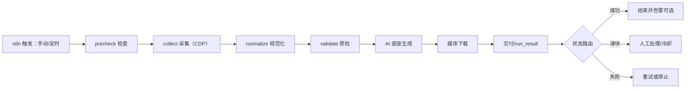
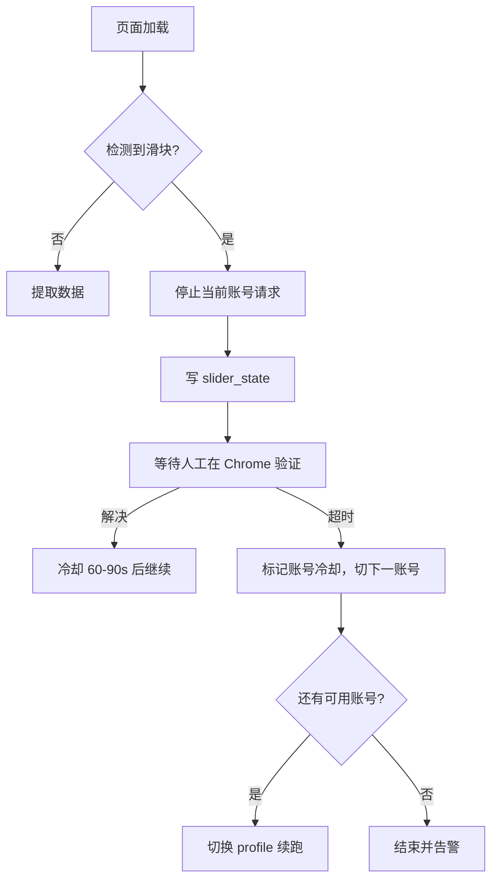

# 1688 自动化工作流详细设计

版本：v1.0.0
日期：2026-08-13

## 1. 目标与边界

目标：在数据侧形成一条可由 n8n 手动或定时触发、可断点续跑、可控制节奏、可回执的 1688 采集与交付链路；不依赖 Codex 浏览器桥。

范围：

- 关键词搜索发现、商品详情、厂家档案和工商信息采集；
- L0/L1 落盘、AI 底座生成、媒体下载、交付文件生成；
- 节奏、滑块、账号冷却和断点状态管理。

暂不包含：

- 直接写正式业务表；
- AI 模型、客服和平台 UI；
- 淘宝、京东等其他来源的完整实现。

## 2. 总体架构



执行面全部是 Python/Node 脚本，n8n 只解析 `run_result.json` 和退出码做路由。

## 3. 触发与模式

| 触发 | 模式 | 用途 |
|---|---|---|
| n8n 手动 | `keyword` | 指定关键词小批试采 |
| n8n 定时 | `incremental` | 定期增量、变化发现 |
| n8n 定时 | `full` | 全量基线（谨慎，需冷却观察） |
| 人工 | `repair` | 失败商品、缺图、缺厂家修复 |

每个触发生成唯一 `run_id`：`1688_<mode>_<YYYYMMDD_HHMMSS>`。

## 4. 阶段契约

| 阶段 | 脚本 | 输入 | 输出 | 退出码含义 |
|---|---|---|---|---|
| precheck | `pipeline_v1.py` / n8n 命令 | 配置、NAS、CDP、登录态 | precheck 报告 | 0 通过，3 配置失败 |
| collect | `cdp_collector.py` | 关键词、数量、pacing profile、profile | `l0/products_raw.jsonl`、`l0/companies_raw.jsonl`、`run_result.json` | 0 完成，1 部分完成，2 滑块停止 |
| normalize | `normalize_companies_raw.py` + 商品规范化 | L0 | `l1/...` | 0 成功，5 可重试 |
| validate | `validate_delivery_data.py` | L1 | 质量报告 | 0 通过，非 0 拒绝 |
| ai_foundation | `build_ai_foundation.py` | 交付 JSON | `ai/1688/v1/*.jsonl`、sqlite | 0 成功 |
| media | `download_media.py` | 媒体清单 | NAS `media/...` + 清单状态 | 0 全部成功，1 部分错误 |
| deliver | `export_direct_delivery.py` / pipeline | L1/L2 | 交付包 + manifest | 0 成功 |

`run_result.json` 至少包含：contract/workflow/version、run_id、source/mode/status、counts、checksums、质量、重试和结构化错误。

## 5. 节奏控制

节奏档案：`adapters/1688/config/pacing_profiles.json`。

| 档案 | 搜索页 | 商品页 | 厂家页 | 用途 |
|---|---:|---:|---:|---|
| `slow` | 20s | 6s | 8s | 触发过风控后的恢复期 |
| `stable` | 15s | 3s | 4s | 当前正式默认 |
| `fast` | 12s | 1s | 2s | 已验证小批可用的低延迟档 |

规则：

- 页面间在基础间隔上增加 ±20% 随机抖动；
- 每天按账号累计请求上限，达到上限自动停止；
- 搜索页连续 0 候选 2 个关键词即停止并冷却；
- 同一账号触发滑块后至少冷却 30 分钟，再切换下一个账号；
- 同一批累计 3 次滑块直接停止整批。

当前校准结论：搜索页 8 秒连搜第 3 个关键词触发 1 次滑块；商品/厂家页 1s/2s 小批仍 0 触发。搜索页是瓶颈，稳定值取 15 秒。

## 6. 风控与滑块状态机



多账号结构：

```text
runtime/browser-profiles/1688/
  cdp-main\        # 账号 1
  cdp-account2\    # 账号 2
  ...
runtime/state/1688_accounts.json   # 日请求量、冷却截止、最近触发时间
```

## 7. 幂等与断点

- 商品唯一键：`1688 + offer_id`；
- 厂家唯一键：`1688 + member_id`；
- 每处理完一个实体先追加 JSONL，再更新 checkpoint；
- 恢复时按 checkpoint 跳过已完成实体；
- JSONL 只允许单行 JSON，禁止 pretty-print；
- 媒体按 URL SHA-256 幂等，已存在文件不重复下载。

## 8. 质量门禁与历史失败经验

商品页：

- 价格与库存在同一节点时必须拆分，不能直接拼接；
- 主图/轮播只取 `od_picture_gallery` 中 `preview-img` 元素；
- 排除 `svg`、`tps-`、`gg_dtc`、`_sum` 图片；
- 详情图取 `[class*="html-description"]` / `v-detail-*` 的 shadowRoot 图片，先滚动触发懒加载；
- 视频取页面/详情/图库的真实视频 URL，页面没有视频就保持空；
- memberId 必须取最后一个 `b2b-`，避免匹配到登录账号；
- 详情页采集必须同时记录 memberId 和 shop URL，防止后续补跑。

厂家页：

- 工厂档案是调度入口，但工商主体字段必须以工商详情页为证据；
- 工商页 JS 空壳时标记 `partial_success` 和 `source_page_not_disclosed`，不伪造。

## 9. n8n 节点映射

当前已实现：


计划扩展（B 阶段完成后）：

```text
manual/schedule trigger
  -> request normalizer
  -> trigger deduplicator
  -> registry gate
  -> lock manager
  -> source workflow
  -> result validator
  -> status router
  -> retry breaker / review gate / quality gate / alert router
  -> receipt handler
```

在四道启用门禁完成前，工作流保持 `active=false`，`source_registry.json` 中 1688 保持 `enabled=false`。

## 10. NAS 数据家

```text
\\tdd-nas\ai应用部\游艺圈\data\
  raw\1688\<run_id>\
  normalized\1688\<run_id>\
  processed\1688\<run_id>\
  media\<sha256>\
  deliveries\1688\<version_date>\
  ai\1688\v1\
  backups\postgresql\
```

项目仓库只保存代码、配置、Schema、测试和文档。

## 11. 数据库切换

当前按交付文件给同事导入。拿到正式 staging 表和权限后，只需新增一个数据库 sink：

```text
同一字段字典/列映射 -> upsert staging -> 同事晋级正式表
```

采集、规范化和质检层不需要重写；媒体仍只写路径和哈希到数据库，文件本体在 NAS。

## 12. 推进与验收顺序

1. 冷却后用 `slow` 档案验证搜索页 12s/10s；
2. 用 `stable` 档案跑 30 商品 + 20 厂家长批验证；
3. 接入 normalize/validate 并跑 707 商品回归；
4. 接入多账号状态文件；
5. 完成 n8n 四道门禁后启用定时工作流；
6. 拿到数据库契约后启用 staging upsert。
